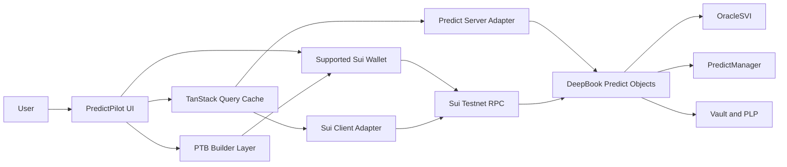

# MASTER_CODEX_PROMPT

## Executive Summary

This file is the final operating manual and one-shot prompt for Codex to build **PredictPilot**, a **DeepBook Predict intelligence and execution terminal on Sui Testnet** for the **Sui Overflow 2026** hackathon. It is intentionally strict: Codex is allowed to make reasonable engineering decisions and improve implementation quality, but it must not violate the project’s verified protocol constraints, product scope, security rules, or demo proof requirements. The authoritative protocol facts in this file come from the current Sui and Mysten documentation for DeepBook Predict, DeepBookV3, Sui PTBs, the Sui TypeScript SDK, dApp Kit, and Codex guidance. The uploaded project brief is also part of the governing context for this file. citeturn12view0turn13view0turn13view1turn14view0turn15view0turn15view1turn15view4turn15view5turn2view0turn7view0turn0file0

The most important verified facts for Codex are these. **DeepBook Predict is currently documented as a Sui Testnet integration surface**, pinned to the `predict-testnet-4-16` branch of `MystenLabs/deepbookv3`, and the docs explicitly warn that **package IDs, object layouts, and entry points may change before Mainnet**. The current public integration target is a **Predict package**, **Predict registry**, **Predict object**, **DUSDC quote asset**, **PLP coin type**, and a public **predict-server** base URL that exposes render-ready market, vault, manager, PnL, and history endpoints. DeepBook Predict supports **binary mint/redeem**, **range mint/redeem**, and **vault supply/withdraw** flows, with positions and ranges stored inside a reusable per-user **PredictManager** rather than as standalone position objects. citeturn12view0turn13view0turn13view1turn14view0turn14view1turn15view1turn30view0

The Sui-side integration rules are also clear. Sui PTBs are built with the `Transaction` class; the CLI offers `sui client ptb` plus `--preview` and `--dry-run` for inspection; wallet integrations should use the `Transaction` kind directly; and app code should prefer serializing a `Transaction` for wallet handoff rather than building bytes inside the app. Mysten’s current SDK and dApp Kit documentation also show React-first integration patterns and document a current dApp Kit stack built around `@mysten/sui`, `@mysten/dapp-kit-react`, and TanStack Query. citeturn2view0turn3view2turn15view3turn15view4turn15view5turn3view1

Two important caveats remain. First, I verified the **DeepSurge platform** as the current hackathon hub for Sui and Walrus builder programs, but I did **not** verify a public, stable, official page for **Sui Overflow 2026**, its participant handbook, or its exact submission form during this research session. Those remain `TODO VERIFY` and should stay blocked in `KNOWN_ISSUES_AND_TODO_VERIFY.md` until confirmed. Second, the current Sui SDK documentation states that the **JSON-RPC client is deprecated** in favor of gRPC or GraphQL; however, documented execution examples and many transaction workflows still use methods such as `executeTransactionBlock`, `signAndExecuteTransaction`, and `waitForTransaction`, so Codex must isolate transport choice behind a thin integration layer instead of baking network transport assumptions into UI code. citeturn22view0turn32view0turn15view3

## How to Use This File

### Purpose

Use this file in two ways:

First, use it as the **human review standard** for every Codex change. If a Codex change conflicts with this document, the repository docs listed below, or official protocol documentation, do not merge it until the conflict is resolved.

Second, copy the full prompt in the **COPY THIS PROMPT INTO CODEX** section into Codex before implementation begins. That prompt gives Codex the project mission, reading order, build phases, required constraints, verified protocol values, failure rules, and acceptance criteria. Codex works best when it has explicit instructions, clear docs, and runnable tests; OpenAI’s own Codex guidance says the agent can read and edit files, run commands, run tests, and is guided by repository `AGENTS.md` files, but users must still manually review and validate all agent-generated code. citeturn7view0turn7view2

### Codex Role Definition

Codex is the implementation agent for PredictPilot. Its job is to:

Build the repository into a working, testable, demo-ready Sui Testnet dApp.

Use the local project docs as the **product, architecture, and security contract**.

Verify protocol details against current official sources before encoding contract integrations.

Prefer a working MVP and reliable demo over wide feature breadth.

Report what changed, what was tested, what failed, and what is still blocked. citeturn7view0turn12view0turn13view0

Codex is **not** allowed to invent DeepBook Predict package IDs, object IDs, function names, endpoints, or hackathon rules. If a required value is not verified, Codex must mark it `TODO VERIFY`, stop when it blocks a transaction flow, and surface the blocker clearly. The DeepBook Predict docs explicitly warn that current Testnet identifiers are provisional and pinned to the `predict-testnet-4-16` branch. citeturn12view0turn13view0turn30view0

### Mission and Hackathon Objective

PredictPilot should present the deepest possible “judge-visible” value for the DeepBook Predict track:

A user can connect a wallet, inspect markets and oracle state, preview a transaction and its risk, execute a real **mint**, **redeem**, **mint_range**, **redeem_range**, **supply**, or **withdraw** transaction against the published DeepBook Predict Testnet surface, then see updated portfolio state, PnL context, history, and a transaction digest proof. DeepBook Predict is explicitly an expiry-based prediction market protocol on Sui, using oracle-driven prices, `PredictManager` accounts, and a shared vault that mints `PLP` for LPs. citeturn12view0turn13view1turn14view0turn14view1turn15view0turn15view1

### Mandatory Reading Order

Codex must read documents in this exact order before coding:

- `AGENTS.md`
- `PROJECT_VISION.md`
- `MVP_SCOPE.md`
- `PRODUCT_REQUIREMENTS_DOCUMENT.md`
- `TECHNICAL_ARCHITECTURE.md`
- `DEEPBOOK_PREDICT_RESEARCH.md`
- `DEEPBOOK_PREDICT_INTEGRATION_GUIDE.md`
- `PTB_COOKBOOK.md`
- `API_CONTRACTS.md`
- `UI_UX_SPECIFICATION.md`
- `WIREFRAMES.md`
- `TESTING_STRATEGY.md`
- `DEMO_SCRIPT.md`
- `CODEX_BUILD_TASKS.md`
- `ENVIRONMENT_SETUP.md`
- `README_DRAFT.md`
- `SUBMISSION_CHECKLIST.md`
- `KNOWN_ISSUES_AND_TODO_VERIFY.md`
- `SECURITY_CHECKLIST.md`

Use those documents this way:

- `AGENTS.md`: repository navigation, commands, local conventions, workflow rules.
- `PROJECT_VISION.md`: what PredictPilot is trying to become.
- `MVP_SCOPE.md`: hard anti-scope-creep boundary.
- `PRODUCT_REQUIREMENTS_DOCUMENT.md`: product acceptance criteria.
- `TECHNICAL_ARCHITECTURE.md`: implementation structure and data flow.
- `DEEPBOOK_PREDICT_RESEARCH.md`: source-of-truth protocol understanding.
- `DEEPBOOK_PREDICT_INTEGRATION_GUIDE.md`: integration notes and verified values.
- `PTB_COOKBOOK.md`: PTB composition patterns.
- `API_CONTRACTS.md`: server and adapter shape.
- `UI_UX_SPECIFICATION.md`: screen behavior and state rules.
- `WIREFRAMES.md`: interaction skeleton.
- `TESTING_STRATEGY.md`: test pyramid and coverage.
- `DEMO_SCRIPT.md`: what judges must see work.
- `CODEX_BUILD_TASKS.md`: backlog and execution order.
- `ENVIRONMENT_SETUP.md`: install, run, config, and testnet setup.
- `README_DRAFT.md`: public-facing consistency.
- `SUBMISSION_CHECKLIST.md`: final submission completeness.
- `KNOWN_ISSUES_AND_TODO_VERIFY.md`: blocker register.
- `SECURITY_CHECKLIST.md`: transaction and secret safety.

### Repository Scan Procedure

Before writing code, Codex must perform this repository scan on macOS or Linux shell:

```bash
pwd
git status
git branch --show-current
find . -maxdepth 2 -type f | sort | sed -n '1,240p'
[ -f package.json ] && cat package.json
[ -f pnpm-lock.yaml ] && echo "pnpm lock exists"
[ -d src ] && find src -maxdepth 3 -type f | sort | sed -n '1,240p'
[ -d app ] && find app -maxdepth 3 -type f | sort | sed -n '1,240p'
[ -d pages ] && find pages -maxdepth 3 -type f | sort | sed -n '1,240p'
[ -d e2e ] && find e2e -maxdepth 3 -type f | sort | sed -n '1,240p'
```

Then Codex must detect:

- framework already chosen in repo: **Vite React**, **Next.js**, or something else,
- location of current routing and app shell,
- whether dApp Kit is already wired,
- whether environment parsing exists,
- whether tests already exist,
- whether an existing transaction or DeepBook integration layer exists,
- whether there are stale hardcoded protocol IDs in components.

If the repo is empty or near-empty, the safest default starting point is a **React + TypeScript** app with Mysten’s documented dApp Kit pattern and TanStack Query. Sui’s own React client example scaffolds a dApp using `pnpm create @mysten/dapp --template react-client-dapp`, and generic React+Vite scaffolding is documented with `pnpm create vite`. If the repo already uses **Next.js**, Codex must keep Next.js and not rewrite the app just because Vite is easier. citeturn3view1turn27view0turn27view2

### Research and Verification Procedure

Before building protocol integrations, Codex must verify these current official facts against docs or repo code:

- current DeepBook Predict package ID,
- current Predict registry ID,
- current Predict object ID,
- current DUSDC coin type,
- current DUSDC currency ID,
- current PLP coin type,
- current public predict-server base URL,
- current public server endpoint shapes,
- exact function names used for `create_manager`, `mint`, `redeem`, `mint_range`, `redeem_range`, `supply`, and `withdraw`,
- oracle lifecycle assumptions,
- whether any required explorer base URL is pinned in local docs.

These are verified today from the current public DeepBook Predict contract information page:

| Key | Verified current value |
|---|---|
| Network | `testnet` |
| Predict server | `https://predict-server.testnet.mystenlabs.com` |
| Predict package | `0xf5ea2b3749c65d6e56507cc35388719aadb28f9cab873696a2f8687f5c785138` |
| Predict registry | `0x43af14fed5480c20ff77e2263d5f794c35b9fab7e2212903127062f4fe2a6e64` |
| Predict object | `0xc8736204d12f0a7277c86388a68bf8a194b0a14c5538ad13f22cbd8e2a38028a` |
| DUSDC coin type | `0xe95040085976bfd54a1a07225cd46c8a2b4e8e2b6732f140a0fc49850ba73e1a::dusdc::DUSDC` |
| DUSDC currency ID | `0xf3000dff421833d4bb8ed58fac146d691a3aaba2785aa1989af65a7089ca3e9c` |
| DUSDC decimals | `6` |
| PLP coin type | `0xf5ea2b3749c65d6e56507cc35388719aadb28f9cab873696a2f8687f5c785138::plp::PLP` |
| Source branch | `predict-testnet-4-16` |

These values are **provisional testnet targets** and must remain config-driven, not component constants. The docs explicitly warn that they may change before Mainnet. citeturn13view0turn12view0turn30view0

The currently documented public server endpoints important to PredictPilot are:

- `GET /status`
- `GET /predicts/:predict_id/state`
- `GET /predicts/:predict_id/oracles`
- `GET /oracles/:oracle_id/state`
- `GET /predicts/:predict_id/quote-assets`
- `GET /oracles/:oracle_id/ask-bounds`
- `GET /predicts/:predict_id/vault/summary`
- `GET /predicts/:predict_id/vault/performance?range=ALL`
- `GET /lp/supplies`
- `GET /lp/withdrawals`
- `GET /managers`
- `GET /managers/:manager_id/summary`
- `GET /managers/:manager_id/positions/summary`
- `GET /managers/:manager_id/pnl?range=ALL`
- `GET /oracles/:oracle_id/prices`
- `GET /oracles/:oracle_id/prices/latest`
- `GET /oracles/:oracle_id/svi`
- `GET /oracles/:oracle_id/svi/latest`
- `GET /positions/minted`
- `GET /positions/redeemed`
- `GET /ranges/minted`
- `GET /ranges/redeemed`
- `GET /trades/:oracle_id` citeturn13view0turn30view0

The major DeepBook Predict function names currently documented for app engineers are:

- `create_manager()`
- `get_trade_amounts()`
- `mint()`
- `redeem()`
- `redeem_permissionless()`
- `get_range_trade_amounts()`
- `mint_range()`
- `redeem_range()`
- `supply()`
- `withdraw()` citeturn14view0

The protocol model that drives UI and state design is also verified:

- `Predict` is the top-level shared object.
- `PredictManager` is a reusable per-user shared account object.
- `OracleSVI` stores market state for one underlying and one expiry.
- Positions and ranges are **not standalone onchain objects**; they are quantities stored in `PredictManager`.
- LPs receive `PLP` shares on supply and burn them on withdraw. citeturn13view1turn14view1turn15view1turn30view0

### Mermaid Architecture Diagram Suggestion



## Verified Reference Snapshot

### Sui and SDK Standards Codex Must Follow

Sui PTBs are built with `Transaction` from `@mysten/sui/transactions`. PTBs can pass pure values, object references, result references, and can be inspected with the CLI using `sui client ptb`, `--preview`, and `--dry-run`. Wallet integrations should pass a `Transaction` object directly, and the official PTB docs recommend using `tx.serialize()` for wallet handoff rather than building raw bytes in app code so wallets can handle gas logic and coin selection. citeturn2view0turn20view4turn20view5

The current SDK documentation shows `@mysten/sui` as the TypeScript SDK, published as ESM-only, while the current dApp Kit documentation describes framework-agnostic core plus React bindings. Sui’s client-app example shows a React setup with `@mysten/sui`, `@mysten/dapp-kit-react`, and `@tanstack/react-query`, and uses a provider pattern to configure network clients and wallet connection surfaces. citeturn15view4turn15view5turn3view1

The documented `useSignAndExecuteTransaction` hook supports a **custom execute function**, which is useful when PredictPilot needs execution routed through an app-controlled client with richer return options like `showRawEffects` and `showObjectChanges`. Separately, the Sui developer cheat sheet recommends, for read-after-write consistency, signing through the wallet and submitting writes and subsequent reads against the same node instead of outsourcing everything to a wallet’s all-in-one execute path. citeturn15view3turn25view0

The current SDK docs also state that `SuiJsonRpcClient` is deprecated in favor of gRPC or GraphQL, but still document `executeTransactionBlock`, `signAndExecuteTransaction`, and `waitForTransaction` methods. PredictPilot should therefore centralize network transport in one adapter and avoid spreading deprecated-client assumptions across UI code. citeturn32view0

### Toolchain Baseline

If `ENVIRONMENT_SETUP.md` already pins exact versions, Codex must obey that file. If it does not, the current official minimums and current releases suggest this conservative baseline:

- Node.js: prefer **Node 22 LTS or later**. Node’s current download page lists both active LTS lines, and pnpm 11 requires Node at least v22 if not using the standalone installer. Vite currently requires Node `20.19+` or `22.12+`, Vitest requires Node `>=20`, and Next.js requires Node `>=20.9`. citeturn5view0turn5view1turn27view0turn26view4turn27view2
- pnpm: prefer **pnpm 11**, enabled through Corepack when possible. The pnpm installation docs recommend updating Corepack first and then enabling pnpm. citeturn5view1
- Sui CLI: install via `suiup` or Homebrew, then verify with `sui --version`. citeturn15view6
- Playwright: install project support with `pnpm create playwright` or, for dependencies already present, `pnpm exec playwright install --with-deps`. citeturn26view0turn26view2
- Vitest: install with `pnpm add -D vitest`. citeturn26view4

### Recommended Local Paths

Codex should create or protect these local paths:

```text
src/config/env.ts
src/config/deepbookPredict.ts
src/lib/sui/client.ts
src/lib/sui/network.ts
src/lib/sui/explorer.ts
src/lib/validation/zod.ts
src/integrations/deepbook-predict/config.ts
src/integrations/deepbook-predict/schemas.ts
src/integrations/deepbook-predict/errors.ts
src/integrations/deepbook-predict/api/
src/integrations/deepbook-predict/ptb/
src/integrations/deepbook-predict/read/
src/features/markets/
src/features/portfolio/
src/features/vault/
src/features/history/
src/features/wallet/
src/features/transactions/
src/components/
src/tests/
src/tests/unit/
src/tests/integration/
src/tests/ptb/
e2e/
.github/workflows/ci.yml
.env.example
```

### Example Config-Driven Environment Variables

Use config-driven values like these. Anything unverified stays `TODO VERIFY`.

```env
NEXT_PUBLIC_SUI_NETWORK=testnet
NEXT_PUBLIC_SUI_RPC_URL=https://fullnode.testnet.sui.io:443
NEXT_PUBLIC_PREDICT_SERVER_URL=https://predict-server.testnet.mystenlabs.com

NEXT_PUBLIC_PREDICT_PACKAGE_ID=0xf5ea2b3749c65d6e56507cc35388719aadb28f9cab873696a2f8687f5c785138
NEXT_PUBLIC_PREDICT_REGISTRY_ID=0x43af14fed5480c20ff77e2263d5f794c35b9fab7e2212903127062f4fe2a6e64
NEXT_PUBLIC_PREDICT_OBJECT_ID=0xc8736204d12f0a7277c86388a68bf8a194b0a14c5538ad13f22cbd8e2a38028a

NEXT_PUBLIC_DUSDC_COIN_TYPE=0xe95040085976bfd54a1a07225cd46c8a2b4e8e2b6732f140a0fc49850ba73e1a::dusdc::DUSDC
NEXT_PUBLIC_DUSDC_CURRENCY_ID=0xf3000dff421833d4bb8ed58fac146d691a3aaba2785aa1989af65a7089ca3e9c
NEXT_PUBLIC_PLP_COIN_TYPE=0xf5ea2b3749c65d6e56507cc35388719aadb28f9cab873696a2f8687f5c785138::plp::PLP

NEXT_PUBLIC_DEFAULT_ORACLE_ID=TODO VERIFY
NEXT_PUBLIC_DEFAULT_MARKET_ID=TODO VERIFY
NEXT_PUBLIC_SUI_EXPLORER_URL=TODO VERIFY

TESTNET_PRIVATE_KEY=DO_NOT_COMMIT
TESTNET_WALLET_ADDRESS=TODO_VERIFY
E2E_BASE_URL=http://localhost:5173
PLAYWRIGHT_HEADLESS=true
```

The Testnet Sui fullnode URL is documented as `https://fullnode.testnet.sui.io:443`, and the faucet docs show Testnet funding via the online faucet or a direct POST to `https://faucet.testnet.sui.io/v2/gas`. DeepBook Predict separately documents a token request form for DUSDC and other Predict testing assets. citeturn32view0turn16view4turn12view0

## Operating Rules for Codex

### Non-Negotiable Build Rules

Codex must build **real DeepBook Predict Testnet execution**, not a lookalike interface. The public Predict server is the main render source for market, vault, portfolio, and history pages, but onchain reads must be used immediately before or after confirmation-critical wallet flows. Do not build the primary UI around raw event decoding or raw chain scans when indexed server surfaces already exist. citeturn12view0turn30view0

Codex must keep all protocol identifiers config-driven. The current docs explicitly warn that Testnet IDs are temporary, so package IDs, object IDs, coin types, and server URLs must live in `src/config` and environment parsing, not inside React components. citeturn12view0turn13view0

Codex must build the MVP in this order:

- first: repository foundation, config, types, schema validation, wallet shell, read adapters;
- second: PTB builders, preview flows, real binary and range execution, digest proof and portfolio refresh;
- last: polish, advanced analytics, deployment, README and submission hardening.

Codex must **not** build any new Move contracts, admin registry operator surfaces, margin-specific features outside the stated scope, or a fake demo layer that hides missing execution. DeepBook Predict already provides the contract surface PredictPilot needs. citeturn12view0turn14view0turn15view2turn11view1

### Non-Negotiable Anti-Hallucination Rules

If a value is not officially verified, Codex must mark it `TODO VERIFY` and avoid pretending it is real.

If local docs conflict with current official protocol docs, the official current docs win for protocol behavior and network/runtime details. If official docs conflict with project product docs about intended UX or feature priority, pause, report the conflict, and ask for a maintainer decision.

Never invent:

- package IDs,
- object IDs,
- oracle IDs,
- explorer base URLs,
- server endpoints,
- onchain function names,
- judge rules,
- submission deadlines,
- track rules.

Keep a running blocker list in `KNOWN_ISSUES_AND_TODO_VERIFY.md`. The current research session did **not** verify a public official Sui Overflow 2026 site, handbook, or submission detail page, so all hackathon-rule specifics remain `TODO VERIFY`. The DeepSurge homepage is verified as a current Sui/Walrus hackathon hub but not as proof of the exact Sui Overflow 2026 rule set. citeturn22view0

### Non-Negotiable Security Rules

Treat all user input as untrusted.

Treat all external server responses as untrusted until validated.

Use runtime schemas, preferably Zod, for all Predict server responses before they enter UI state. Zod is a TypeScript-first validation library and should back the DeepBook Predict adapter boundary. citeturn5view6

Show a transaction preview **before signature**.

Show a risk preview **before execution**, and label it as an **estimate** unless it comes from verified protocol quotes or onchain post-trade simulation.

Show transaction digest proof **after execution**.

Never commit:

- private keys,
- seed phrases,
- wallet exports,
- `.env.local`,
- `.env.test`,
- production secrets,
- faucet credentials.

Do not sign concurrent transactions that touch the same owned mutable object. Sui’s developer cheat sheet explicitly warns against signing two concurrent transactions that touch the same mutable owned object. citeturn25view0

### Non-Negotiable Demo Reliability Rules

For every user-facing execution flow, the demo must show:

- selected market or oracle,
- previewed action,
- wallet signature step,
- successful execution result,
- transaction digest,
- refreshed portfolio/history or refreshed vault view.

If the Predict server is unavailable, the app may degrade to limited read mode and must clearly label the outage. If an execution preview cannot be validated, risky execution should be blocked or strongly warned. If oracle data is stale or not live for mint flows, mint must be blocked; the Oracle docs explicitly state that mints require a live oracle. citeturn15view0turn12view0

Mocks are permitted only for:

- unit and integration tests,
- empty/fallback UI states,
- local component development,
- local demo rehearsal when clearly labeled.

Mocks are **not** permitted as the primary hackathon proof for market execution, LP actions, or transaction proof.

### Priority Rules

**MVP priority:** binary mint/redeem, range mint/redeem, manager discovery/creation, DUSDC deposit/withdraw, vault supply/withdraw, portfolio refresh, history refresh, digest proof.

**Stretch goals:** richer analytics, advanced portfolio visuals, scenario tools, replay tools, deployment polish.

**Demo priority:** every visible flow required by `DEMO_SCRIPT.md` must work on Testnet before adding extra screens.

**Testing priority:** environment parsing, schemas, adapter correctness, PTB builder correctness, preview gating, error handling, E2E happy paths, and critical blocked-path tests first.

**Deployment priority:** only after real testnet execution works consistently and CI is green.

### Failure Modes and Fallback Rules

If package IDs or object IDs change, update only config, not component code. The docs explicitly warn these values may change. citeturn12view0turn13view0

If DUSDC is missing, block write flows that require quote balance and surface instructions to request Predict Testnet tokens through the documented token request form. Read-only views may continue. citeturn12view0

If the RPC or Predict server fails, retry intelligently, show a degraded-data warning, and never fabricate “fresh” data. Transport selection must remain swappable because current SDK docs recommend migrating away from JSON-RPC. citeturn32view0turn12view0

If wallet signing fails, preserve the unsigned PTB preview and show a safe error without leaking internal state or secrets.

If a transaction fails, always check status and expose a safe error plus digest if available. The documented client methods explicitly remind developers to check transaction status. citeturn32view0

If oracle data is stale or not active, block mint and clearly explain why. The oracle lifecycle docs say mints require a live oracle and updates are rejected after settlement. citeturn15view0

## Build Workflow and Standards

### Required Implementation Standards

Use TypeScript strictly. The current Sui SDK is TypeScript-friendly and ESM-only, and the documentation calls out compatible module resolution settings such as `NodeNext`, `Node16`, or `Bundler`. citeturn15view4

Use React with current dApp Kit bindings. The docs describe a React package, component wrappers, and hooks for wallet and client state, while Sui’s official client app example shows a provider-based composition with TanStack Query. citeturn15view5turn3view1turn5view5

Use a dedicated adapter layer for:

- Sui network client transport,
- Predict server API calls,
- DeepBook Predict read transformation,
- PTB construction,
- wallet execution handoff.

Use schema validation at the adapter boundary before data enters app state.

Use explicit loading, empty, error, success, and stale-data states on every data surface.

Use an execution state machine for every write flow: **idle → validating → preview-ready → signing → submitted → confirmed → refreshed**.

### Required PTB Standards

Build PTBs with `Transaction`.

Use `tx.object()` for object references and typed `tx.pure.*` helpers or BCS-serialized values for pure inputs.

Use `Transaction` serialization for wallet handoff where possible instead of building bytes inside app code.

Use custom execution or post-execution waiting to ensure read-after-write consistency and to capture effects/object changes needed for digest proof and portfolio refreshing. The SDK documents `executeTransactionBlock`, `signAndExecuteTransaction`, and `waitForTransaction`, and dApp Kit documents a custom execute path in `useSignAndExecuteTransaction`. citeturn2view0turn20view3turn20view4turn15view3turn32view0

### Required API, Validation, and Error Standards

All Predict server responses must be validated.

Do not assume server payload stability.

Normalize server data to local domain models before UI usage.

For transaction errors, preserve:

- user-safe error message,
- raw error for logs if safe,
- transaction digest if present,
- failed flow context,
- retry suggestion.

Never expose stack traces or secrets to the end user.

### Required Wallet UX Standards

Use a clear connect wallet entry point.

Use the currently connected address consistently across manager lookup, balances, and execution.

Warn when the connected network is wrong.

Do not enable execution buttons until network, config, manager state, and quote balances are valid.

Do not ask for a signature until the PTB preview is visible.

### Required Testnet Execution Standards

PredictPilot must target **Sui Testnet** and the **current DeepBook Predict Testnet deployment**. The published Predict package IDs and server endpoints are temporary and pinned to `predict-testnet-4-16`, so every execution flow must read those values from config. citeturn13view0turn12view0turn30view0

For funding and testnet setup, Sui documents Testnet funding through the faucet and balance checks using `sui client balance`, while DeepBook Predict separately documents a token request form for DUSDC. citeturn16view4turn16view5turn12view0

### Required Testing and CI Standards

The minimum command set Codex should wire if missing is:

```bash
pnpm install
pnpm lint
pnpm typecheck
pnpm test
pnpm test:unit
pnpm test:integration
pnpm test:ptb
pnpm test:e2e
pnpm build
pnpm exec playwright install --with-deps
```

Playwright’s docs recommend adding a GitHub Actions workflow during initialization, and GitHub’s Node.js workflow docs recommend using `actions/setup-node` to pin Node versions consistently in CI. Vitest documents installation through a dev dependency and Playwright documents browser installation through `pnpm exec playwright install --with-deps`. citeturn26view0turn26view2turn26view4turn26view5

### Phase Workflow

Use these phases exactly:

**Phase 0**  
Read docs, scan repo, inspect package manager, framework, CI, env parsing, tests, and existing integration code.

**Phase 1**  
Establish repository foundation, scripts, lint/typecheck, config parsing, and local file structure.

**Phase 2**  
Implement environment and config layer: protocol IDs, network, RPC, server URLs, explorer config, feature flags.

**Phase 3**  
Implement domain types, Zod schemas, API adapters, and normalized read models.

**Phase 4**  
Implement Sui client integration, wallet integration, network guardrails, and address/account state.

**Phase 5**  
Implement DeepBook Predict read integration: markets, oracle state, manager state, vault summaries, history.

**Phase 6**  
Implement PTB builders for `create_manager`, deposit/withdraw if needed, `mint`, `redeem`, `mint_range`, `redeem_range`, `supply`, and `withdraw`.

**Phase 7**  
Implement transaction preview and risk preview, including guardrails for oracle lifecycle, missing quote assets, and invalid config.

**Phase 8**  
Implement core UI screens: market browser, execution panel, portfolio panel, vault panel, history panel.

**Phase 9**  
Implement real execution flows with wallet handoff, digest capture, status checks, wait-for-confirmation, and state refresh.

**Phase 10**  
Implement portfolio, PnL, manager detail, vault analytics, LP history, and post-trade refresh consistency.

**Phase 11**  
Implement and stabilize tests, security checks, wrong-network handling, API failure paths, PTB inspection, and E2E coverage.

**Phase 12**  
Polish demo mode, deployment setup, README consistency, submission assets, and final cleanup.

### Progress, Blockers, and PR Standards

After each meaningful change, Codex must report:

- changed files,
- why the change was made,
- commands run,
- test results,
- unresolved blockers,
- any new `TODO VERIFY` items.

If blocked on a protocol uncertainty, Codex must stop the affected flow, not guess.

Each PR or change batch should remain logically scoped, update tests where applicable, and update docs when the public behavior changed.

## COPY THIS PROMPT INTO CODEX

The prompt below is the one-shot working prompt for Codex. The protocol values and rules embedded in it come from the currently published DeepBook Predict docs, DeepBookV3 repo branch `predict-testnet-4-16`, current Sui SDK/PTB docs, and current Codex guidance. Keep using config-driven IDs because the docs explicitly warn that Testnet identifiers may change. citeturn13view0turn12view0turn30view0turn2view0turn7view0

```text
You are Codex working inside the PredictPilot repository.

Your mission:
Build PredictPilot into a working, testable, demo-ready DeepBook Predict intelligence and execution terminal for the Sui Overflow 2026 hackathon.

Core product:
PredictPilot is a DeepBook Predict frontend and execution terminal on Sui Testnet. It must support real testnet reads and writes for binary mint/redeem, range mint/redeem, and vault supply/withdraw flows. It must show transaction preview before signing, risk preview before execution, a transaction digest after execution, and then refresh affected portfolio/history/vault state.

You are allowed to improve implementation details and make reasonable engineering decisions, but you must not violate:
- product scope
- security requirements
- verified DeepBook Predict constraints
- Sui transaction standards
- demo reliability rules
- TODO VERIFY blockers

Read order:
1. AGENTS.md
2. PROJECT_VISION.md
3. MVP_SCOPE.md
4. PRODUCT_REQUIREMENTS_DOCUMENT.md
5. TECHNICAL_ARCHITECTURE.md
6. DEEPBOOK_PREDICT_RESEARCH.md
7. DEEPBOOK_PREDICT_INTEGRATION_GUIDE.md
8. PTB_COOKBOOK.md
9. API_CONTRACTS.md
10. UI_UX_SPECIFICATION.md
11. WIREFRAMES.md
12. TESTING_STRATEGY.md
13. DEMO_SCRIPT.md
14. CODEX_BUILD_TASKS.md
15. ENVIRONMENT_SETUP.md
16. README_DRAFT.md
17. SUBMISSION_CHECKLIST.md
18. KNOWN_ISSUES_AND_TODO_VERIFY.md
19. SECURITY_CHECKLIST.md

Initial workflow:
- Read AGENTS.md first.
- Scan the repository before coding.
- Detect the framework already in use.
- Prefer preserving the existing framework.
- If the repo is effectively empty, default to a React + TypeScript app compatible with current Sui dApp Kit patterns.
- Read KNOWN_ISSUES_AND_TODO_VERIFY.md before building protocol integrations.
- Use CODEX_BUILD_TASKS.md as the backlog.
- Use MVP_SCOPE.md to avoid scope creep.
- Use TECHNICAL_ARCHITECTURE.md as the architecture contract.
- Use DEEPBOOK_PREDICT_INTEGRATION_GUIDE.md and PTB_COOKBOOK.md for protocol integration.
- Use TESTING_STRATEGY.md to create tests.
- Use DEMO_SCRIPT.md to prioritize demo-visible flows.
- Use SECURITY_CHECKLIST.md before building any transaction path.

Hard rules:
- Never fake DeepBook Predict execution.
- Never present mock data as real testnet proof.
- Never hardcode package IDs, object IDs, oracle IDs, coin types, RPC URLs, or server URLs inside UI components.
- Keep all such values in config files and environment parsing.
- Never commit secrets, private keys, seed phrases, `.env.local`, `.env.test`, wallet exports, or faucet credentials.
- Treat all external API responses as untrusted until validated.
- Treat all user input as untrusted.
- If a required value is not verified, mark it TODO VERIFY and stop the affected flow instead of guessing.
- If local docs conflict with official current protocol docs, official current protocol docs win for protocol/runtime details.
- If product docs conflict with protocol constraints, stop and report the conflict.

Current verified DeepBook Predict Testnet integration values:
- Network: testnet
- Predict server URL: https://predict-server.testnet.mystenlabs.com
- Predict package ID: 0xf5ea2b3749c65d6e56507cc35388719aadb28f9cab873696a2f8687f5c785138
- Predict registry ID: 0x43af14fed5480c20ff77e2263d5f794c35b9fab7e2212903127062f4fe2a6e64
- Predict object ID: 0xc8736204d12f0a7277c86388a68bf8a194b0a14c5538ad13f22cbd8e2a38028a
- DUSDC coin type: 0xe95040085976bfd54a1a07225cd46c8a2b4e8e2b6732f140a0fc49850ba73e1a::dusdc::DUSDC
- DUSDC currency ID: 0xf3000dff421833d4bb8ed58fac146d691a3aaba2785aa1989af65a7089ca3e9c
- PLP coin type: 0xf5ea2b3749c65d6e56507cc35388719aadb28f9cab873696a2f8687f5c785138::plp::PLP
- Source branch: predict-testnet-4-16

Important protocol facts:
- DeepBook Predict is an expiry-based prediction market protocol on Sui.
- Predict is the top-level shared object.
- PredictManager is the per-user reusable manager object.
- OracleSVI holds one underlying and one expiry’s market state.
- Positions and ranges are not standalone onchain objects; they are quantities stored in PredictManager.
- LP flows use PLP shares minted on supply and burned on withdraw.
- Mints require a live oracle.
- The public predict-server should be the main render source for market, vault, portfolio, and history pages.
- Use onchain reads immediately before or after confirmation-critical wallet flows.

Verified function names you may use if needed:
- create_manager
- get_trade_amounts
- mint
- redeem
- redeem_permissionless
- get_range_trade_amounts
- mint_range
- redeem_range
- supply
- withdraw

Server endpoints you may depend on:
- GET /status
- GET /predicts/:predict_id/state
- GET /predicts/:predict_id/oracles
- GET /oracles/:oracle_id/state
- GET /predicts/:predict_id/quote-assets
- GET /oracles/:oracle_id/ask-bounds
- GET /predicts/:predict_id/vault/summary
- GET /predicts/:predict_id/vault/performance?range=ALL
- GET /lp/supplies
- GET /lp/withdrawals
- GET /managers
- GET /managers/:manager_id/summary
- GET /managers/:manager_id/positions/summary
- GET /managers/:manager_id/pnl?range=ALL
- GET /oracles/:oracle_id/prices
- GET /oracles/:oracle_id/prices/latest
- GET /oracles/:oracle_id/svi
- GET /oracles/:oracle_id/svi/latest
- GET /positions/minted
- GET /positions/redeemed
- GET /ranges/minted
- GET /ranges/redeemed
- GET /trades/:oracle_id

Use config-driven environment variables with names like:
- NEXT_PUBLIC_SUI_NETWORK
- NEXT_PUBLIC_SUI_RPC_URL
- NEXT_PUBLIC_PREDICT_SERVER_URL
- NEXT_PUBLIC_PREDICT_PACKAGE_ID
- NEXT_PUBLIC_PREDICT_REGISTRY_ID
- NEXT_PUBLIC_PREDICT_OBJECT_ID
- NEXT_PUBLIC_DUSDC_COIN_TYPE
- NEXT_PUBLIC_DUSDC_CURRENCY_ID
- NEXT_PUBLIC_PLP_COIN_TYPE
- NEXT_PUBLIC_DEFAULT_ORACLE_ID
- NEXT_PUBLIC_DEFAULT_MARKET_ID
- NEXT_PUBLIC_SUI_EXPLORER_URL
- TESTNET_PRIVATE_KEY
- TESTNET_WALLET_ADDRESS
- E2E_BASE_URL
- PLAYWRIGHT_HEADLESS

Recommended file layout:
- src/config/env.ts
- src/config/deepbookPredict.ts
- src/lib/sui/client.ts
- src/lib/sui/network.ts
- src/lib/validation/zod.ts
- src/integrations/deepbook-predict/config.ts
- src/integrations/deepbook-predict/schemas.ts
- src/integrations/deepbook-predict/errors.ts
- src/integrations/deepbook-predict/api/
- src/integrations/deepbook-predict/read/
- src/integrations/deepbook-predict/ptb/
- src/features/markets/
- src/features/portfolio/
- src/features/vault/
- src/features/history/
- src/features/transactions/
- src/tests/
- src/tests/unit/
- src/tests/integration/
- src/tests/ptb/
- e2e/
- .github/workflows/ci.yml

Framework and transport guidance:
- Preserve the current repo framework if one already exists.
- If the repo already uses Next.js, keep Next.js.
- If the repo is empty, a Vite React TypeScript app is acceptable.
- Use current Sui dApp Kit and TypeScript SDK patterns.
- Keep transport isolated so RPC, gRPC, or GraphQL choices are swappable.
- Prefer wallet-safe Transaction handoff and config-driven network clients.
- Do not spread deprecated transport assumptions through UI components.

Required UX behavior:
- Show wallet connect and current account state.
- Block execution on wrong network.
- Discover existing PredictManager or create one.
- Show manager balances and position summaries.
- Show binary and range trade forms.
- Show vault supply and withdraw forms.
- Show transaction preview before signature.
- Show risk preview before execution.
- Show digest and status after execution.
- Refresh portfolio, history, and relevant market or vault state after execution.
- Clearly label stale, loading, empty, and error states.
- Clearly label any estimate as estimate.

Required security behavior:
- Validate all server responses with runtime schemas.
- Fail closed when required config is missing.
- Block mint when oracle state is stale or not live.
- Block writes when package ID, predict object ID, or required quote asset config is missing.
- Never leak secrets in logs or UI.
- Never let mocks act as primary proof of testnet functionality.
- Show safe, useful errors for wallet rejection and chain failure.
- Check transaction status after execution and do not treat submission as success.

Phases:
Phase 0: Read docs and inspect repo
Phase 1: Repo foundation
Phase 2: Environment and config
Phase 3: Types, schemas, API adapters
Phase 4: Sui client and wallet integration
Phase 5: DeepBook Predict read integration
Phase 6: PTB transaction builders
Phase 7: Transaction preview and risk preview
Phase 8: Core UI screens
Phase 9: Real execution flows
Phase 10: Portfolio, PnL, history, Vault, and PLP
Phase 11: Testing, security, and QA
Phase 12: Demo mode, polish, deployment, and submission readiness

What to build first:
- env/config layer
- DeepBook Predict config constants from env
- schema validation and API adapter layer
- wallet/network plumbing
- manager discovery/creation read path
- market/oracle/vault read surfaces

What to build second:
- PTB builders for binary/range/vault flows
- transaction preview and risk preview
- real wallet execution
- digest proof and wait-for-confirmation
- post-transaction refresh

What to build last:
- advanced analytics polish
- deployment tuning
- README and submission cleanup
- optional stretch UI

What not to build:
- new Move contracts
- admin registry surfaces
- margin products outside scope
- fake execution layers
- hidden mock fallback presented as real data
- hardcoded testnet values inside components

Testing requirements:
- Add or keep scripts for lint, typecheck, unit, integration, PTB, E2E, and build.
- Run tests after meaningful changes.
- Create tests for wrong network blocking, missing config blocking, schema validation, preview generation, wallet rejection handling, failed transaction handling, post-success refresh, and digest display.
- Add Playwright coverage for at least one happy-path read flow and one guarded execution flow.
- Keep CI green or report why it cannot be green yet.

Reporting requirements:
After each meaningful batch, report:
- files changed
- why they changed
- commands run
- test results
- blocked items
- TODO VERIFY items added or resolved

Shell commands you may use when helpful:
- git status
- pnpm install
- pnpm lint
- pnpm typecheck
- pnpm test
- pnpm build
- pnpm test:e2e
- pnpm exec playwright install --with-deps
- sui --version
- sui client active-env
- sui client balance

If environment setup is missing and you need to suggest it, prefer documented commands such as:
- corepack enable pnpm
- pnpm create vite
- pnpm add @mysten/sui @mysten/dapp-kit-react @tanstack/react-query
- pnpm add -D vitest
- pnpm create playwright
- brew install sui
- sui --version

Final acceptance criteria:
- Real DeepBook Predict Testnet read integration works.
- At least one real execution flow works end to end on Testnet.
- Preview appears before signing.
- Risk preview appears before execution.
- Digest appears after execution.
- Portfolio/history or vault state refreshes after execution.
- IDs and endpoints are config-driven.
- Tests exist for critical paths and blockers.
- No secrets are committed.
- No fake execution is used as demo proof.

If any critical verification is missing, stop the affected flow and report the blocker instead of guessing.
```

## Final Checklists

### Pre-Build Checklist

- [ ] `AGENTS.md` through `SECURITY_CHECKLIST.md` were read in the required order.
- [ ] Repository scan is complete.
- [ ] Existing framework choice is detected and preserved.
- [ ] `KNOWN_ISSUES_AND_TODO_VERIFY.md` is reviewed for blockers.
- [ ] Current DeepBook Predict Testnet values match the published contract information page. citeturn13view0
- [ ] `NEXT_PUBLIC_PREDICT_PACKAGE_ID`, `NEXT_PUBLIC_PREDICT_REGISTRY_ID`, `NEXT_PUBLIC_PREDICT_OBJECT_ID`, `NEXT_PUBLIC_DUSDC_COIN_TYPE`, and `NEXT_PUBLIC_PLP_COIN_TYPE` are config-driven, not component constants. citeturn13view0
- [ ] Chosen wallet integration pattern is based on current dApp Kit and Transaction docs. citeturn15view3turn15view5turn2view0
- [ ] Node, pnpm, and Sui CLI meet the version policy in `ENVIRONMENT_SETUP.md`, or default to a Node 22+ baseline if no pin exists. citeturn5view1turn27view0turn26view4turn27view2
- [ ] Testnet SUI funding path is known and working.
- [ ] DUSDC acquisition path is known and working or explicitly blocked behind `TODO VERIFY`. citeturn12view0turn16view4
- [ ] `NEXT_PUBLIC_SUI_EXPLORER_URL` is either verified or marked `TODO VERIFY`.

### Build Checklist

- [ ] Env parsing and config validation exist.
- [ ] Predict server adapters use schema validation.
- [ ] Market, oracle, manager, vault, and history reads are implemented from the documented server endpoints. citeturn13view0turn30view0
- [ ] `PredictManager` discovery or creation flow exists.
- [ ] Binary trade preview exists.
- [ ] Range trade preview exists.
- [ ] Vault supply preview exists.
- [ ] Vault withdraw preview exists.
- [ ] Wallet signing occurs only after preview.
- [ ] Transaction result handling checks status and captures digest. citeturn32view0
- [ ] Success path refreshes affected portfolio/history/vault data.
- [ ] Wrong-network and missing-config guardrails block execution.
- [ ] Stale or inactive oracle blocks minting. citeturn15view0
- [ ] No mock path is masquerading as real execution.
- [ ] Lint, typecheck, and tests run after meaningful changes.

### Demo Checklist

- [ ] Demo wallet is funded with Testnet SUI.
- [ ] Demo wallet has DUSDC or the demo flow clearly uses a pre-funded manager/wallet and explains it. citeturn12view0
- [ ] Active Predict object and target oracle are known.
- [ ] Predict server health is checked with `/status`. citeturn13view0
- [ ] At least one binary or range flow is executed on Testnet during rehearsal.
- [ ] At least one vault LP flow is executed on Testnet during rehearsal.
- [ ] Digest proof is visible after successful execution.
- [ ] Portfolio/history refresh is visible after successful execution.
- [ ] Wrong-network behavior is tested.
- [ ] Predict server failure behavior is tested.
- [ ] Wallet rejection behavior is tested.
- [ ] No stale IDs remain in `.env` or config.
- [ ] Screen copy is clear enough for non-expert judges.

### Submission Checklist

- [ ] README and docs reflect what is actually implemented.
- [ ] No unverified protocol values are presented as facts.
- [ ] All remaining `TODO VERIFY` items are either resolved or explicitly listed as known limitations.
- [ ] Secrets are excluded from git history and current working tree.
- [ ] CI is green or documented with an explicit blocker and workaround.
- [ ] A live or locally reproducible demo path exists.
- [ ] The submission package includes repository, README, demo video, screenshots, and transaction proof artifacts as required by `SUBMISSION_CHECKLIST.md`.
- [ ] Hackathon-specific submission rules remain blocked until officially verified from the Sui Overflow 2026 site, handbook, and submission page.
- [ ] Final manual review of all Codex-generated diffs is complete. OpenAI’s Codex guidance explicitly says human validation remains essential. citeturn7view0