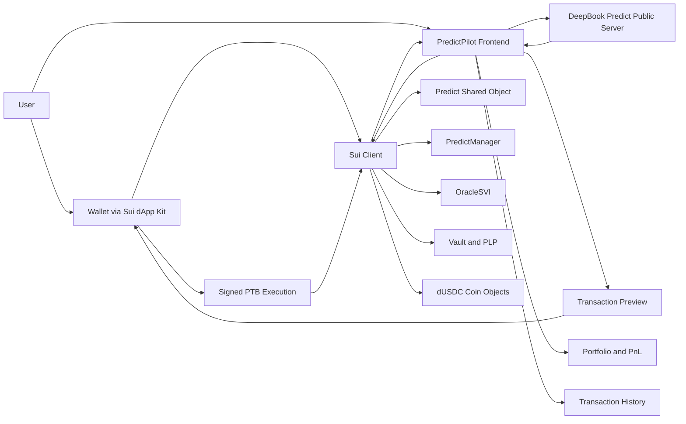

# PredictPilot

**DeepBook Predict intelligence and execution terminal for Sui Overflow 2026**

## Overview

### Hackathon context

PredictPilot is a DeepBook-focused submission for **Sui Overflow 2026**, the global Sui hackathon. The official hackathon site lists a **Specialized Track: DeepBook** for projects that build **trading or liquidity applications powered by DeepBook’s on-chain orderbook**. As of June 16, 2026, the Overflow site also shows a **May–August 2026** event window, but some timeline text on the same page still references older 2025 dates, so final submission timing should be re-checked against the latest handbook before submitting. citeturn14view0turn16search1

### Project status

**Status:** Active hackathon build  
**README status:** Draft intended to become the public repository `README.md` once the implementation is finalized.

### One-line description

PredictPilot is a **risk-aware trading and liquidity terminal** for **DeepBook Predict on Sui Testnet**, combining render-ready market intelligence with **wallet-connected PTB execution** for binary positions, vertical ranges, and vault liquidity flows. citeturn0search1turn6view0turn12view3

### Short product summary

DeepBook Predict is an expiry-based prediction market protocol on Sui. It supports **binary positions**, **vertical ranges**, and **vault LP participation** through `PLP` shares, all coordinated by a `Predict` shared object, per-user `PredictManager` accounts, and `OracleSVI` market state. PredictPilot turns that protocol surface into a clean operator terminal: discover markets, inspect oracle state and ask bounds, preview mint/redeem or LP actions, sign a transaction, and verify the result on Testnet. citeturn0search1turn2view1turn2view2turn2view3turn2view4

## Why PredictPilot exists

### Problem statement

DeepBook Predict exposes a rich protocol surface, but building a strong user experience requires combining several moving parts:

- render-ready market, vault, and portfolio reads from the **public Predict server**;
- freshness-sensitive oracle updates from **Sui events/checkpoints**;
- authoritative wallet-flow reads from **onchain objects** like `Predict`, `PredictManager`, `OracleSVI`, and quote coin balances. citeturn4search0turn11view0

That means a good frontend cannot be “just an indexer dashboard” and cannot be “just a generic prediction market UI.” It needs to understand protocol-specific objects, risk controls, and executable flows. citeturn11view1turn3view0

### Solution overview

PredictPilot is designed as a **DeepBook Predict execution terminal** with three principles:

1. **Fast reads from the public Predict server** for market discovery, portfolio summaries, vault summaries, and history. citeturn6view0  
2. **Authoritative transaction preparation** using onchain reads plus Sui programmable transaction blocks. PTBs on Sui allow multiple commands, object handling, and coin management in a single transaction. citeturn12view3  
3. **Risk-aware execution** by surfacing oracle freshness, ask bounds, previewed trade amounts, and post-transaction proof such as digest and explorer links. DeepBook Predict explicitly documents global and per-oracle ask bounds, plus a vault exposure check for minting. citeturn11view1turn11view2

### Why PredictPilot

PredictPilot is intentionally built around the protocol’s real primitives instead of around a generic “bet” abstraction:

- **`PredictManager`** is the user account model, and positions/ranges are stored as internal quantities there rather than as separate position NFTs or standalone objects. citeturn2view2turn1search4turn1search8
- **`OracleSVI`** is not a simple price feed; it stores spot, forward, SVI surface parameters, timestamps, activation status, and settlement state. citeturn2view3
- **Vault liquidity** is not a side feature; the Predict vault takes the opposite side of every trade and issues `PLP` LP shares for `supply()` / `withdraw()` flows. citeturn2view4turn3view3turn3view4

### Why DeepBook Predict

DeepBook Predict is interesting because it is not just an order form. It combines:

- protocol-native prediction markets on Sui;
- binary mint/redeem;
- vertical range mint/redeem;
- quote-asset vault liquidity;
- a public server designed for application rendering;
- protocol-level pricing and risk controls. citeturn0search1turn11view1turn6view0

### Why Sui

PredictPilot fits Sui well for two reasons:

- **PTBs** make it practical to assemble wallet-friendly, multi-step execution flows for DeFi-style interactions. citeturn12view3turn1search6
- The current Sui stack is moving toward **gRPC and GraphQL** for reads, simulation, and transaction workflows, with JSON-RPC deprecated in favor of those interfaces by July 2026. citeturn13view0turn13view1turn13view2

### What makes this different from a generic prediction market frontend

PredictPilot is **not** a generic “yes/no market” interface. It is specifically shaped around verified DeepBook Predict protocol concepts:

- `Predict`
- `PredictManager`
- `OracleSVI`
- `MarketKey`
- `RangeKey`
- `PLP`
- protocol ask bounds
- vault exposure and max-payout-aware withdrawal limits. citeturn2view1turn2view2turn2view3turn2view4turn1search4turn11view1

### What makes this different from an analytics-only dashboard

PredictPilot is **not** just a read-only analytics interface. The core product requirement is **execution**:

- create or discover a `PredictManager`;
- deposit quote assets;
- preview trade or LP amounts;
- sign a PTB with a wallet;
- refresh portfolio and transaction history after finality. citeturn3view0turn3view5turn6view0turn12view3

## Product and user experience

### Key features

- Wallet-connected Sui Testnet app with DeepBook Predict-aware network checks. citeturn12view0turn12view2turn12view4
- Market discovery powered by the Predict public server. citeturn6view0
- Oracle panels that surface **live status**, **freshness**, **spot/forward/SVI state**, and **settlement awareness**. citeturn2view3
- Binary trade preview and execution using verified DeepBook Predict functions such as `get_trade_amounts()`, `mint()`, and `redeem()`. citeturn3view0
- Range trade preview and execution using `get_range_trade_amounts()`, `mint_range()`, and `redeem_range()`. citeturn3view0
- Vault LP flows using `supply()` and `withdraw()` with `PLP` share awareness. citeturn3view3turn3view4turn2view4
- Portfolio, PnL, and history surfaces backed by the Predict public server. citeturn6view0
- Transaction preview and digest proof designed for a judge-friendly live demo.  
- Testnet-first architecture with explicit warnings around provisional package IDs and object layouts. citeturn6view0

### MVP features

The MVP target for the hackathon is:

- Connect wallet on Sui Testnet.
- Read market/oracle/vault state.
- Discover or create a `PredictManager`. The verified public function to create one is `create_manager()`. citeturn3view0
- Show `dUSDC` balance and manager summary. Official docs verify the current quote asset as **DeepBook Test USDC**, onchain type `0xe95040085976bfd54a1a07225cd46c8a2b4e8e2b6732f140a0fc49850ba73e1a::dusdc::DUSDC`, decimals `6`, with currency ID `0xf3000dff421833d4bb8ed58fac146d691a3aaba2785aa1989af65a7089ca3e9c`. citeturn6view0
- Preview and execute at least one real binary mint.
- Preview and execute at least one real binary redeem.
- Preview and execute at least one vault supply or withdraw.
- Refresh portfolio, PnL, and transaction history after execution.

### Demo features

The stronger demo path includes:

- Oracle freshness warnings.
- Ask bounds visibility before minting. DeepBook Predict documents both global and tighter per-oracle ask bounds. citeturn11view1turn11view2
- PTB preview before wallet signature.
- Range preview or range execution.
- Vault summary, `PLP` balance, and LP performance view.
- Explorer deep links for transaction digest proof.

### Screenshots

> Replace these placeholders once the UI is finalized.

- `docs/screenshots/dashboard.png` — dashboard / market intelligence
- `docs/screenshots/market-detail.png` — oracle + trade panel
- `docs/screenshots/tx-preview.png` — PTB preview modal
- `docs/screenshots/portfolio.png` — portfolio / PnL / history
- `docs/screenshots/vault.png` — vault summary / `PLP` flows

Example markdown placeholders:

```md


```

### Demo video

- Demo video: `TODO ADD VIDEO URL`
- Live demo: `TODO ADD LIVE DEMO URL`
- Repository: `TODO ADD REPOSITORY URL`

### Main user flows

#### Binary mint flow

1. Connect wallet.
2. Confirm Testnet and quote asset balance.
3. Pick an oracle / strike / side.
4. Read ask bounds and preview via `get_trade_amounts()`.
5. Build PTB and sign.
6. Execute `mint()`.
7. Show digest and refreshed positions. citeturn3view0turn11view2

#### Binary redeem flow

1. Load existing manager positions.
2. Select a binary position.
3. Preview payout.
4. Build PTB and sign.
5. Execute `redeem()` or, if needed for settled positions and allowed by the use case, `redeem_permissionless()`.
6. Refresh manager summary and history. citeturn3view0

#### Range mint flow

1. Select oracle, expiry, lower strike, and higher strike.
2. Preview via `get_range_trade_amounts()`.
3. Execute `mint_range()`.
4. Refresh portfolio state. citeturn3view0turn1search4

#### Range redeem flow

1. Load vertical range quantities from the manager.
2. Preview payout.
3. Execute `redeem_range()`.
4. Refresh positions and history. citeturn3view0turn2view2

#### Vault supply flow

1. Confirm accepted quote asset.
2. Enter supply amount.
3. Preview expected `PLP` outcome.
4. Execute `supply()`.
5. Refresh vault summary and LP balances. citeturn2view4turn3view3

#### Vault withdraw flow

1. Load `PLP` balance and available withdrawal amount.
2. Preview quote asset withdrawal.
3. Execute `withdraw()`.
4. Refresh vault summary and wallet balances. DeepBook Predict notes withdrawals are constrained by available amount after max payout coverage. citeturn3view4turn2view4

#### Portfolio and PnL flow

The Predict public server exposes:

- `GET /managers/:manager_id/summary`
- `GET /managers/:manager_id/positions/summary`
- `GET /managers/:manager_id/pnl?range=ALL` citeturn6view0

#### Transaction history flow

The Predict public server documents history endpoints including:

- `GET /positions/minted`
- `GET /positions/redeemed`
- `GET /ranges/minted`
- `GET /ranges/redeemed`
- `GET /trades/:oracle_id` citeturn6view0

## Architecture and integration

### Architecture overview

DeepBook Predict’s own design guidance recommends splitting reads by purpose:

- **public Predict server** for rendering markets, portfolios, vault summaries, and history;
- **Sui checkpoint/event streams** when a UI needs lower-latency oracle freshness;
- **direct onchain reads** for wallet flows requiring authoritative state. citeturn11view0turn6view0

PredictPilot follows that exact pattern.

### Architecture diagram



### DeepBook Predict integration overview

The current public DeepBook Predict Testnet deployment documented by Sui includes:

- Public server: `https://predict-server.testnet.mystenlabs.com`
- Predict package: `0xf5ea2b3749c65d6e56507cc35388719aadb28f9cab873696a2f8687f5c785138`
- Predict registry: `0x43af14fed5480c20ff77e2263d5f794c35b9fab7e2212903127062f4fe2a6e64`
- Predict object: `0xc8736204d12f0a7277c86388a68bf8a194b0a14c5538ad13f22cbd8e2a38028a`
- Current quote asset: `0xe95040085976bfd54a1a07225cd46c8a2b4e8e2b6732f140a0fc49850ba73e1a::dusdc::DUSDC`
- `PLP` coin type: `0xf5ea2b3749c65d6e56507cc35388719aadb28f9cab873696a2f8687f5c785138::plp::PLP` citeturn6view0

**Important:** the same Sui docs explicitly state that DeepBook Predict is currently documented as a **Testnet integration surface** and that package IDs, object layouts, and entry points may change before Mainnet. PredictPilot must therefore keep these values **config-driven**, not hardcoded into UI logic. citeturn6view0

### Sui PTB integration overview

Sui transactions are built as **programmable transaction blocks**, letting apps combine function calls, coin handling, and object operations inside a single transaction. PredictPilot uses this model for previewable, wallet-signable DeepBook Predict actions. citeturn12view3

### Wallet integration overview

The official Sui dApp Kit provides framework-agnostic core plus React bindings, hooks, and wallet actions. The React getting-started guide also shows a standard pattern using `createDAppKit`, `DAppKitProvider`, and a `ConnectButton`. Auto-connect is enabled by default in wallet connection flows. citeturn12view1turn12view0turn12view2

### dUSDC overview

This README uses **“dUSDC”** as shorthand for the current DeepBook Predict Testnet quote asset. The official onchain asset currently documented by Sui is **DeepBook Test USDC (DUSDC)** with:

- type: `0xe95040085976bfd54a1a07225cd46c8a2b4e8e2b6732f140a0fc49850ba73e1a::dusdc::DUSDC`
- currency ID: `0xf3000dff421833d4bb8ed58fac146d691a3aaba2785aa1989af65a7089ca3e9c`
- decimals: `6` citeturn6view0

### PredictManager overview

`PredictManager` is a **per-user shared account object** that wraps a DeepBook `BalanceManager`, stores quote balances, and tracks binary/range quantities internally. Each user should create one manager and reuse it. Importantly, positions and ranges are **not** separate onchain objects. citeturn2view2turn1search8

### OracleSVI overview

`OracleSVI` is the market-state object for one underlying asset and one expiry. It stores spot price, forward price, SVI parameters, status, timestamps, and settlement price. Mints require a live oracle; redeems can quote against live or settled state. citeturn2view3

### Vault and PLP overview

The vault takes the opposite side of every Predict trade, tracks balance and exposure, and issues `PLP` shares to liquidity providers via `supply()` and `withdraw()`. The docs also note that later suppliers receive shares proportional to current vault value, and withdrawals are restricted by max payout coverage. citeturn2view4turn11view0

### Tech stack

**Verified stack choices from official Sui tooling**

- **React + TypeScript + Vite** via `@mysten/create-dapp` quick start. citeturn12view0
- **Tailwind CSS v4** in the default create-dapp React setup. citeturn12view0
- **Sui dApp Kit** for wallet connectivity and app/client wiring. citeturn12view1turn12view2
- **Sui TypeScript SDK** for transaction building and chain interactions. citeturn7search18turn1search6
- **gRPC / GraphQL-era Sui architecture** instead of building new dependencies on deprecated JSON-RPC. citeturn13view0turn13view1

**Planned local project stack**

- React
- TypeScript
- Vite
- Tailwind CSS
- TanStack Query
- Zod
- Vitest
- Playwright

> If the repository later standardizes on **Next.js** instead of **Vite**, update environment variable prefixes from `VITE_` to `NEXT_PUBLIC_` and adjust start/build commands accordingly. `@mysten/create-dapp` currently documents both React and Next.js paths. citeturn12view0

### Repository structure

Proposed structure for the public repo:

```text
.
├─ src/
│  ├─ app/
│  ├─ components/
│  ├─ config/
│  ├─ features/
│  │  ├─ dashboard/
│  │  ├─ markets/
│  │  ├─ portfolio/
│  │  ├─ predict-manager/
│  │  ├─ trade-binary/
│  │  ├─ trade-range/
│  │  └─ vault/
│  ├─ hooks/
│  ├─ integrations/
│  │  └─ deepbook-predict/
│  │     ├─ api/
│  │     ├─ readers/
│  │     ├─ tx/
│  │     └─ schemas/
│  ├─ lib/
│  ├─ stores/
│  ├─ tests/
│  └─ types/
├─ e2e/
├─ docs/
│  ├─ screenshots/
│  └─ diagrams/
├─ public/
└─ README.md
```

## Getting started

### Prerequisites

Minimum expected prerequisites for local development:

- macOS development machine
- Node.js `TODO VERIFY`
- pnpm `TODO VERIFY`
- Sui-compatible wallet implementing the Wallet Standard
- Sui Testnet account
- Testnet SUI for gas
- DeepBook Test USDC (`DUSDC`) for quote-asset flows
- access to the current DeepBook Predict Testnet deployment values from config. citeturn4search5turn12view4turn12view6turn6view0

### macOS setup notes

This project is intended to be hackathon-friendly on macOS. For the full machine bootstrap path, use `ENVIRONMENT_SETUP.md` once it is finalized.

### Installation instructions

Assuming the repository uses the Vite + React shape recommended by the official Sui create-dapp tooling: citeturn12view0

```bash
git clone TODO_ADD_REPOSITORY_URL
cd predictpilot
pnpm install
cp .env.example .env.local
pnpm dev
```

### Environment variable setup

Because DeepBook Predict Testnet values are provisional, environment-driven configuration is mandatory. Official Sui docs explicitly warn that package IDs and object layouts may change before Mainnet. citeturn6view0

### `.env.example`

```bash
# App
VITE_APP_NAME=PredictPilot

# Sui network
VITE_SUI_NETWORK=testnet
VITE_SUI_RPC_URL=https://fullnode.testnet.sui.io:443

# DeepBook Predict public server
VITE_PREDICT_SERVER_URL=https://predict-server.testnet.mystenlabs.com

# Verified DeepBook Predict Testnet deployment values
VITE_PREDICT_PACKAGE_ID=0xf5ea2b3749c65d6e56507cc35388719aadb28f9cab873696a2f8687f5c785138
VITE_PREDICT_REGISTRY_ID=0x43af14fed5480c20ff77e2263d5f794c35b9fab7e2212903127062f4fe2a6e64
VITE_PREDICT_OBJECT_ID=0xc8736204d12f0a7277c86388a68bf8a194b0a14c5538ad13f22cbd8e2a38028a

# Quote asset
VITE_DUSDC_COIN_TYPE=0xe95040085976bfd54a1a07225cd46c8a2b4e8e2b6732f140a0fc49850ba73e1a::dusdc::DUSDC
VITE_DUSDC_CURRENCY_ID=0xf3000dff421833d4bb8ed58fac146d691a3aaba2785aa1989af65a7089ca3e9c

# LP share coin
VITE_PLP_COIN_TYPE=0xf5ea2b3749c65d6e56507cc35388719aadb28f9cab873696a2f8687f5c785138::plp::PLP

# Defaults selected by the UI
VITE_DEFAULT_ORACLE_ID=TODO_VERIFY
VITE_DEFAULT_MANAGER_ID=TODO_VERIFY

# Explorer / links
VITE_EXPLORER_URL=TODO_VERIFY

# Testing
E2E_BASE_URL=http://localhost:5173
PLAYWRIGHT_HEADLESS=true
```

### Running locally

```bash
pnpm dev
```

Open the local app URL printed by Vite, usually:

```text
http://localhost:5173
```

### Running tests

```bash
pnpm test
pnpm test:unit
pnpm test:integration
pnpm test:ptb
```

### Running E2E tests

```bash
pnpm playwright install
pnpm test:e2e
```

### Building for production

```bash
pnpm build
```

### Testnet setup

Official Sui docs describe Testnet as a public staging network for developers, with no-real-value Testnet tokens, and list the public Testnet fullnode URL as `https://fullnode.testnet.sui.io:443`. They also warn that Testnet data can be wiped occasionally and should not be relied on for permanent storage. citeturn12view4

Use a Sui wallet connected to **Testnet**, not Mainnet or Devnet.

### dUSDC setup

The current DeepBook Predict quote asset is the documented `DUSDC` type above. The official contract docs verify the asset identity and decimals, but a standardized public “request dUSDC” flow is **not** clearly documented in the same source. Treat the exact acquisition path as **TODO VERIFY** and record the final steps in `ENVIRONMENT_SETUP.md`. citeturn6view0

### Demo setup

Before recording a demo or presenting live:

- pre-fund the wallet with Testnet SUI for gas; official faucet options are documented by Sui. citeturn12view6
- verify the wallet is on Testnet.
- verify environment config still matches the current DeepBook Predict contract information page. citeturn6view0
- pre-create or verify a working `PredictManager`.
- verify at least one live oracle and one vault summary load correctly.

## Running, verification, and deployment

### Verification steps

A good manual verification path is:

1. Open PredictPilot.
2. Connect wallet.
3. Confirm the app shows **Testnet**.
4. Confirm the app loads market and oracle data from the Predict server.
5. Confirm the app can fetch or create a `PredictManager`.
6. Confirm trade preview works.
7. Execute one small real transaction.
8. Capture the transaction digest.
9. Check the digest in a Testnet explorer.
10. Confirm portfolio and history refresh.  

The official Predict server and contract docs provide the verified endpoints and protocol object model needed for this flow. citeturn6view0turn2view1turn2view2

### Deployment notes

For hackathon demo purposes, public Sui endpoints are acceptable. For anything beyond low-volume demo use, Sui’s RPC best-practices guide warns that public fullnode endpoints are rate-limited to **100 requests per 30 seconds** and should not be relied on for high-traffic production apps. citeturn12view5

PredictPilot should therefore use one of these deployment modes:

- **Hackathon demo mode:** public Testnet fullnode + Predict public server.
- **Serious production mode:** dedicated/shared Sui infrastructure + version-pinned config + deeper observability.

### Production deployment notes

Sui now recommends current data access through **gRPC** and **GraphQL**. JSON-RPC is deprecated, and new development should avoid deep dependency on the old interface. citeturn13view0turn13view1

### Troubleshooting

#### Wallet does not connect

- Confirm a Sui wallet extension is installed and enabled.
- Confirm the wallet implements the Wallet Standard or is supported through dApp Kit discovery. citeturn4search5turn12view1

#### Wrong network

- Switch wallet to **Testnet**.
- Confirm `VITE_SUI_NETWORK=testnet`.
- Confirm `VITE_SUI_RPC_URL=https://fullnode.testnet.sui.io:443`. citeturn12view4

#### Market data loads but execution fails

- Re-check the current DeepBook Predict package/object values from official contract docs.
- Re-check wallet gas balance.
- Re-check whether the oracle is live and not stale.
- Re-check whether the quote asset is accepted by the deployment. Official docs list accepted quote-asset reads under Predict config surfaces. citeturn11view2turn6view0

#### Public RPC is unstable or throttled

- Expect occasional instability on public shared infrastructure, especially during demos.
- If you expect sustained traffic, move to a dedicated/shared provider. citeturn12view5

#### Testnet state looks inconsistent

- Remember that Testnet data can occasionally be wiped and is not permanent storage. citeturn12view4

## Limitations, documentation, and submission

### Known limitations

- DeepBook Predict is currently documented as a **Testnet** integration surface, so package IDs and layouts may change. citeturn6view0
- Public Sui RPC endpoints are rate-limited and unsuitable for serious production load. citeturn12view5
- Testnet data may be reset and is not permanent. citeturn12view4
- dUSDC acquisition flow is not fully documented in the same official contract reference and remains **TODO VERIFY**.
- Exact default oracle IDs, market IDs, and explorer URL conventions remain **TODO VERIFY** for this README draft.
- If the final app uses Next.js instead of Vite, environment variable names and local commands in this draft must be updated.

### `TODO VERIFY`

Before turning this draft into the final public README, verify:

- final repository URL
- final demo URL
- final demo video URL
- final screenshot paths
- final local framework choice: **Vite** vs **Next.js**
- final wallet list to highlight in README
- final `PredictManager` deposit/withdraw helper function names if referenced explicitly
- final default oracle/market IDs used by demos
- final explorer base URL
- final package manager / Node version constraints
- final dUSDC request instructions for judges and testers

### Security notes

- Never hardcode private keys or seed phrases.
- Never commit `.env.local`, wallet secrets, or test private keys.
- Keep protocol IDs in config modules, not spread across UI components.
- Validate all server responses at runtime before rendering or transforming them.
- Treat trade previews as advisory until verified against authoritative chain state immediately before execution.

### Financial risk disclaimer

PredictPilot is a **hackathon demo application** for **Sui Testnet**. Testnet tokens have **no real monetary value**, but the trading and LP flows being modeled are still financial primitives and should be treated carefully from a UX and security perspective. Do not interpret any interface output as financial advice. Sui’s own onboarding docs emphasize that Testnet and Devnet tokens are free development tokens with no real value. citeturn12view6

### Project documentation index

This repository is designed to be documentation-driven. Core docs include:

- `AGENTS.md`
- `PROJECT_VISION.md`
- `MVP_SCOPE.md`
- `PRODUCT_REQUIREMENTS_DOCUMENT.md`
- `TECHNICAL_ARCHITECTURE.md`
- `DEEPBOOK_PREDICT_RESEARCH.md`
- `DEEPBOOK_PREDICT_INTEGRATION_GUIDE.md`
- `PTB_COOKBOOK.md`
- `API_CONTRACTS.md`
- `UI_UX_SPECIFICATION.md`
- `WIREFRAMES.md`
- `TESTING_STRATEGY.md`
- `DEMO_SCRIPT.md`
- `CODEX_BUILD_TASKS.md`
- `ENVIRONMENT_SETUP.md`
- `README.md` (finalized from this draft)

### Hackathon submission checklist

- [ ] Real DeepBook Predict integration is demonstrated.
- [ ] Wallet connection works on Sui Testnet.
- [ ] At least one real transaction is executed on Testnet.
- [ ] Transaction digest is shown in the demo.
- [ ] Portfolio/history refresh after execution is visible.
- [ ] README is updated from draft to final.
- [ ] Demo video URL is added.
- [ ] Live demo URL is added.
- [ ] Screenshots are added.
- [ ] All `TODO VERIFY` items are resolved or explicitly disclosed.
- [ ] Final package/object IDs are checked against the latest official contract info page. citeturn6view0

### Future roadmap

After the hackathon, PredictPilot can grow into:

- richer oracle-surface exploration,
- better scenario analysis for strikes and ranges,
- deeper PnL attribution,
- vault performance comparison views,
- advanced PTB preview and simulation UX,
- alerting around stale oracle or ask-bound changes,
- production-grade RPC and caching strategy.

### Contributors

- **Raj Patil** — `TODO ADD ROLE / LINKS`
- `TODO ADD TEAM MEMBERS`

### License

`TODO ADD LICENSE`

### Acknowledgements

Built with the Sui developer stack and informed by official documentation for:

- **Sui Overflow 2026** citeturn14view0
- **DeepBook Predict** citeturn0search1turn6view0
- **Sui dApp Kit** citeturn12view0turn12view1turn12view2
- **Sui transactions / PTBs** citeturn12view3
- **Sui Testnet / faucet / data access guidance** citeturn12view4turn12view5turn12view6turn13view1turn13view2

### Final judge-facing summary

PredictPilot is a **DeepBook-native execution terminal**, not a generic prediction market skin and not a read-only analytics page. It is built around the actual DeepBook Predict object model — `Predict`, `PredictManager`, `OracleSVI`, the vault, `PLP`, binary and range flows — and it is designed to prove one thing clearly during judging: **a user can understand a DeepBook Predict market, preview risk-aware actions, execute a real Sui Testnet transaction, and immediately verify the result through refreshed portfolio state and transaction proof.** citeturn2view1turn2view2turn2view3turn2view4turn12view3