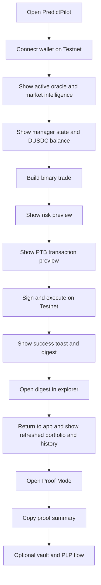

# DEMO_SCRIPT.md

## Demo purpose and positioning

### Demo purpose

This document defines the exact live demo, recorded demo, and fallback demo for PredictPilot, a DeepBook Predict intelligence and execution terminal built for Sui Overflow 2026. The goal is not to show a generic betting UI. The goal is to prove that PredictPilot integrates the current DeepBook Predict Testnet surface, reads render-ready indexed data from the public Predict server, constructs Sui PTBs for real user actions, and updates portfolio state after execution. DeepBook Predict is currently documented as a Testnet integration surface on Sui, with the public integration pinned to the `predict-testnet-4-16` branch and provisional package IDs that may change before Mainnet. citeturn8search0turn8search3turn26view0

### Demo goal

The demo should make a judge believe four things within minutes:

PredictPilot understands the market before it trades, PredictPilot previews risk before signing, PredictPilot executes a real Testnet transaction through a wallet, and PredictPilot refreshes portfolio and history after confirmation. This maps directly to DeepBook Predict’s intended integration model, where apps render from the public Predict server, use direct onchain reads for confirmation-critical wallet flows, and submit real actions through `Predict` and `PredictManager`. citeturn9search0turn11search2turn19view0

### Judge-facing narrative

Use this narrative throughout the demo:

“PredictPilot is not a prediction website. It is a DeepBook Predict terminal. It helps a user discover an active oracle, inspect oracle freshness and ask bounds, build a trade or LP position, preview the PTB before signing, execute on Sui Testnet, and verify the result through the transaction digest and refreshed portfolio state.”

That framing is accurate to the protocol. DeepBook Predict supports expiry-based binary positions and vertical ranges, uses `OracleSVI` for oracle and volatility surface state, stores user balances and quantities inside a reusable `PredictManager`, and uses shared vault liquidity represented by `PLP`. citeturn8search0turn11search1turn11search2turn19view0

### Core value proposition

PredictPilot’s message to judges is simple:

“DeepBook gives builders market primitives. PredictPilot turns those primitives into a serious operator interface.”

That positioning fits the hackathon and the protocol. The Sui Overflow 2026 DeepBook specialized track is for trading or liquidity applications powered by DeepBook’s onchain orderbook, and the Specialized Track pool for DeepBook is listed at $70,000 on the official event page. Predict itself is positioned by Sui as the third composable DeepBook financial primitive, alongside Spot and Margin, designed for binary markets, spreads, leveraged products, and structured instruments. citeturn24view0turn24view1turn24view2turn26view0

### Why this fits the DeepBook track

Say this if a judge asks why this belongs in the DeepBook track:

“Because the core product is a trading and liquidity application on top of DeepBook Predict. We are using DeepBook Predict’s `Predict` object, `PredictManager`, `OracleSVI`, vault, and `PLP` flows, not just visualizing price action. The product executes the actual mint, redeem, supply, and withdraw flows that the protocol exposes.”

This is consistent with the current docs and repository quickstart, which identify `predict::create_manager`, `predict::mint`, `predict::redeem`, `predict::mint_range`, `predict::redeem_range`, `predict::supply`, and `predict::withdraw` as the core transaction paths for apps. citeturn19view0

### Why this is not a generic prediction market frontend

Use this differentiation line:

“Polymarket-style apps stop at a market page. PredictPilot adds oracle diagnostics, volatility surface awareness, manager funding, risk preview, PTB preview, vault participation, PLP visibility, portfolio analytics, and transaction digest proof.”

That distinction is grounded in Predict’s design. Predict is not only for directional binaries. It also supports vertical ranges, shared vault liquidity, quote-asset deposits into a reusable manager, and an indexed data path for market, vault, portfolio, and history surfaces. The Sui launch post also explicitly differentiates Predict from dead-end prediction tokens by emphasizing composability with Spot and Margin. citeturn8search0turn11search2turn19view0turn26view0

### Why this is not just an analytics dashboard

Use this line:

“Everything you see in PredictPilot is there to end in execution. Analytics are not the product. Execution quality is the product.”

This is the right framing for DeepBook Predict because the protocol docs emphasize both render-ready reads from the Predict server and direct onchain reads around write flows that need confirmation-critical state. The protocol is designed for applications that read, preview, then execute. citeturn9search0turn19view0

### Why Sui

Use this line when needed:

“We built this on Sui because the UX needs fast, composable onchain execution. Sui gives us PTBs for rich multi-step transactions, wallet-standard integration, and the performance profile DeepBook was designed around.”

Sui documents PTBs as multi-command programmable transaction blocks built with the TypeScript SDK, and recommends serializing PTBs for wallet handoff. DeepBookV3 is documented as leveraging Sui’s parallel execution and low fees for low-latency trading, while Sui itself is documented as a high-throughput, low-latency, asset-oriented smart contract platform. citeturn0search3turn16search7turn8search2turn22search6

### DeepBook Predict differentiation script

Use this exactly:

“DeepBook Predict is not only binary prediction infrastructure. It is an options-like primitive with binary positions, vertical ranges, oracle-driven pricing, shared vault liquidity, and native composability with Spot and Margin. PredictPilot is the terminal that makes those primitives legible and executable.”

That wording reflects the docs and launch materials. Predict is documented as an expiry-based prediction market protocol with binary positions, vertical ranges, `OracleSVI`, `PredictManager`, and shared `PLP` vault liquidity. The launch post describes it as the third DeepBook primitive that unlocks binary markets, options-like products, leveraged products, and structured instruments. citeturn8search0turn11search2turn26view0

## Demo prerequisites and setup

### Demo prerequisites

Freeze these items before the final live demo or recording:

* A working PredictPilot build on Sui Testnet
* One funded Testnet wallet with enough SUI for gas
* If possible, a second backup wallet
* A verified DeepBook Predict Testnet environment
* One preselected active oracle and one backup oracle
* A preselected binary strike and one fallback strike
* A preselected range band and one fallback range
* A preselected LP amount for the vault flow
* At least one completed historical transaction in the same wallet so the history screen is visibly non-empty

DeepBook Predict is currently documented for Sui Testnet and recommends builders request Predict Testnet tokens, including DUSDC and other assets, through the project’s token request flow. Sui also documents Testnet faucet usage for SUI balances, which you need for gas. citeturn8search0turn7search1

### Current repository demo status

The app now includes the terminal shell, market/oracle/portfolio/vault/history pages, strategy builder, risk preview, transaction preview, wallet-connected execution wiring for binary, range, and vault flows, honest demo mode, and automated test coverage. The final submission package still needs a public deployment URL, demo video URL, selected live oracle/market, screenshots, and real Testnet transaction digests.

Store final proof artifacts in:

* `docs/submission/proof/digests.md`
* `docs/submission/screenshots/`
* `docs/submission/final-form-copy.md`

Do not treat demo-mode fixtures or mocked tests as live Testnet proof.

### Verified integration targets

Use the current official Testnet integration targets below unless a newer official deployment supersedes them. The docs and the repository quickstart match on these identifiers. citeturn8search3turn19view0

```txt
Network: Testnet
Public Predict server: https://predict-server.testnet.mystenlabs.com
Predict package: 0xf5ea2b3749c65d6e56507cc35388719aadb28f9cab873696a2f8687f5c785138
Predict registry: 0x43af14fed5480c20ff77e2263d5f794c35b9fab7e2212903127062f4fe2a6e64
Predict object: 0xc8736204d12f0a7277c86388a68bf8a194b0a14c5538ad13f22cbd8e2a38028a
Current quote asset: 0xe95040085976bfd54a1a07225cd46c8a2b4e8e2b6732f140a0fc49850ba73e1a::dusdc::DUSDC
Sui Testnet fullnode example: https://fullnode.testnet.sui.io:443
```

### Wallet setup checklist

PredictPilot should use Sui dApp Kit for app integration and a Wallet Standard compatible connection flow. Any wallet implementing Wallet Standard is automatically discoverable in dApp Kit, and the current React guide exposes `ConnectButton`, `useCurrentAccount`, and `useCurrentNetwork` for a clean connection UX. Wallet Standard also defines the signing methods `sui:signTransaction` and `sui:signAndExecuteTransaction`, which is exactly the surface PredictPilot needs for demoed execution. citeturn7search3turn15search2turn15search3turn8search4

Wallet setup checklist:

* Confirm the demo wallet opens in the correct browser profile
* Confirm the wallet is on Sui Testnet
* Confirm wallet auto-restore works if previously authorized
* Confirm wallet has visible SUI balance for gas
* Confirm the wallet modal does not expose embarrassing personal accounts
* Rename or bookmark the wallet account if the wallet supports that
* Keep the extension pinned in the browser toolbar for quick rescue
* Prepare one backup wallet if account authorization breaks

### Testnet setup checklist

Testnet setup checklist:

* Confirm PredictPilot points to the current official Predict Testnet package and object
* Confirm the Sui client points to Testnet
* Confirm the app health check for the Predict server passes through `/status`
* Confirm the chosen oracle is active, not stale, and has recent price data
* Confirm portfolio refresh works after at least one completed transaction
* Confirm explorer.sui.io loads Testnet correctly before recording

These checks matter because the docs explicitly recommend using the public Predict server for render-ready data, while using direct onchain reads around wallet flows and transaction confirmation. citeturn9search0turn19view0turn23search2

### dUSDC setup checklist

Use this checklist:

* Acquire the quote asset documented for current Predict Testnet, `DUSDC`
* Fund the wallet with DUSDC before the demo
* Keep a visible pretrade DUSDC balance on the dashboard
* Keep enough extra DUSDC for both binary and LP flows
* If the product supports a balance detail panel, keep it expanded during the first trade

The current Testnet quote asset is documented as `DUSDC`, and the repository quickstart shows manager deposit as the normal pattern before minting or redeeming. The manager deposit flow is implemented in `predict_manager::deposit`. citeturn8search3turn19view0

### PredictManager setup checklist

Use this checklist:

* Check whether the wallet owner already has a manager
* If yes, verify its summary loads correctly
* If no, keep the create-manager flow ready as the first live action
* Save the created `manager_id` into app state
* Make sure the portfolio page visibly references the same manager

This matters because PredictManager is a reusable per-user shared account object, and positions are not separate onchain objects. They live inside the manager. citeturn11search1turn11search2turn19view0

### Market setup checklist

Use this checklist:

* Select one primary oracle: `TODO VERIFY`
* Select one secondary oracle: `TODO VERIFY`
* Select one binary strike near current spot for the most intuitive preview
* Select one backup strike with clearly non-zero quote values
* Select one range band that can be explained in one sentence
* Verify ask bounds load for the chosen oracle
* Verify oracle history endpoints return recent prices and SVI values

The Predict server exposes oracles, oracle state, oracle price history, latest prices, SVI history, latest SVI, and ask-bounds endpoints. citeturn19view0

### OracleSVI setup checklist

Use this checklist:

* Confirm the oracle is `Active`
* Confirm the last update timestamp is recent
* Confirm spot and forward both load
* Confirm SVI parameters load
* Confirm expiry is clearly shown in the UI
* Confirm a stale warning appears if you simulate or force old data in demo mode
* Prepare one line explaining that the first post-expiry price update freezes settlement

This matches the Oracle docs. `OracleSVI` stores spot, forward, SVI params, lifecycle state, last update timestamp, and settlement price. It moves from inactive to active, then pending settlement, then settled when the first post-expiry price update freezes settlement. Mints require a live oracle. citeturn11search5turn11search2turn19view0

### Vault and PLP setup checklist

Use this checklist:

* Confirm vault summary loads
* Confirm current vault performance chart loads if used
* Confirm current LP share balance is either present or intentionally zero before supply
* Confirm the supply preview shows expected `PLP` output
* Confirm the withdraw preview is available even if not executed live
* Keep one backup screenshot of a successful prior supply transaction

The public server exposes vault summary and vault performance endpoints, and the protocol docs define `predict::supply` and `predict::withdraw` as the liquidity entry points that mint and burn `PLP`. citeturn19view0turn11search2

### Demo account setup

Use one primary demo account with these characteristics:

* Clean wallet name
* Enough SUI for gas
* Enough DUSDC for multiple flows
* One existing manager if you want a smoother first minute
* At least one completed historical transaction
* No distracting unrelated tokens or NFTs on the screen

If you want the strongest first-time-user story, use a fresh wallet with no manager. If you want the safest five-minute video, use a prepared wallet with a manager and small prior history. Both are valid. The safer recorded-demo approach aligns with Devpost and HackerEarth guidance to script the demo path, show the working project quickly, and prepare fallbacks in advance. citeturn13search1turn13search3turn13search0

### Demo data setup

Prepare these data states before recording:

* Non-empty market list
* At least one active oracle
* At least one oracle with visible price history
* At least one manager summary
* At least one position or one LP event in history
* One visible stale-oracle fallback state in demo mode
* One visible rejected trade or invalid-input state in demo mode

### Pre-demo verification checklist

Run this exact checklist 30 minutes before presenting:

* Open PredictPilot and hard refresh once
* Confirm wallet extension is authenticated
* Confirm current network badge says Testnet
* Confirm `/status` returns healthy
* Confirm the chosen oracle still appears in `/predicts/:predict_id/oracles`
* Confirm `/oracles/:oracle_id/state` returns data for the chosen oracle
* Confirm manager summary endpoint loads
* Confirm portfolio and PnL pages load
* Confirm explorer.sui.io opens and is set to Testnet
* Close unrelated tabs
* Silence notifications
* Zoom browser to 100% or 110% depending on readability
* Rehearse the first 30 seconds once out loud

### Live demo flow

The live flow should follow this order:



This sequence matches what hackathon judges need most: fast context, real action, visible proof, then refreshed state. It also reflects Devpost guidance to quickly set the scene, demo the working project, and wrap with impact instead of spending time on setup fluff. citeturn13search1turn13search3

### Proof-first judge path

Use this as the preferred live or recorded story once Proof Mode is implemented:

1. Start on Dashboard or Demo Mode.
2. Open **Best Demo Markets** and choose the recommended active oracle.
3. Open the oracle health audit and show lifecycle, freshness, ask-bounds, expiry, and strike validity.
4. Open Strategy Builder and show binary or range payoff/risk.
5. Open the PTB preview and show that simulation is ready before signing.
6. Sign the wallet transaction on Sui Testnet.
7. Show the digest and explorer link.
8. Open Proof Mode and show readiness, execution proof, reconciliation, and source labels.
9. Copy the proof summary for submission notes.
10. Open Portfolio and History only after Proof Mode makes the proof status clear.

Use this line when the proof page is visible:

“This is the judge verification layer. Wallet, chain, Predict server, and local UI state are separated, so the app does not pretend that an indexed refresh is stronger than a confirmed digest.”

### Pending Index fallback line

If the chain transaction is confirmed but portfolio or history has not refreshed yet, say:

“The chain proof is already here: we have the digest and explorer link. The Predict server is low-lag, not zero-lag, so the app labels portfolio/history as `Pending Index` instead of pretending the refresh has completed.”

### Recorded video demo flow

The recorded video should be even tighter.

Current live-build version:

* Start on the dashboard with wallet already connected
* Spend under 20 seconds on the problem statement
* Show oracle freshness, ask bounds, and manager balance
* Execute one binary mint end to end
* Show success, digest, explorer link, portfolio refresh, and history refresh
* If time allows, show one vault supply preview or execution
* Close with why DeepBook Predict plus Sui makes this special

Future PP-061+ version:

* Add Proof Mode after the digest
* Copy the proof summary only after the proof page shows the correct source labels

This approach follows Devpost guidance to show the project in action quickly and spend the limited time on the actual resolution of the problem. citeturn13search1turn13search3

### Backup demo flow

If you lose confidence in live transaction reliability, switch to this backup path:

* Start with the wallet already connected
* Show current active oracle and fresh market intelligence
* Open a previously completed transaction in history
* Explain the exact PTB preview and risk preview your app produces
* Show a recorded clip or backup screenshot of a live mint
* Return to the app and show the resulting updated portfolio and history
* Then show a vault preview, not a live withdraw

HackerEarth’s hackathon guidance explicitly advises hardcoding the demo path and preparing fallbacks because judges reward a clear punchline more than fragile live integrations that never reach the end. citeturn13search0

## Timed demo scripts

### Ten-second opening pitch

Use this exactly:

“PredictPilot is a DeepBook Predict terminal on Sui. It turns live oracle data into executable binary, range, and vault actions with risk preview, PTB preview, and real Testnet proof.”

### Thirty-second opening pitch

Use this exactly:

“PredictPilot helps traders and LPs use DeepBook Predict like a serious market product, not like a toy betting page. We pull indexed market and portfolio data from the Predict server, inspect `OracleSVI` freshness and ask bounds, fund a reusable `PredictManager`, preview the risk and PTB before signing, execute on Sui Testnet, and then show the transaction digest plus refreshed portfolio state.” The protocol docs support this exact flow and identify the public Predict server, `OracleSVI`, `PredictManager`, and wallet-flow direct reads as the recommended integration model. citeturn8search0turn11search2turn19view0

### Sixty-second opening pitch

Use this exactly:

“DeepBook Predict is live on Sui Testnet as the third DeepBook financial primitive, alongside Spot and Margin. It supports binary positions, vertical ranges, oracle-driven pricing, shared vault liquidity, and LP shares called `PLP`. PredictPilot is the frontend terminal that makes those primitives usable. In one flow, I can connect a wallet, inspect a live oracle, create or reuse a `PredictManager`, fund it with DUSDC, preview a trade, review the PTB before signing, execute on Testnet, and verify the result with the transaction digest and updated portfolio. That is the full thesis: intelligence, execution, and proof.” citeturn8search0turn11search2turn19view0turn26view0

### Three-minute demo script

Use the following timestamps and words.

**0:00 to 0:15**

“PredictPilot is a DeepBook Predict intelligence and execution terminal on Sui. Instead of giving users a simple yes-no market, it gives them live oracle state, risk controls, PTB preview, and actual Testnet execution.”

**0:15 to 0:35**

“This dashboard is powered by the current DeepBook Predict Testnet surface. The protocol is live on Testnet, and an app is supposed to combine the public Predict server for render-ready state with direct onchain reads around wallet flows.” citeturn8search0turn9search0turn19view0

**0:35 to 0:55**

“I connect my wallet here. PredictPilot checks that I am on Sui Testnet and surfaces my DUSDC balance plus my `PredictManager` state. Each user reuses one manager, and positions live inside that manager rather than as separate objects.” citeturn15search3turn11search1turn11search2

**0:55 to 1:20**

“Here is an active oracle. PredictPilot shows spot, forward, SVI state, expiry, freshness, and ask bounds. That matters because DeepBook Predict prices from oracle fair values plus spread and utilization controls, and mints require a live oracle.” citeturn11search2turn11search5turn19view0

**1:20 to 1:55**

“I select a binary position, enter my size, and PredictPilot gives me a risk preview before I sign anything. Then we show the PTB transaction preview, so the user sees exactly which action they are about to submit.”

**1:55 to 2:20**

“Now I execute the transaction on Sui Testnet.” Then click execute, sign in wallet, and wait. “This is a real Testnet action, not a mocked button.”

**2:20 to 2:40**

“The app returns a transaction digest. I can open that digest in the Sui Explorer to prove the write happened onchain.” Sui documents explorer-based inspection of transactions and packages, and the official explorer supports browsing transactions and objects. citeturn23search2turn23search10turn23search14

**2:40 to 3:00**

“Back in the app, I show the digest, explorer link, portfolio refresh, and history refresh. This is the key credibility moment: live oracle to preview, preview to signature, signature to digest, digest to updated state. After PP-061 ships, this same moment should end in Proof Mode with Verified or Pending Index source labels.”

### Five-minute demo script

Use this if you get the standard recorded-video slot.

**0:00 to 0:20**

“DeepBook Predict is the new prediction and options-like primitive in the DeepBook stack on Sui. PredictPilot is the operator terminal for it.”

**0:20 to 0:50**

“Predict supports binary positions, vertical ranges, shared vault liquidity, and a per-user `PredictManager`. The public Predict server exposes market, vault, portfolio, PnL, and history endpoints that make a serious trading UI possible.” citeturn8search0turn11search2turn19view0

**0:50 to 1:20**

“Here on the dashboard, I can see live market intelligence. I am not only seeing a market headline. I am seeing the active oracle, time to expiry, freshness, and the manager state that will actually fund the trade.”

**1:20 to 1:50**

“Notice that PredictPilot is on Sui Testnet and my wallet is connected. The app uses Sui wallet-standard integration and executes PTBs through the wallet, which is the recommended Sui app pattern.” citeturn8search4turn15search3turn0search3

**1:50 to 2:35**

“Let’s do a real binary mint. I pick the direction, the strike, and the quantity. Before signing, PredictPilot shows me a risk preview and a PTB preview. I want the user to understand the trade before they authorize it.”

**2:35 to 3:10**

“Now I sign and execute on Testnet. The result is a transaction digest. That proves the exact onchain write.”

**3:10 to 3:40**

“After confirmation, PredictPilot shows the digest, explorer link, and refreshed app state. The digest is the chain proof. Portfolio and history are reconciliation checks. If the Predict server is still catching up, call that pending indexed refresh, not fake success. After PP-061 ships, this section should use Proof Mode to show the same evidence layers in one place.” The repository quickstart explicitly recommends confirming onchain state, then refreshing the indexed endpoints that back the current page, because the server is low-lag, not zero-lag.

**3:40 to 4:20**

“Now I’ll show a second capability: a range position or a vault flow. Predict natively supports vertical ranges, and LPs can supply quote assets into the shared vault to receive `PLP` shares.” citeturn8search0turn11search2turn19view0

**4:20 to 5:00**

“This is why PredictPilot fits the DeepBook track. It is a trading and liquidity application powered by DeepBook primitives, running on Sui, with real Testnet execution and proof.”

### Seven-minute extended demo script

Use this only if you know you have the time.

**Opening**

“Prediction markets are still mostly shallow consumer apps. DeepBook Predict turns them into composable financial primitives. PredictPilot is the execution layer that makes those primitives useful.”

**Explain the stack**

“DeepBook now has Spot, Margin, and Predict. Predict is live on Testnet and is designed for binary markets, spreads, leveraged products, and structured instruments.” citeturn26view0turn20search0turn20search5

**Show dashboard**

“Everything here is written for action. Market cards show oracle freshness, expiry, and route into executable flows.”

**Show oracle screen**

“This oracle view exposes `OracleSVI`: spot, forward, SVI params, status, and settlement lifecycle. The protocol only allows mints against a live oracle, so our UI makes freshness explicit.” citeturn11search5turn11search2

**Show manager screen**

“This is the user’s `PredictManager`. It is the reusable account that holds deposited quote balances plus binary and range quantities. Predict positions are not separate NFTs or separate objects.” citeturn11search1turn11search2

**Execute binary mint**

Show risk preview, PTB preview, sign, success, digest, explorer verification, portfolio refresh.

**Execute binary redeem or show preview**

“This matters because a serious terminal must show both open and close flows, not just open-interest cosmetics.”

**Show range flow**

“Predict supports vertical ranges keyed by lower and higher strikes. That gives us more expressive products than plain up-down markets.” citeturn11search2turn19view0

**Show vault flow**

“LPs supply accepted quote assets into the shared vault and receive `PLP`. PredictPilot treats traders and LPs as first-class users in the same interface.” citeturn11search2turn19view0

**Close**

“PredictPilot proves that DeepBook Predict can be surfaced as a professional execution experience on Sui, with real wallet actions, real Testnet transactions, and real post-trade state.”

## Screen-by-screen runbook and demo paths

### Judge walkthrough flow

Use this route for a first-time judge.

Current live-build path:

Dashboard → Wallet connect → Market intelligence → Oracle detail → Manager funding or manager discovery → Binary trade builder → Risk preview → PTB preview → Wallet signature → Success and digest → Portfolio refresh → History row → Optional vault screen.

Future PP-061+ path:

Dashboard → Best Demo Markets → Oracle Health Audit → Manager funding or manager discovery → Binary trade builder → Payoff/Risk preview → PTB preview → Wallet signature → Success and digest → Proof Mode → Portfolio refresh → History row → Optional vault screen.

This sequence follows the principle that the strongest demos set context briefly, spend most of the time in the working product, and finish by showing impact and proof. citeturn13search1turn13search0

### Screen-by-screen demo plan

#### Dashboard

**What to say**

“PredictPilot starts by showing decision context, not just market slogans. I can immediately see active markets, oracle freshness, and whether I am ready to trade.”

**What to click**

Click `Connect Wallet` if disconnected. If already connected, click the primary active market or `Open Intelligence`.

**What judges should notice**

* Network badge says `Testnet`
* Wallet state is obvious
* DUSDC balance is visible
* There is a clean path from read to action

#### Wallet connection

**What to say**

“We use standard Sui wallet integration. Once authorized, the app can read my account state and submit PTBs through the wallet.”

**What to click**

Click `Connect Wallet` → select wallet → approve connection.

**What judges should notice**

* No custom wallet hacks
* Connection is fast
* The selected network becomes visible in the UI

Sui’s current dApp Kit docs show `ConnectButton`, network selection, and transaction execution through the dApp Kit instance. citeturn15search3turn15search5

#### Wrong-network warning

**What to say**

“If the wallet is not on Testnet, PredictPilot blocks execution and tells the user exactly why.”

**What to click**

If demo mode supports it, toggle `Wrong Network` once. Otherwise skip in live mode.

**What judges should notice**

* Safety before action
* The app does not allow accidental submission on the wrong chain

#### Market intelligence screen

**What to say**

“This view is where PredictPilot becomes a terminal. We are pulling indexed market state from the Predict server and translating it into an execution-ready view.”

**What to click**

Click the chosen oracle card.

**What judges should notice**

* Active oracle status
* Expiry
* Spot and forward
* A clear path into a market action

The Predict server is the recommended render backend for market lists and oracle views. The repo quickstart identifies `/predicts/:predict_id/oracles` and `/oracles/:oracle_id/state` as the main starting points. citeturn19view0

#### Oracle status and SVI surface screen

**What to say**

“This is `OracleSVI`, the state object for one underlying and one expiry. It stores spot, forward, volatility-surface parameters, lifecycle status, timestamps, and settlement after expiry. PredictPilot exposes that because tradeability depends on it.” citeturn11search5turn11search2

**What to click**

Click `Show Ask Bounds`, `Show Freshness`, and optionally `Show Surface`.

**What judges should notice**

* Freshness indicator
* Ask bounds
* Expiry
* Settlement behavior or status badge

**SVI surface explanation script**

“SVI stands for the parameterized volatility surface the oracle provides for this market. You do not need to inspect every parameter to trade, but you do need to know whether the oracle and its pricing context are live and fresh.”

#### PredictManager screen

**What to say**

“This is the user’s reusable `PredictManager`. It stores DUSDC balances and position quantities internally. The important design choice here is that positions are not separate objects. They live inside the manager.”

**What to click**

Click `Open Manager`, then `Summary`.

**What judges should notice**

* Manager ID
* Quote balance
* Position summary count
* Portfolio link

**PredictManager explanation script**

“Instead of scattering separate position objects across the account, DeepBook Predict gives each user one reusable manager. That is what PredictPilot centers as the execution account.”

#### dUSDC deposit flow

**What to say**

“If the manager needs funding, I can deposit DUSDC into it before trading. This keeps execution capital explicit.”

**What to click**

Click `Deposit DUSDC` → enter small amount → `Preview Deposit` → `Execute`.

**What judges should notice**

* Preview before execution
* Available wallet DUSDC and resulting manager balance

**dUSDC explanation script**

“DUSDC is the current accepted quote asset for the active Predict Testnet surface. We use it as the quote-denominated base for funding and settlement in this demo.” citeturn8search3turn19view0

#### Binary mint flow

**What to say**

“Now I will open a real binary position. I pick the direction, strike, and size. PredictPilot converts that into a DeepBook Predict mint flow.”

**What to click**

Click `Binary` → choose `UP` or `DOWN` → set strike and quantity → `Preview Trade`.

**What judges should notice**

* Direction
* Strike
* Quantity
* Premium or cost estimate

The repository quickstart identifies `predict::mint<Quote>` as the directional-position entry point, using `Predict`, `PredictManager`, `OracleSVI`, `MarketKey`, quantity, and `Clock`. citeturn19view0

#### Risk preview

**What to say**

“Before the wallet sees anything, PredictPilot shows a risk preview. I want the user to understand the exposure they are creating before they sign.”

**What to click**

Click `Risk Preview`.

**What judges should notice**

* Estimated spend
* Max payout framing
* Oracle freshness
* Any stale-data or invalid-input warning

**Risk preview demo script**

“This preview answers the trader’s first question: what am I risking, what am I buying, and is the oracle state trustworthy enough to proceed?”

#### Transaction preview

**What to say**

“This is the PTB preview. On Sui, user transactions are programmable transaction blocks, so PredictPilot shows the user the exact action category before handoff to the wallet.”

**What to click**

Click `Transaction Preview`.

**What judges should notice**

* Action type: `mint`
* Target manager
* Target oracle
* Quantity and quote asset
* Gas estimate if available
* Network clearly labeled `Testnet`

**PTB explanation script**

“Sui PTBs let us build multi-step user actions as one transaction. PredictPilot previews that action before handing it to the wallet, then the wallet signs and executes it.” PTBs are the official Sui pattern for constructing multi-command transactions, and Sui recommends serializing a PTB for wallet handoff rather than building bytes in app code. citeturn0search3turn16search7

#### Wallet signature and execution

**What to say**

“Now I am signing and executing the PTB on Sui Testnet.”

**What to click**

Click `Execute on Testnet` → approve in wallet.

**What judges should notice**

* Real wallet popup
* No fake loading animation hiding the wallet step
* Clear success or failure path

#### Success, digest, and explorer proof

**What to say**

“The app returns a transaction digest. This is the proof anchor for the action. I can open it in the Sui Explorer to confirm the transaction onchain.”

**What to click**

Click `View Digest` or `Open in Explorer`.

**What judges should notice**

* Digest string is visible
* Explorer page opens on the correct network
* The app is not asking judges to trust it blindly

Sui’s official explorer supports browsing transactions and objects, and Sui documentation repeatedly uses explorers as the inspection surface for balances, objects, and package logic. citeturn23search2turn23search8turn23search10

#### Portfolio and PnL refresh

**What to say**

“After confirmation, PredictPilot refreshes the server-backed portfolio surfaces. This is where the trade becomes a visible position, not just a toast.”

**What to click**

Click `Portfolio` or let the app auto-refresh.

**What judges should notice**

* Updated position appears
* Manager balance changes
* PnL panel updates if available
* No manual page refresh needed

The Predict server exposes manager summary, positions summary, and PnL endpoints, and the repo quickstart explicitly recommends refreshing both authoritative transaction state and indexed server state after writes. citeturn19view0

#### Transaction history screen

**What to say**

“This history row is the operational record of the trade. A professional terminal needs both execution and auditability.”

**What to click**

Click `History` → open latest row.

**What judges should notice**

* Event type
* Time
* Digest
* Linked market or oracle
* Resulting quantity or payout

The Predict server exposes history endpoints for positions minted, positions redeemed, ranges minted, ranges redeemed, LP supplies, LP withdrawals, and oracle trade history. citeturn19view0

#### Binary redeem flow

**What to say**

“To close or realize value, PredictPilot also supports the redeem flow. This is not just an open-position-only demo.”

**What to click**

Click the open position → `Redeem Preview` → `Execute Redeem` if you have enough time and confidence, otherwise stop at preview.

**What judges should notice**

* Close-flow symmetry
* Same preview discipline before signing

The repo quickstart identifies `predict::redeem<Quote>` and `predict::redeem_permissionless<Quote>` for settled positions. citeturn19view0

#### Range mint or range preview

**What to say**

“DeepBook Predict also supports vertical ranges, not only simple directional markets. That is one of the clearest ways this product goes beyond a basic prediction UI.”

**What to click**

Click `Range` → set `Lower Strike` and `Higher Strike` → enter quantity → `Preview Range`.

**What judges should notice**

* Bounded payoff concept
* More expressive instrument design

The docs define vertical ranges keyed by `(oracle_id, expiry, lower_strike, higher_strike)` and the repo quickstart identifies `predict::mint_range<Quote>` and `predict::redeem_range<Quote>` as entry points. citeturn11search2turn19view0

#### Vault and PLP screen

**What to say**

“PredictPilot also serves LPs. The vault takes the opposite side of every Predict trade, and LPs receive `PLP` shares when they supply quote assets.”

**What to click**

Click `Vault` → `Supply Preview` → optional `Execute Supply`.

**What judges should notice**

* LP side is real, not placeholder
* `PLP` is explained
* Vault utilization and value matter

**PLP explanation script**

“`PLP` is the LP share token minted when a user supplies accepted quote assets into the shared Predict vault. It represents a proportional claim on vault value, subject to current vault constraints.” citeturn11search2turn19view0

### Demo path one: first-time judge walkthrough

Use this exact path for live judging booths:

1. Open dashboard
2. One sentence on the problem
3. Connect wallet
4. Open active oracle
5. Explain freshness plus ask bounds
6. Open binary builder
7. Show risk preview
8. Show PTB preview
9. Execute mint
10. Show digest
11. Show refreshed portfolio

### Demo path two: real Testnet binary mint

Use this if you want the strongest proof of execution:

1. Start wallet already connected
2. Open selected oracle `TODO VERIFY`
3. Choose `UP` or `DOWN`
4. Preview risk
5. Preview PTB
6. Execute
7. Show digest
8. Show portfolio delta

### Demo path three: real Testnet binary redeem

Use this if you already opened a position during rehearsal or earlier in the presentation:

1. Open the position from portfolio
2. Click `Redeem Preview`
3. Explain expected quote payout
4. Execute redeem
5. Show updated manager balance
6. Show history row

### Demo path four: range mint or range preview

Use this when you want sophistication without risking a second live write:

1. Open `Range`
2. Explain bounded payoff in one sentence
3. Enter lower and upper strikes
4. Show range preview
5. If stable, execute
6. If not stable, stop at preview and say, “This is the exact flow for vertical ranges.”

### Demo path five: vault and PLP flow

Use this when a judge asks about liquidity or protocol economics:

1. Open `Vault`
2. Show current vault summary
3. Enter supply amount
4. Preview `PLP`
5. Execute or stop at preview
6. Show resulting LP state

### Demo path six: portfolio and PnL refresh

Use this immediately after any successful transaction:

1. Navigate to `Portfolio`
2. Call out updated manager balance
3. Call out new or changed position quantity
4. Open `PnL`
5. Explain that the indexed server is used for render-ready portfolio surfaces

### Demo path seven: transaction history and digest proof

Use this when a judge says “How do I know it really executed?”:

1. Click the newest history row
2. Show digest in app
3. Click `Open in Explorer`
4. Show the explorer page on Testnet
5. Return to the app and show the same trade in history

### How to show real Testnet execution

Real execution must be visible in five places:

* Network badge says `Testnet`
* Wallet popup appears
* A real loading state follows wallet approval
* A transaction digest is returned
* Portfolio and history change afterwards

If any of these five signals is missing, the demo feels simulated.

### How to show transaction digest

Always show the digest in-app first, then optionally open the explorer. Do not only say “the backend succeeded.” The digest is the trust bridge between your UI and the chain. Sui tooling and explorer flows are digest-centric, including replay and transaction inspection. citeturn23search6turn23search2

### How to show post-transaction portfolio refresh

Say this:

“The transaction is confirmed, and now the indexed portfolio surfaces catch up. This is why we separate execution-critical reads from render-ready reads.”

That statement mirrors the protocol integration model documented in the Predict docs and repository quickstart. citeturn9search0turn19view0

### How to show judge confidence signals

The highest-confidence signals are:

* Official Testnet package and object IDs in config
* Live wallet signature
* Visible risk preview before signing
* Visible PTB preview before signing
* Transaction digest after execution
* Explorer verification
* Updated manager summary
* Updated history row
* Optional LP flow

## Failure handling, video package, and final checklist

### Demo failure handling

Use this rule:

Never hide a failure. Reframe it, prove what still works, and move to the next strongest evidence point.

### If wallet fails

Say this:

“The wallet connection state is flaky right now, so I’ll use the already-authorized backup account. The important part is that PredictPilot still shows the exact risk preview, PTB preview, and transaction proof flow.”

Then switch immediately to the backup account.

### If Testnet RPC fails

Say this:

“The Testnet RPC is degraded right now, so I’ll show the exact same action from a recorded successful execution with the transaction digest and resulting portfolio state. The integration path remains the same.”

Then show the backup clip and come back to the live UI.

### If Predict server fails

Say this:

“The indexed render backend is having issues, so I’ll fall back to the last-known oracle and manager state plus a prior successful transaction. The write path still goes through the wallet and the chain.”

If your app supports a degraded mode, show it. If not, move to backup media.

### If oracle data is stale

Say this:

“This is an example of why PredictPilot surfaces freshness as a first-class UX primitive. We refuse to treat stale oracle state like live market state.”

This is faithful to the fact that Tradeability depends on oracle lifecycle and live state. citeturn11search5turn11search2

### If DUSDC is missing

Say this:

“The current manager does not have the quote inventory needed, so I’ll switch to the prepared account to keep the focus on the DeepBook Predict flow.”

### If transaction fails

Say this:

“The value of the terminal is also in making failed execution legible. Here is the transaction preview, the error handling path, and how the user can inspect or retry safely.”

Then show the failure toast, field validation, or rejected wallet state.

### If the app is slow

Say this:

“The app is waiting on indexed refresh, so while that catches up, I’ll show the transaction digest that already proves the onchain write.”

This is another faithful framing because the Predict repo warns that the server is low-lag, not zero-lag, immediately after writes. citeturn19view0

### Backup screenshots or video plan

Prepare three backup assets:

* A 20 to 30 second clip of a successful binary mint with digest
* A screenshot of updated portfolio after that mint
* A screenshot or clip of a successful vault supply flow

Use them only if live execution is at risk, and label them as backup proof. Store public-safe screenshots under `docs/submission/screenshots/` and record matching digests in `docs/submission/proof/digests.md`.

### Final submission video structure

Use this structure for the actual hackathon video:

* 0:00 to 0:10, hook
* 0:10 to 0:25, problem and thesis
* 0:25 to 0:45, explain DeepBook Predict and why this track
* 0:45 to 1:30, dashboard and oracle intelligence
* 1:30 to 2:20, manager plus DUSDC plus trade builder
* 2:20 to 3:05, risk preview plus PTB preview plus wallet signature
* 3:05 to 3:35, digest plus explorer proof
* 3:35 to 4:15, portfolio plus history refresh
* 4:15 to 4:45, vault or range bonus capability
* 4:45 to 5:00, closing pitch

This structure aligns with Devpost’s demo advice to set the scene quickly, show the working project, and close with impact. citeturn13search1turn13search3

### Voiceover script

Use this exact voiceover for a polished five-minute cut:

“PredictPilot is a DeepBook Predict intelligence and execution terminal on Sui. DeepBook Predict is live on Testnet as the third financial primitive in the DeepBook stack, alongside Spot and Margin. It supports binary positions, vertical ranges, shared vault liquidity, and reusable user accounts called PredictManagers. PredictPilot turns that protocol surface into a serious trading workflow. We begin with indexed market and portfolio state from the public Predict server. We inspect an active oracle, including freshness, expiry, and ask bounds. We confirm the user’s DUSDC balance and manager state. Then we build a real binary position, show a risk preview, and show the PTB transaction preview before handing the transaction to the wallet. The user signs and executes on Sui Testnet. PredictPilot returns a transaction digest, which we can verify in the Sui Explorer. Finally, we refresh the portfolio and history, proving the state change from read to action to onchain confirmation. This is not a generic betting interface. It is a DeepBook execution terminal.” citeturn8search0turn11search2turn19view0turn26view0turn23search2

### On-screen captions

Use short captions only:

* “DeepBook Predict on Sui Testnet”
* “Live OracleSVI Freshness”
* “PredictManager and DUSDC Balance”
* “Risk Preview Before Signing”
* “PTB Preview”
* “Real Wallet Execution”
* “Transaction Digest Proof”
* “Portfolio and History Refresh”
* “Vault and PLP Support”

### Final pitch closing

Use this exactly:

“DeepBook gave us the primitive. PredictPilot gave it a terminal. We proved live market intelligence, risk-aware execution, real Sui Testnet writes, transaction digest proof, and refreshed portfolio state. That is why PredictPilot belongs in the DeepBook track.”

### Judge Q&A preparation

Keep answers under 20 seconds unless asked to expand.

### Likely judge questions and strong answers

**What is actually onchain here?**

“The manager, oracle, vault, positions, and transaction are all onchain. The public server is only the indexed read layer for fast page rendering.” citeturn9search0turn11search2

**Are positions NFTs or separate objects?**

“No. Positions and ranges are internal quantities stored inside `PredictManager`.” citeturn11search1turn11search2

**What makes this different from Polymarket clones?**

“We support DeepBook Predict primitives like vertical ranges, shared vault liquidity, `PLP`, oracle diagnostics, and composability with the broader DeepBook stack.” citeturn26view0turn11search2

**Why do you show both risk preview and PTB preview?**

“Because traders need two different assurances: economic understanding and transaction understanding.”

**What is the strongest proof this is real?**

“The wallet signature, the returned Testnet digest, the explorer verification, and the refreshed portfolio.”

**Why Sui instead of another chain?**

“Because the product benefits from PTBs, fast execution, and DeepBook’s native integration on Sui.” citeturn0search3turn8search2turn22search6

**What part is still unfinished?**

“`TODO VERIFY` items are the exact oracle and market selection we freeze for the final recording, plus any optional extra vault or range execution that depends on Testnet stability.”

### Demo recording checklist

Use this before exporting the video:

* Record in 16:9
* Browser zoom set correctly
* Dark theme consistent
* Mouse clicks visible but not exaggerated
* Only one wallet account visible
* Testnet badge visible at least twice
* Digests readable
* Audio normalized
* No dead air during wallet signing
* Backup clip exported separately
* Title card says `PredictPilot`
* End card repeats the one-line thesis

### Final demo checklist

Use this as the last gate before submission:

* Opening pitch under 15 seconds
* One official DeepBook Predict explanation
* One official Sui explanation
* One live or previously recorded verified Testnet action
* Risk preview shown before execution
* PTB preview shown before execution
* Wallet signature shown
* Transaction digest shown
* Portfolio refresh shown
* History row shown
* Digest recorded in `docs/submission/proof/digests.md`
* Screenshot proof stored in `docs/submission/screenshots/`
* DeepBook track fit explained
* No invented package IDs, APIs, or market IDs
* All unresolved values marked `TODO VERIFY`
* Backup assets ready
* Closing pitch memorized

### Final note for execution

For the final recorded submission, prioritize one flawless end-to-end binary mint over multiple fragile actions. Hackathon judges reward clarity, credible proof, and a clean narrative. Devpost specifically recommends setting the scene quickly, demoing the working project, and closing with the long-term value, while HackerEarth emphasizes scripting the demo path and preparing fallbacks. Use that discipline here. citeturn13search1turn13search3turn13search0
