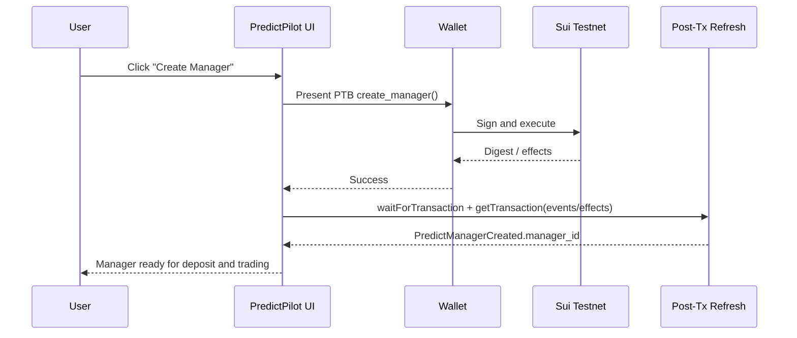
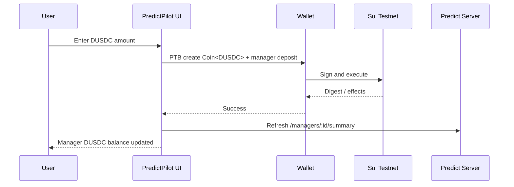
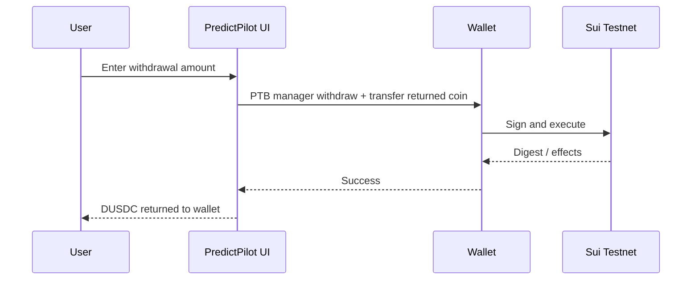
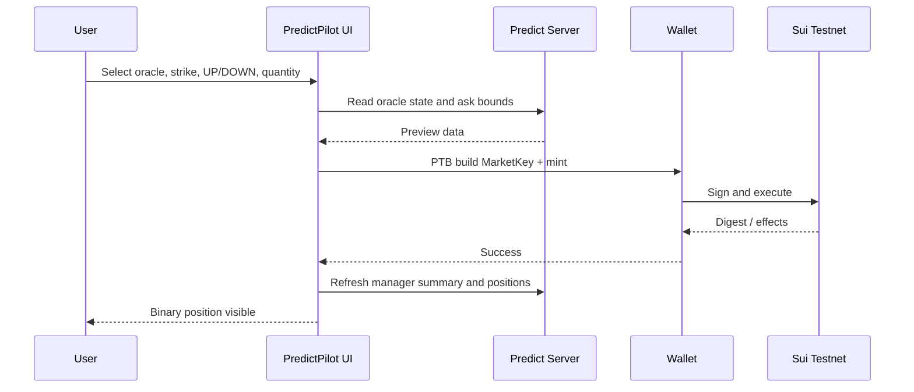
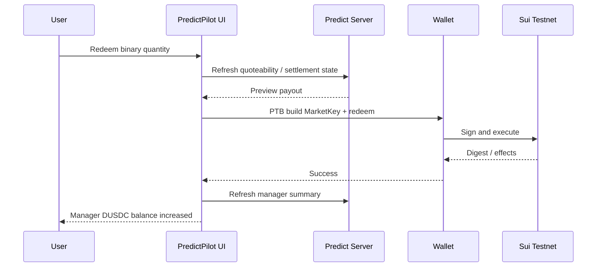
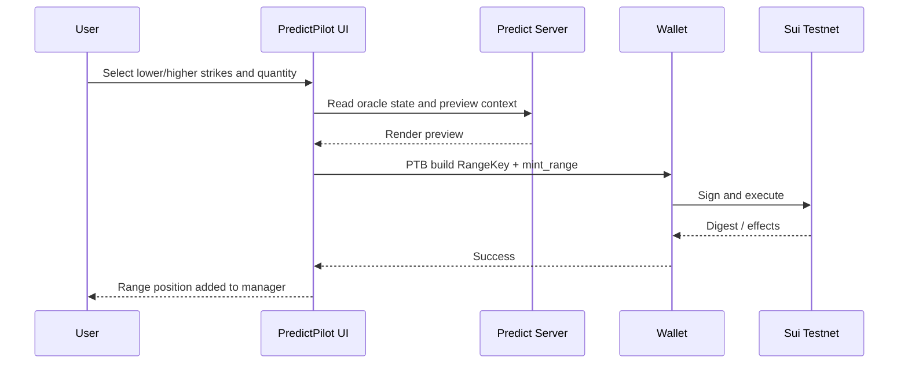
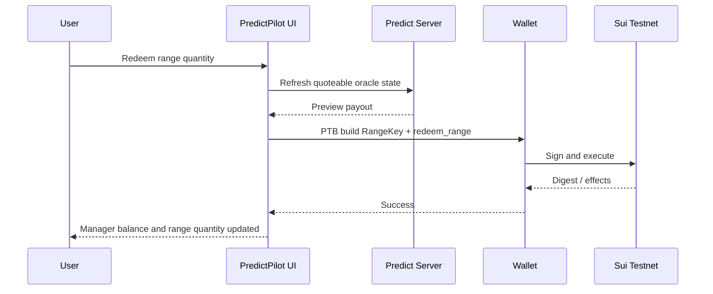
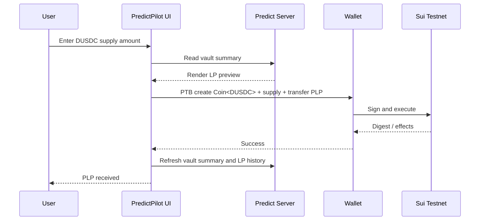
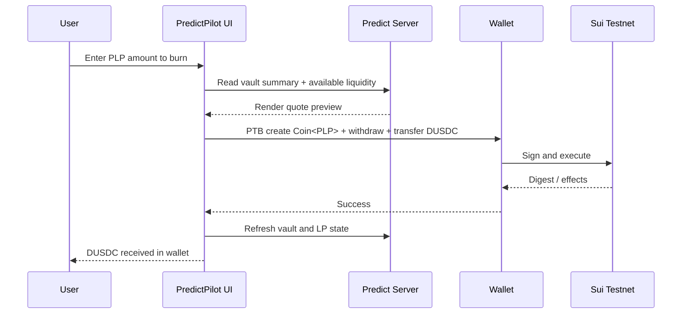

# PTB_COOKBOOK

## Executive summary

PredictPilot should treat PTBs as the heart of the product, not just a transaction wrapper around a UI. DeepBook Predict is currently documented as a **testnet-first**, **provisional** integration surface on Sui, with verified public testnet package and object IDs, a public predict server, and a contract surface centered on the `deepbook_predict::predict`, `predict_manager`, `market_key`, `range_key`, `oracle`, and `vault` modules. The official docs explicitly warn that package IDs, object layouts, and entry points can change before mainnet, so every PTB builder in this repository must be config-driven and version-gated. citeturn10view0turn29view0turn29view1turn29view2turn29view3

For PredictPilot, the winning move is to prove **real execution** across the exact DeepBook Predict lifecycle: create a reusable `PredictManager`, fund it with testnet `DUSDC`, mint and redeem binary positions, mint and redeem vertical ranges, and supply/withdraw vault liquidity for `PLP`. That aligns more closely with the patterns that have already won recognition in the Sui ecosystem, where prior winners included execution-heavy DeFi and trading tools such as **CLMM and DeepBook Market Making Vaulta** and **NAVI arbitrage Bot**, while Sui Overflow 2025 selected 36 winners from 599 submissions. A polished PTB execution layer is therefore more strategically important than a visually complex but shallow dashboard. citeturn4view11turn4view10

The most important product-level constraint in the current public API is this: `predict::create_manager()` returns only an `ID`, while manager funding and trading functions require a mutable `PredictManager` shared object. In practice, that means **manager creation is a standalone first transaction** for MVP reliability. PredictPilot should not assume it can create a manager and immediately use it in the same PTB through the current public surface. That single constraint should shape the demo flow, onboarding flow, retry logic, and E2E test plan. citeturn16view1turn18view6

## Verified integration baseline

The official Sui documentation for DeepBook Predict currently publishes the following public testnet integration values: network `Testnet`, predict server base `https://predict-server.testnet.mystenlabs.com`, predict package `0xf5ea2b3749c65d6e56507cc35388719aadb28f9cab873696a2f8687f5c785138`, predict registry `0x43af14fed5480c20ff77e2263d5f794c35b9fab7e2212903127062f4fe2a6e64`, predict object `0xc8736204d12f0a7277c86388a68bf8a194b0a14c5538ad13f22cbd8e2a38028a`, quote asset type `0xe95040085976bfd54a1a07225cd46c8a2b4e8e2b6732f140a0fc49850ba73e1a::dusdc::DUSDC`, quote asset currency ID `0xf3000dff421833d4bb8ed58fac146d691a3aaba2785aa1989af65a7089ca3e9c`, and `PLP` type `0xf5ea2b3749c65d6e56507cc35388719aadb28f9cab873696a2f8687f5c785138::plp::PLP`. These values come from the `predict-testnet-4-16` branch and must be treated as provisional. citeturn10view0turn10view1

The public server is useful for **render-ready** market, vault, portfolio, and history data. Official endpoints include `/predicts/:predict_id/state`, `/predicts/:predict_id/oracles`, `/oracles/:oracle_id/state`, `/predicts/:predict_id/quote-assets`, `/oracles/:oracle_id/ask-bounds`, `/predicts/:predict_id/vault/summary`, `/managers/:manager_id/summary`, `/managers/:manager_id/positions/summary`, `/managers/:manager_id/pnl?range=ALL`, `/positions/minted`, `/positions/redeemed`, `/ranges/minted`, `/ranges/redeemed`, and `/trades/:oracle_id`. PredictPilot should use these endpoints for UI rendering and post-transaction refresh, but continue to rely on direct onchain objects for signing-critical and wallet-critical state. citeturn10view2turn10view3turn10view4turn10view5

For wallet integration, the official path is Sui dApp Kit plus the Wallet Standard. Wallet Standard wallets are discoverable automatically, and the dApp Kit is the official SDK for app integration. The current docs show `createDAppKit` with a Sui testnet gRPC fullnode at `https://fullnode.testnet.sui.io:443`, wrapped by `DAppKitProvider`, and connection via `ConnectButton` or `connectWallet`. citeturn25view0turn25view1turn25view4turn25view5

The repository should centralize these values in a typed config module and never hardcode them inside page components or button handlers.

```ts
// LOCAL APP CODE — verified values should live in config, never in UI components.
export const deepbookPredictConfig = {
  network: 'testnet',
  fullnodeUrl: 'https://fullnode.testnet.sui.io:443',
  predictServerBaseUrl: 'https://predict-server.testnet.mystenlabs.com',
  predictPackageId:
    '0xf5ea2b3749c65d6e56507cc35388719aadb28f9cab873696a2f8687f5c785138',
  predictRegistryId:
    '0x43af14fed5480c20ff77e2263d5f794c35b9fab7e2212903127062f4fe2a6e64',
  predictObjectId:
    '0xc8736204d12f0a7277c86388a68bf8a194b0a14c5538ad13f22cbd8e2a38028a',
  dusdcType:
    '0xe95040085976bfd54a1a07225cd46c8a2b4e8e2b6732f140a0fc49850ba73e1a::dusdc::DUSDC',
  dusdcCurrencyId:
    '0xf3000dff421833d4bb8ed58fac146d691a3aaba2785aa1989af65a7089ca3e9c',
  plpType:
    '0xf5ea2b3749c65d6e56507cc35388719aadb28f9cab873696a2f8687f5c785138::plp::PLP',
} as const;
```

Recommended PTB integration files for PredictPilot:

```text
src/integrations/deepbook-predict/
  config.ts
  client.ts
  serverApi.ts
  types.ts
  keys.ts
  queryKeys.ts
  refresh.ts
  errors.ts
  resultParsers.ts
  events.ts
  tx/
    shared.ts
    createManager.ts
    depositManager.ts
    withdrawManager.ts
    mintBinary.ts
    redeemBinary.ts
    mintRange.ts
    redeemRange.ts
    supplyVault.ts
    withdrawVault.ts
    simulate.ts
```

This structure is a local recommendation, but it follows the official Sui guidance to build composable transaction modules around the `Transaction` builder and to accept a signer-compatible execution path for wallet usage. citeturn34view0turn26search6

## PTB fundamentals for PredictPilot

Sui PTBs are a sequence of commands that execute **atomically**. If any command fails, the entire PTB rolls back. That is exactly what PredictPilot wants for “fund then trade” compositions such as deposit-plus-mint or supply-plus-transfer-PLP, because partial execution would be unacceptable in a demo or live wallet session. citeturn34view0

In the TypeScript SDK, PredictPilot should build with `Transaction`, use `moveCall` for DeepBook Predict entry points, use `tx.object(...)` for shared objects such as `Predict`, `PredictManager`, and `OracleSVI`, and use `tx.pure.*(...)` for pure values such as `u64`, `bool`, `address`, and `id`. The SDK also explicitly supports passing the result of one command into later commands, which is essential for constructing `MarketKey` or `RangeKey` values inside the same PTB and for handling returned coin objects from vault withdrawal flows. citeturn6view1turn6view2turn34view0turn37search6

The SDK’s `tx.coin({ balance, type })` helper is especially important for PredictPilot because most user actions are funded with non-SUI `DUSDC`. Official docs state that `tx.coin()` draws from address balances and owned coins automatically, and that it works for non-SUI tokens as well. That means PredictPilot can avoid brittle manual coin-object selection logic in the MVP PTB builders. citeturn34view0turn33search9

Gas should usually be left on automatic defaults. Official SDK docs say that when gas is not configured explicitly, the SDK uses the reference gas price, simulates the transaction to estimate budget, and selects payment sources automatically. PredictPilot should only override gas budget or gas payment in exceptional cases, because manual gas tuning adds demo risk. citeturn27view0turn33search12

For preview and smoke-testing, PredictPilot should use `simulateTransaction`, because official docs state that simulation can return `effects`, `balanceChanges`, and `commandResults`, and that `commandResults` are unique to simulation. This is the cleanest official way to validate PTB shape before signing and to build test assertions around expected object mutations. citeturn27view0

After submission, PredictPilot should always wait for indexing before refreshing dependent reads or building follow-on PTBs. Official docs call out `waitForTransaction` specifically to prevent race conditions after execution. This matters a lot because `PredictManager` creation, manager funding, and position flows all mutate shared objects that users will immediately query again in the demo. citeturn6view7turn27view0

DeepBook Predict also has several object-model facts that must shape every PTB builder. `PredictManager` is a per-user **shared** account object that wraps a DeepBook `BalanceManager`; binary and range positions are **not separate onchain objects**; instead, they are quantities stored in tables keyed by `MarketKey` and `RangeKey`. PredictPilot must therefore never model positions as transferable NFTs or standalone objects, and every trade PTB must operate through the manager object. citeturn11search1turn11search2turn29view1turn21view0

## PTB recipes

### Shared builder helpers

The verified public entry points and their parameter shapes are:

- `deepbook_predict::predict::create_manager(ctx)` → returns `ID`. citeturn16view1turn29view0
- `deepbook_predict::predict_manager::deposit<T>(&mut PredictManager, Coin<T>, &TxContext)`. citeturn18view6
- `deepbook_predict::predict_manager::withdraw<T>(&mut PredictManager, amount, &mut TxContext)` → returns `Coin<T>`. citeturn18view6turn18view7
- `deepbook_predict::predict::mint<Quote>(&mut Predict, &mut PredictManager, &OracleSVI, MarketKey, quantity, &Clock, &mut TxContext)`. citeturn16view1turn18view2
- `deepbook_predict::predict::redeem<Quote>(&mut Predict, &mut PredictManager, &OracleSVI, MarketKey, quantity, &Clock, &mut TxContext)`. citeturn16view1turn18view3
- `deepbook_predict::predict::mint_range<Quote>(&mut Predict, &mut PredictManager, &OracleSVI, RangeKey, quantity, &Clock, &mut TxContext)`. citeturn16view1turn18view4
- `deepbook_predict::predict::redeem_range<Quote>(&mut Predict, &mut PredictManager, &OracleSVI, RangeKey, quantity, &Clock, &mut TxContext)`. citeturn16view1turn18view5
- `deepbook_predict::predict::supply<Quote>(&mut Predict, Coin<Quote>, &Clock, &mut TxContext)` → returns `Coin<PLP>`. citeturn18view0
- `deepbook_predict::predict::withdraw<Quote>(&mut Predict, Coin<PLP>, &Clock, &mut TxContext)` → returns `Coin<Quote>`. citeturn18view1turn17view4

The key-building helpers are also verified:

- `deepbook_predict::market_key::up(oracle_id, expiry, strike)` and `down(...)` for binary keys. citeturn21view0turn23view0
- `deepbook_predict::range_key::new(oracle_id, expiry, lower_strike, higher_strike)` for vertical ranges, aborting if lower is not below higher. citeturn21view0turn24view0

```ts
// LOCAL APP CODE — shared helpers used by all builder modules.
import { Transaction } from '@mysten/sui/transactions';
import { deepbookPredictConfig as cfg } from '../config';

export function newPredictTx(): Transaction {
  return new Transaction();
}

export function predictObject(tx: Transaction) {
  return tx.object(cfg.predictObjectId);
}

export function managerObject(tx: Transaction, managerId: string) {
  return tx.object(managerId);
}

export function oracleObject(tx: Transaction, oracleId: string) {
  return tx.object(oracleId);
}

export function clockObject(tx: Transaction) {
  // TODO VERIFY current testnet Clock object usage in your client stack.
  // In most Sui apps this is the framework clock object reference.
  return tx.object('0x6');
}

export function walletDusdcCoin(tx: Transaction, amountBaseUnits: bigint) {
  return tx.coin({ balance: amountBaseUnits, type: cfg.dusdcType });
}
```

### `createManager`

`PredictManager` is meant to be created once and reused, and the current public `create_manager()` function returns only an `ID`. Because deposit and trade functions require the mutable shared manager object itself, PredictPilot should make manager creation its own dedicated PTB and then refresh by event or by manager list before enabling downstream actions. citeturn11search2turn16view1turn18view6



```ts
// LOCAL APP CODE — PTB builder.
import { Transaction } from '@mysten/sui/transactions';
import { deepbookPredictConfig as cfg } from '../config';

export function buildCreateManagerTx() {
  const tx = new Transaction();

  tx.moveCall({
    target: `${cfg.predictPackageId}::predict::create_manager`,
    arguments: [],
  });

  return tx;
}
```

Use `PredictManagerCreated` or the created object list to discover the new manager ID after execution. The source code verifies that `predict_manager::new()` shares the manager object and emits `PredictManagerCreated { manager_id, owner }`. citeturn18view7turn29view1

### `deposit dUSDC to PredictManager`

The official manager funding function is `predict_manager::deposit<T>`, and the manager owner deposits quote assets there before minting positions or ranges. Because it expects `Coin<T>`, PredictPilot should source a wallet `DUSDC` coin with `tx.coin({ balance, type: DUSDC_TYPE })` and pass that directly into the deposit call. citeturn12view0turn18view6turn34view0



```ts
// LOCAL APP CODE — PTB builder.
import { Transaction } from '@mysten/sui/transactions';
import { deepbookPredictConfig as cfg } from '../config';

export function buildDepositManagerTx(args: {
  managerId: string;
  amountBaseUnits: bigint;
}) {
  const tx = new Transaction();
  const coin = tx.coin({ balance: args.amountBaseUnits, type: cfg.dusdcType });

  tx.moveCall({
    target: `${cfg.predictPackageId}::predict_manager::deposit`,
    typeArguments: [cfg.dusdcType],
    arguments: [tx.object(args.managerId), coin],
  });

  return tx;
}
```

### `withdraw dUSDC from PredictManager`

Manager withdrawal returns a `Coin<T>`, so PredictPilot should immediately transfer the returned `Coin<DUSDC>` back to the connected account in the same PTB. This is a local implementation requirement derived from the verified function signature. citeturn18view6turn18view7turn34view0



```ts
// LOCAL APP CODE — PTB builder.
import { Transaction } from '@mysten/sui/transactions';
import { deepbookPredictConfig as cfg } from '../config';

export function buildWithdrawManagerTx(args: {
  managerId: string;
  amountBaseUnits: bigint;
  sender: string;
}) {
  const tx = new Transaction();

  const coin = tx.moveCall({
    target: `${cfg.predictPackageId}::predict_manager::withdraw`,
    typeArguments: [cfg.dusdcType],
    arguments: [tx.object(args.managerId), tx.pure.u64(args.amountBaseUnits)],
  });

  tx.transferObjects([coin], tx.pure.address(args.sender));
  return tx;
}
```

### `mint binary`

Binary positions are keyed by `oracle_id`, `expiry`, `strike`, and direction, and the protocol stores the resulting quantity inside the manager rather than minting a standalone position object. The verified `mint<Quote>` flow checks owner, trading pause, positive quantity, accepted quote asset, matching key, and live-oracle status before withdrawing payment from the manager. PredictPilot should therefore validate these same conditions in the UI before signing. citeturn21view0turn18view2turn19search2



```ts
// LOCAL APP CODE — PTB builder.
import { Transaction } from '@mysten/sui/transactions';
import { deepbookPredictConfig as cfg } from '../config';

export function buildMintBinaryTx(args: {
  managerId: string;
  oracleId: string;
  expiryMs: bigint;
  strike: bigint;
  quantity: bigint;
  isUp: boolean;
}) {
  const tx = new Transaction();

  const key = tx.moveCall({
    target: args.isUp
      ? `${cfg.predictPackageId}::market_key::up`
      : `${cfg.predictPackageId}::market_key::down`,
    arguments: [
      tx.pure.id(args.oracleId),
      tx.pure.u64(args.expiryMs),
      tx.pure.u64(args.strike),
    ],
  });

  tx.moveCall({
    target: `${cfg.predictPackageId}::predict::mint`,
    typeArguments: [cfg.dusdcType],
    arguments: [
      tx.object(cfg.predictObjectId),
      tx.object(args.managerId),
      tx.object(args.oracleId),
      key,
      tx.pure.u64(args.quantity),
      clockObject(tx),
    ],
  });

  return tx;
}
```

For future “one-click fund and mint,” PredictPilot can compose `predict_manager::deposit<DUSDC>` and `predict::mint<DUSDC>` in the same PTB after the manager already exists, because PTBs are atomic and command sequencing is supported. For MVP reliability, however, the normal judge flow should keep deposit and mint as separate user-visible steps unless you have thoroughly tested the combined builder. That batching recommendation is an implementation inference grounded in Sui PTB semantics and the verified function signatures. citeturn34view0turn18view6turn18view2

### `redeem binary`

The verified `redeem<Quote>` flow pays out back into the owner’s manager balance, not directly to the wallet. That means PredictPilot’s UI must clearly explain that a successful redeem updates the manager balance first; a separate manager withdrawal PTB is required to move redeemed `DUSDC` back to the wallet. citeturn9view2turn16view1turn18view3



```ts
// LOCAL APP CODE — PTB builder.
export function buildRedeemBinaryTx(args: {
  managerId: string;
  oracleId: string;
  expiryMs: bigint;
  strike: bigint;
  quantity: bigint;
  isUp: boolean;
}) {
  const tx = new Transaction();

  const key = tx.moveCall({
    target: args.isUp
      ? `${cfg.predictPackageId}::market_key::up`
      : `${cfg.predictPackageId}::market_key::down`,
    arguments: [
      tx.pure.id(args.oracleId),
      tx.pure.u64(args.expiryMs),
      tx.pure.u64(args.strike),
    ],
  });

  tx.moveCall({
    target: `${cfg.predictPackageId}::predict::redeem`,
    typeArguments: [cfg.dusdcType],
    arguments: [
      tx.object(cfg.predictObjectId),
      tx.object(args.managerId),
      tx.object(args.oracleId),
      key,
      tx.pure.u64(args.quantity),
      clockObject(tx),
    ],
  });

  return tx;
}
```

### `mint range`

`RangeKey` identifies a vertical range by `oracle_id`, `expiry`, `lower_strike`, and `higher_strike`, and the official constructor aborts if `lower_strike >= higher_strike`. PredictPilot should enforce that check in form validation before a signature request. citeturn24view0turn24view1turn18view4



```ts
// LOCAL APP CODE — PTB builder.
export function buildMintRangeTx(args: {
  managerId: string;
  oracleId: string;
  expiryMs: bigint;
  lowerStrike: bigint;
  higherStrike: bigint;
  quantity: bigint;
}) {
  const tx = new Transaction();

  const rangeKey = tx.moveCall({
    target: `${cfg.predictPackageId}::range_key::new`,
    arguments: [
      tx.pure.id(args.oracleId),
      tx.pure.u64(args.expiryMs),
      tx.pure.u64(args.lowerStrike),
      tx.pure.u64(args.higherStrike),
    ],
  });

  tx.moveCall({
    target: `${cfg.predictPackageId}::predict::mint_range`,
    typeArguments: [cfg.dusdcType],
    arguments: [
      tx.object(cfg.predictObjectId),
      tx.object(args.managerId),
      tx.object(args.oracleId),
      rangeKey,
      tx.pure.u64(args.quantity),
      clockObject(tx),
    ],
  });

  return tx;
}
```

### `redeem range`

The verified `redeem_range<Quote>` flow removes user range quantity and pays back to the manager. The function also checks matching range key and quoteable oracle state. PredictPilot should therefore block redeem-range buttons when the oracle is not quoteable according to current indexed state. citeturn18view5turn4view6



```ts
// LOCAL APP CODE — PTB builder.
export function buildRedeemRangeTx(args: {
  managerId: string;
  oracleId: string;
  expiryMs: bigint;
  lowerStrike: bigint;
  higherStrike: bigint;
  quantity: bigint;
}) {
  const tx = new Transaction();

  const rangeKey = tx.moveCall({
    target: `${cfg.predictPackageId}::range_key::new`,
    arguments: [
      tx.pure.id(args.oracleId),
      tx.pure.u64(args.expiryMs),
      tx.pure.u64(args.lowerStrike),
      tx.pure.u64(args.higherStrike),
    ],
  });

  tx.moveCall({
    target: `${cfg.predictPackageId}::predict::redeem_range`,
    typeArguments: [cfg.dusdcType],
    arguments: [
      tx.object(cfg.predictObjectId),
      tx.object(args.managerId),
      tx.object(args.oracleId),
      rangeKey,
      tx.pure.u64(args.quantity),
      clockObject(tx),
    ],
  });

  return tx;
}
```

### `supply vault`

The official `supply<Quote>` flow takes a `Coin<Quote>` and returns `Coin<PLP>`. Source docs state that first depositors get shares 1:1 and later depositors receive shares proportional to deposit relative to vault value. PredictPilot should immediately transfer the returned `PLP` coin object back to the sender wallet in the same PTB. citeturn18view0turn36view0



```ts
// LOCAL APP CODE — PTB builder.
export function buildSupplyVaultTx(args: {
  amountBaseUnits: bigint;
  sender: string;
}) {
  const tx = new Transaction();
  const dusdcCoin = tx.coin({ balance: args.amountBaseUnits, type: cfg.dusdcType });

  const plpCoin = tx.moveCall({
    target: `${cfg.predictPackageId}::predict::supply`,
    typeArguments: [cfg.dusdcType],
    arguments: [tx.object(cfg.predictObjectId), dusdcCoin, clockObject(tx)],
  });

  tx.transferObjects([plpCoin], tx.pure.address(args.sender));
  return tx;
}
```

### `withdraw vault`

The official `withdraw<Quote>` flow burns `PLP`, calculates a quote amount from shares and vault value, checks that the requested amount is within currently available liquidity after max-payout coverage, consumes the withdrawal limiter, and returns a `Coin<Quote>`. This is one of the most failure-prone PTBs in the product, so PredictPilot should show explicit “available to withdraw” messaging before the wallet prompt. citeturn18view1turn9view4turn36view3



```ts
// LOCAL APP CODE — PTB builder.
export function buildWithdrawVaultTx(args: {
  plpAmountBaseUnits: bigint;
  sender: string;
}) {
  const tx = new Transaction();
  const plpCoin = tx.coin({ balance: args.plpAmountBaseUnits, type: cfg.plpType });

  const quoteCoin = tx.moveCall({
    target: `${cfg.predictPackageId}::predict::withdraw`,
    typeArguments: [cfg.dusdcType],
    arguments: [tx.object(cfg.predictObjectId), plpCoin, clockObject(tx)],
  });

  tx.transferObjects([quoteCoin], tx.pure.address(args.sender));
  return tx;
}
```

## Reliability, error handling, idempotency, and security

### Error handling and retries

PredictPilot must surface protocol-specific precondition failures before wallet signing whenever possible. Official sources verify that binary mint requires a live oracle, range redeem requires a quoteable oracle, price updates settle the oracle at or after expiry, and settled oracles reject further live updates. That means the UI should refresh oracle state and ask bounds just before building mint or redeem PTBs, not only when the screen first loads. citeturn4view6turn32view1turn32view2

When a transaction executes, PredictPilot should check success or failure explicitly, because official SDK results are discriminated unions and failed transactions expose an error message on status. For wallet flows, the frontend should distinguish at least four classes of failure: wallet rejection, network mismatch, simulation failure, and onchain execution failure. citeturn27view0

For retries, use a strict rule: **never blind-resubmit a PTB after a network timeout until you have checked whether the digest landed**. This is a local safety rule, but it follows directly from Sui’s transaction execution model and from the need to wait for indexing before dependent reads. In practice, PredictPilot should stash the last attempted PTB hash and digest in UI state, query `waitForTransaction` or `getTransaction` on reconnect, and only rebuild if the prior transaction is confirmed absent. citeturn6view7turn27view0

### Idempotency

PredictPilot’s idempotency should be **application-level**, not chain-level. Local recommendations:

- Disable the submit button immediately on wallet prompt open.
- Keep one in-flight PTB per `(account, action, managerId, oracleId, key, quantity)` tuple.
- Store the serialized transaction JSON and the first returned digest for recovery.
- After reconnect, reconcile by digest first, then refresh manager summary and history endpoints.

This is especially important for `createManager`, where duplicate clicks could create multiple managers, and for supply/withdraw flows that return coin objects directly to the wallet. The reason to treat `createManager` as high-risk is verified by the contract surface: the function creates and shares a fresh manager and emits `PredictManagerCreated`. citeturn16view1turn18view7

### Gas and payload hygiene

PredictPilot should prefer default gas settings. If explicit gas is ever necessary for demo stability, set budget only after observing simulation output in your own environment. Official docs confirm that the SDK already derives gas price and gas budget through simulation by default. citeturn27view0turn33search12

Do not mix gas coins with business-logic coins unnecessarily. Official docs note that `tx.gas` is specifically the gas payment coin and that `tx.coin()` works for general token creation. Since PredictPilot’s business asset is `DUSDC`, PTB builders should use `tx.coin({ type: cfg.dusdcType, ... })` for deposits and vault supply, not gas-coin tricks. citeturn6view2turn33search3turn34view0

### Security rules

PredictPilot should never let the frontend invent package IDs, object IDs, or move targets. Every target string must be derived from a config object loaded at app startup. That is especially important because the official docs explicitly mark the current DeepBook Predict deployment as provisional and subject to change before mainnet. citeturn10view0

The app should also treat `PredictManager` as sensitive account state. The verified source shows it wraps a `BalanceManager` and internal deposit/withdraw capabilities, and ownership checks are enforced on deposit, withdraw, mint, redeem, and range flows. PredictPilot must not expose any admin or governance surfaces from `registry.move`, because the official docs describe those as operator and governance functions rather than normal user integrations. citeturn29view1turn18view6turn11search7

### Live events and refresh strategy

When low-latency oracle data matters, PredictPilot can supplement server refreshes with Sui event streaming. Official DeepBook Predict docs specifically call out `oracle::OraclePricesUpdated`, `oracle::OracleSVIUpdated`, `oracle::OracleSettled`, and `oracle::OracleActivated` as the event types to watch when the UI needs fresher oracle state than the indexed server provides. The source code also verifies these exact event structs. citeturn9view6turn30view0turn30view1turn30view2turn30view3

## Testing, E2E coverage, and demo operations

PredictPilot should test every PTB builder at three layers: pure builder tests, simulation smoke tests, and signed wallet-path smoke tests. The official SDK makes this feasible because `simulateTransaction` returns effects, balance changes, and command results before execution. citeturn27view0

Recommended test cases:

```text
Unit builder tests
- buildCreateManagerTx uses predict::create_manager target and no args
- buildDepositManagerTx uses predict_manager::deposit<DUSDC>
- buildWithdrawManagerTx transfers returned Coin<DUSDC> to sender
- buildMintBinaryTx builds MarketKey with up/down correctly
- buildRedeemBinaryTx uses same MarketKey path as mint
- buildMintRangeTx uses range_key::new with ordered strikes
- buildRedeemRangeTx uses range_key::new with same key derivation
- buildSupplyVaultTx transfers returned Coin<PLP> to sender
- buildWithdrawVaultTx transfers returned Coin<DUSDC> to sender

Simulation smoke tests
- createManager sim passes on fresh wallet
- depositManager sim changes manager DUSDC balance
- mintBinary sim mutates manager position and manager balance
- redeemBinary sim increases manager DUSDC balance
- mintRange sim mutates range position quantity
- redeemRange sim updates range quantity and payout
- supplyVault sim returns PLP coin
- withdrawVault sim fails gracefully when amount exceeds available liquidity

E2E smoke tests
- connect wallet on testnet
- create manager once, cache manager id, reload app, rediscover same manager
- deposit then mint a binary position
- redeem part of a binary position
- mint then redeem a range
- supply DUSDC and receive PLP
- withdraw some PLP and receive DUSDC
- post-tx UI refresh after waitForTransaction
- duplicate-click protection on every action
```

For demo mode, use a deterministic checklist:

- one funded wallet on **Sui Testnet** with enough SUI gas and enough `DUSDC`,
- one pre-created manager,
- one active oracle with known expiry and visible ask bounds,
- one small binary mint amount,
- one small range mint amount,
- one small vault supply amount,
- one already-held `PLP` amount for vault withdrawal,
- one post-transaction refresh path that updates both server-derived UI and direct wallet balances.

That checklist follows directly from the official DeepBook Predict user flow and from the public testnet orientation of the current deployment. citeturn11search0turn10view0

For the strongest judge demo, the sequence should be:

```text
connect wallet
→ verify testnet
→ find existing manager or create one
→ deposit DUSDC to manager
→ mint binary
→ redeem binary
→ mint range
→ redeem range
→ supply vault and receive PLP
→ withdraw vault and receive DUSDC
→ show refreshed manager/vault/history state
```

That flow demonstrates the full “intelligence and execution terminal” thesis far better than a static market browser, while staying inside the verified protocol surface. citeturn11search0turn10view3turn10view4turn10view5

## TODO VERIFY and final checklist

### `TODO VERIFY`

- `Clock` object wiring in your specific client path. The official sources verify `&Clock` parameters in Predict and Oracle functions, but your exact frontend helper for passing the framework clock object should still be confirmed in your runtime stack. citeturn18view2turn18view5turn18view0turn32view1
- Whether you want to transfer returned `Coin<DUSDC>` / `Coin<PLP>` objects directly or add an extra conversion-to-balance step for cleaner wallet UX. The contract signatures are verified; the UX choice is local. citeturn18view7turn18view0turn18view1
- The exact include/options surface returned by your chosen wallet execution hook in the current dApp Kit version, because official docs show multiple integration paths and hook documentation is evolving. citeturn26search2turn27view0
- The exact post-execution parser you prefer for manager discovery: parse `PredictManagerCreated` from events or scan created objects by type. Both are plausible from the verified source surface; pick one and test it end to end. citeturn18view7turn29view1
- Whether to ship combined “deposit+mint” and “deposit+supply” PTBs in the judge demo or keep them as two-step flows for maximum reliability. The chain semantics permit composition, but demo choice should be based on your own smoke results. citeturn34view0turn18view6turn18view2

### Final checklist

- [ ] Use only verified testnet package/object/type IDs from config.
- [ ] Keep `createManager` as a dedicated first PTB.
- [ ] Never model positions as standalone objects.
- [ ] Build binary keys with `market_key::up/down`.
- [ ] Build range keys with `range_key::new`.
- [ ] Use `tx.coin({ balance, type: cfg.dusdcType })` for wallet `DUSDC`.
- [ ] Transfer returned `Coin<PLP>` and `Coin<DUSDC>` outputs in the same PTB.
- [ ] Simulate every PTB in tests before relying on it in demo flow.
- [ ] Always call `waitForTransaction` before downstream refresh or next-step PTB.
- [ ] Refresh manager summary, positions summary, vault summary, and relevant history endpoints after success.
- [ ] Disable duplicate submission while a wallet prompt or digest is in flight.
- [ ] Fail closed on wrong network, missing manager, inactive oracle, unquoteable oracle, invalid strikes, or zero amounts.
- [ ] Treat all current DeepBook Predict IDs and layouts as provisional testnet values.
- [ ] Optimize for judge-demo determinism before adding any “one-click” batching features.