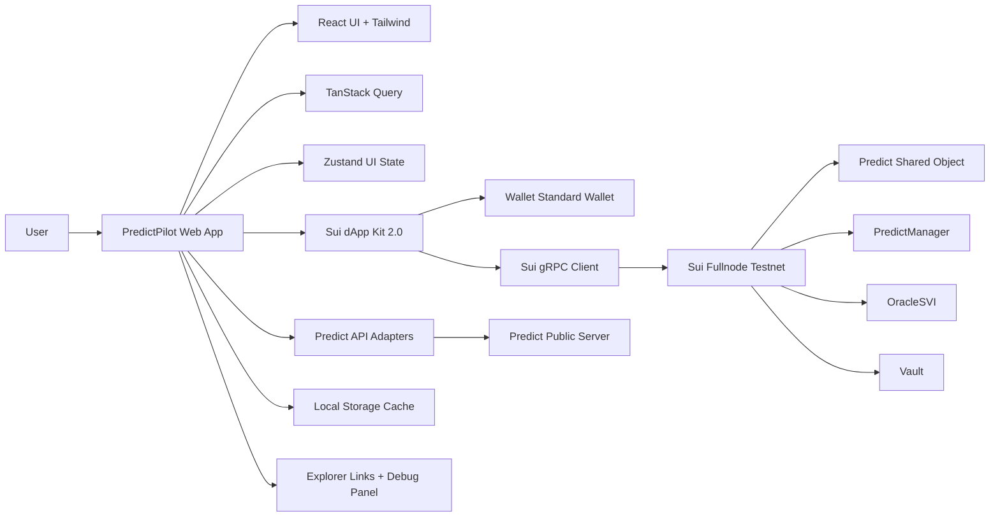
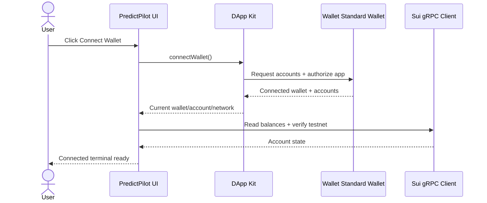
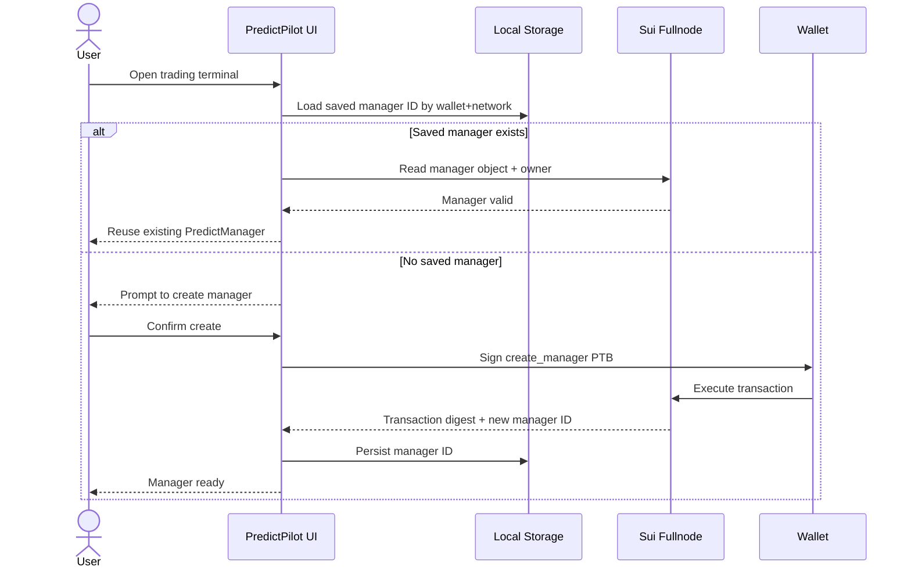
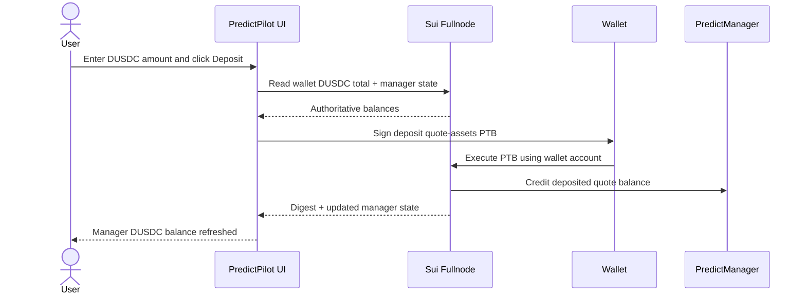
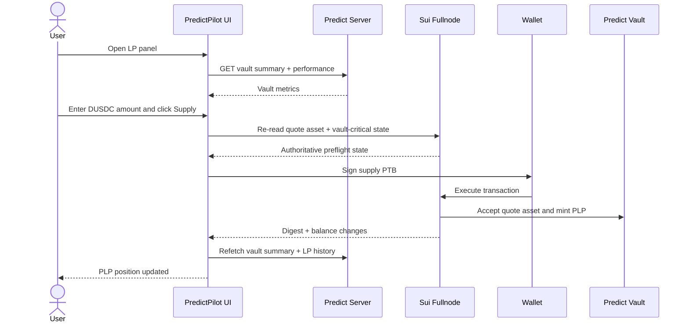
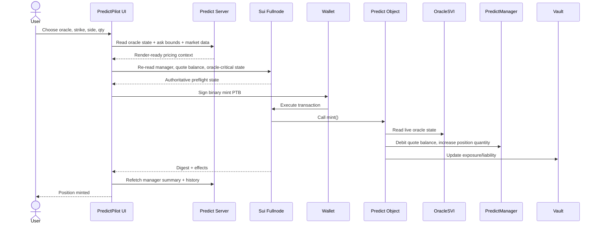
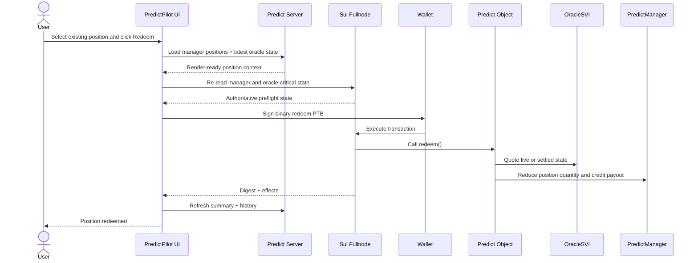

# PredictPilot Technical Architecture

## Architectural foundation

**Architecture summary.** PredictPilot should be a technically real, front-end–first DeepBook Predict terminal built for live Sui Testnet execution. The core product is not a generic prediction-market UI and not an analytics-only dashboard. It is a decision-and-execution surface that lets a connected wallet discover active Predict markets, inspect oracle state and strike structures, preview binary and range trades, deposit DUSDC into a reusable `PredictManager`, execute `mint()` and `redeem()` flows through Sui programmable transaction blocks, and optionally supply liquidity to the shared Predict vault for `PLP`. This aligns with the official DeepBook specialized track, which asks builders to create trading or liquidity applications powered by DeepBook, and with Predict’s documented integration model, which explicitly splits render-ready server reads from authoritative onchain wallet reads. citeturn39view0turn13view1turn15view1turn15view2

**Architecture goals.** The architecture must optimize for five outcomes: first, real Predict Testnet execution; second, a reliable judge demo with minimal hidden dependencies; third, clear separation between rendering data, authoritative wallet state, and transaction-building logic; fourth, configuration-driven protocol identifiers because the official Predict docs state that the current deployment is provisional on Testnet; and fifth, a product surface that looks like a real trading terminal rather than a hackathon toy. That emphasis is consistent with recent Sui Overflow winners, which included DeFi execution products such as Hop Aggregator and Aeon in 2024, infrastructure and smart-account tooling such as Kraken in 2024, and AI-enabled trading/data infrastructure such as RaidenX in 2025. This is an inference from the winners lists and should guide priorities toward real capability plus strong UX. citeturn13view2turn22view0turn21view0

**Architecture non-goals.** PredictPilot should not ship its own onchain protocol during the hackathon, should not expose admin or registry-operator workflows, should not depend on a privileged backend signer, should not hardcode protocol IDs inside React components, should not treat positions as separate NFT-like objects, and should not build broad portfolio support for unrelated Sui DeFi products before the Predict demo is rock-solid. The official Registry docs describe setup, oracle creation, quote-asset management, and pricing/risk controls as operator and governance surfaces that “most app integrations do not call directly,” so those surfaces are out of scope for the primary application. citeturn38view1turn23view2

**System overview.** Predict’s design revolves around four core onchain components: the top-level `Predict` shared object, the per-user shared `PredictManager`, the per-underlying/per-expiry `OracleSVI`, and the shared `Vault`; liquidity providers receive `PLP` when they call `predict::supply`, while traders interact with binary positions and vertical ranges that are stored as quantities inside the `PredictManager` rather than as standalone objects. Applications are expected to render markets, portfolios, vault summaries, and history from the public Predict server, subscribe to checkpoints or events for faster oracle updates when necessary, and read `Predict`, `PredictManager`, `OracleSVI`, and quote-asset state directly onchain for wallet-critical flows. That official split is the architectural backbone of PredictPilot. citeturn15view3turn23view2turn13view4turn15view2

**Verified runtime configuration.** The current official Predict Testnet deployment is documented as provisional and sourced from the `predict-testnet-4-16` branch. PredictPilot must therefore keep every protocol identifier in config, never in UI code, and must block startup if required values are missing or malformed. citeturn14view2turn15view0

| Key | Verified value |
|---|---|
| Network | `testnet` |
| Sui fullnode | `https://fullnode.testnet.sui.io:443` |
| Predict server | `https://predict-server.testnet.mystenlabs.com` |
| Predict package | `0xf5ea2b3749c65d6e56507cc35388719aadb28f9cab873696a2f8687f5c785138` |
| Predict registry | `0x43af14fed5480c20ff77e2263d5f794c35b9fab7e2212903127062f4fe2a6e64` |
| Predict object | `0xc8736204d12f0a7277c86388a68bf8a194b0a14c5538ad13f22cbd8e2a38028a` |
| Current quote asset type | `0xe95040085976bfd54a1a07225cd46c8a2b4e8e2b6732f140a0fc49850ba73e1a::dusdc::DUSDC` |
| DUSDC decimals | `6` |
| DUSDC currency ID | `0xf3000dff421833d4bb8ed58fac146d691a3aaba2785aa1989af65a7089ca3e9c` |
| PLP type | `0xf5ea2b3749c65d6e56507cc35388719aadb28f9cab873696a2f8687f5c785138::plp::PLP` |

All values in the table above come from the current official Predict contract-information page and must be treated as mutable Testnet configuration rather than permanent constants. citeturn14view2turn29view3



The diagram reflects the official Predict guidance to split render-ready reads and authoritative onchain reads, plus the current Sui dApp Kit 2.0 model that uses framework-specific bindings over a core wallet layer and gRPC-style clients. citeturn13view1turn31view0turn31view1turn31view2

**Hackathon note.** The official Overflow 2026 site clearly lists a DeepBook specialized track and a `$70,000 USD` DeepBook pool, but the same page currently contains stale 2025 timeline copy under the 2026 branding. PredictPilot should therefore keep hackathon date fields and submission-calendar automation marked as `TODO VERIFY` until checked against the latest handbook or organizer announcements. citeturn39view0turn39view1turn39view2turn42search0

## Runtime topology and transaction flows

**Frontend architecture.** PredictPilot should use **Vite + React + TypeScript + Tailwind CSS** as the main application shell. The official Sui dApp Kit React quick-start and `create-dapp` path scaffold React + TypeScript + Vite with Tailwind and preconfigured wallet UI, which makes Vite the best hackathon-speed choice. Next.js is supported, but official dApp Kit docs note SSR caveats around wallet-interacting components, so SSR complexity is not worth the trade-off for a demo-first trading terminal that does not need SEO or server rendering. citeturn31view1turn30search5turn33search7

**Backend architecture.** The default backend architecture should be **no dedicated backend**. Predict’s own docs already define the right split: render pages from the official public Predict server and confirm wallet-critical state directly onchain. PredictPilot should therefore be a static client app that talks to the Predict server and Sui fullnode directly. An optional edge adapter may be added later only for response caching, CORS mediation, or a judge-mode snapshot layer, but that adapter must remain stateless, non-custodial, and incapable of signing transactions. citeturn13view1turn15view0

**Data fetching architecture.** The app should divide reads into three planes. The **render plane** uses the Predict server for market lists, oracle metadata, vault summaries, manager summaries, position summaries, PnL, and history. The **freshness plane** uses checkpoint or event subscriptions for near-real-time oracle updates. The **authority plane** uses direct Sui reads immediately before wallet actions and immediately after transaction confirmation. This follows Predict’s official recommendation nearly verbatim and avoids both overloading the chain for page rendering and trusting indexed data for transaction preflight. citeturn13view1turn23view2turn14view0

**Predict server endpoint plan.** PredictPilot should use only documented endpoints for read-heavy surfaces.

| Surface | Endpoint |
|---|---|
| Health | `GET /status` |
| Predict state | `GET /predicts/:predict_id/state` |
| Oracle list | `GET /predicts/:predict_id/oracles` |
| Oracle state | `GET /oracles/:oracle_id/state` |
| Quote assets | `GET /predicts/:predict_id/quote-assets` |
| Ask bounds | `GET /oracles/:oracle_id/ask-bounds` |
| Vault summary | `GET /predicts/:predict_id/vault/summary` |
| Vault performance | `GET /predicts/:predict_id/vault/performance?range=ALL` |
| LP supply history | `GET /lp/supplies` |
| LP withdrawal history | `GET /lp/withdrawals` |
| Manager list | `GET /managers` |
| Manager summary | `GET /managers/:manager_id/summary` |
| Positions summary | `GET /managers/:manager_id/positions/summary` |
| PnL | `GET /managers/:manager_id/pnl?range=ALL` |
| Oracle price history | `GET /oracles/:oracle_id/prices` |
| Oracle SVI history | `GET /oracles/:oracle_id/svi` |
| Mint/redemption history | `GET /positions/minted`, `GET /positions/redeemed`, `GET /ranges/minted`, `GET /ranges/redeemed` |

The endpoint table above is based on the current official public-server section of the Predict contract-information page. Exact query parameters beyond what is shown in that documentation are `TODO VERIFY` and must not be assumed. citeturn15view0

**DeepBook Predict integration architecture.** PredictPilot should model Predict exactly as the protocol is documented, not as a generic AMM or market board. The app integrates a top-level `Predict` object, a reusable per-user `PredictManager`, one or more `OracleSVI` markets, and the shared `Vault`. It should surface binary positions and vertical ranges as manager-backed quantities keyed by `MarketKey` and `RangeKey`, not as separate collectible assets. The UI copy, state model, and query model should stay account-centric: “manager balance,” “binary quantity,” “range quantity,” and “vault share,” because that matches the underlying data model. citeturn15view3turn13view4turn24search9

**Sui wallet integration architecture.** PredictPilot should use **Sui dApp Kit 2.0** with **Wallet Standard** discovery. The current official recommendation is to use `@mysten/dapp-kit-core` and `@mysten/dapp-kit-react` for new projects, because the legacy `@mysten/dapp-kit` package is JSON-RPC–only and deprecated for new work. Any Wallet Standard wallet should appear automatically in the connection UI, and the app can optionally register Slush web-wallet support while still keeping browser-extension wallets first-class. citeturn31view0turn32search1turn32search3turn32search5

**Wallet integration implementation.** The app should create one dApp Kit instance for `testnet`, backed by `SuiGrpcClient`, and wrap the entire app with `DAppKitProvider`. Auto-connect may remain enabled for convenience, but judge mode should include a visible “connected wallet / selected account / selected network” strip so automatic reconnect never obscures which account is live. Connect, disconnect, and switch-account flows should remain entirely within dApp Kit and Wallet Standard abstractions. citeturn31view1turn31view2turn31view4



This wallet flow matches the current dApp Kit 2.0 action model and Wallet Standard discovery pattern. citeturn31view4turn31view3turn32search1

**PTB transaction architecture.** Every state-changing Predict flow should be expressed as a typed Sui `Transaction` object and handed to the wallet for signing and execution. The app should construct PTBs with `tx.object(...)` and `tx.pure(...)`, not prebuilt bytes, because Sui explicitly recommends passing `Transaction` objects to the wallet and using serialization only for wallet-context transfer so the wallet can handle gas logic and coin selection. PredictPilot should therefore keep transaction assembly in client-side builder modules and let the wallet own final signing and execution. citeturn34view1turn34view3turn18view1

**PTB composition rule.** Builders should create small, composable PTB factories: create manager, deposit DUSDC, mint binary, redeem binary, mint range, redeem range, supply vault liquidity, withdraw vault liquidity, and manager quote withdrawal. They should never be assembled ad hoc inside React components. For local scripts or future automated harnesses, `SerialTransactionExecutor` is appropriate for same-sender sequential flows because it avoids `SequenceNumber` issues; a parallel executor should be reserved for explicit tooling, not the main UI. citeturn34view5turn34view6

**Transaction builder architecture.** Because current official Predict docs publish contract information and functions but do not surface a dedicated public Predict SDK page comparable to DeepBookV3 SDK or DeepBook Margin SDK, PredictPilot should build typed local transaction modules on top of `@mysten/sui`. If an official Predict SDK appears later, the builder layer can be swapped underneath stable interfaces. `TODO VERIFY`: whether official source packages or generated bindings should be used directly before implementation freeze. citeturn12search0turn27search0turn27search3

Recommended builder interfaces:

- `buildCreateManagerTx(ctx): Transaction`
- `buildDepositQuoteTx(ctx, amount): Transaction`
- `buildWithdrawQuoteTx(ctx, amount): Transaction`
- `buildMintBinaryTx(ctx, oracleId, expiry, strike, isUp, quantity): Transaction`
- `buildRedeemBinaryTx(ctx, oracleId, expiry, strike, isUp, quantity): Transaction`
- `buildMintRangeTx(ctx, oracleId, expiry, lowerStrike, higherStrike, quantity): Transaction`
- `buildRedeemRangeTx(ctx, oracleId, expiry, lowerStrike, higherStrike, quantity): Transaction`
- `buildSupplyVaultTx(ctx, amount): Transaction`
- `buildWithdrawVaultTx(ctx, plpAmount, quoteType): Transaction`

These are local application interfaces, not claims about onchain target names.

**PredictManager architecture.** `PredictManager` is a per-user shared account object that wraps a DeepBook `BalanceManager`, stores quote balances, and tracks positions internally. Each user should create one manager and reuse it. The manager must therefore be treated as a long-lived account primitive, cached client-side by wallet address and network, and revalidated on app load by reading the object onchain and confirming the owner. The UI must not assume managers can be rediscovered cheaply from server endpoints unless documented filters are available; instead, use local persistence first and creation fallback second. `TODO VERIFY`: whether the public `/managers` endpoint exposes owner filters suitable for deterministic discovery. citeturn13view4turn37view1turn26search5



This flow reflects the documented `create_manager()` entry point and the recommendation to reuse one manager per user. citeturn14view8turn13view4

**dUSDC handling architecture.** Predict currently documents **DUSDC** as the active Testnet quote asset with `6` decimals, and the Predict docs explicitly direct builders to request Testnet tokens through an official token-request form. PredictPilot should normalize every displayed amount through a single decimal-safe formatter, keep DUSDC type metadata in config, and pre-fund the demo wallet in advance of demos rather than relying on live token requests during judging. citeturn14view2turn13view0

**DUSDC funding and balance strategy.** Sui’s address-balances rollout means fungible assets can live partly as coin objects and partly in address balances, and the TypeScript SDK can source from both. PredictPilot should therefore show combined wallet balances, not just coin-object balances, and the DUSDC-deposit flow should use SDK helpers or equivalent logic that can draw from both representations when creating the coin input needed by the manager-deposit PTB. `TODO VERIFY`: the exact best helper for DUSDC deposit in the final SDK revision used by the repo before demo freeze. citeturn36search2turn36search0turn36search3



The documented manager flow says the manager owner deposits quote assets before minting and can later withdraw them. The exact onchain target string for deposit is `TODO VERIFY` from source, but the operation itself is documented. citeturn37view0turn37view1

**OracleSVI market data architecture.** Each `OracleSVI` stores spot price, forward price, SVI surface parameters, activation status, update timestamp, and settlement price. PredictPilot should treat oracle reads as the canonical market-state primitive and derive UI sections around lifecycle: inactive, active, pending settlement, and settled. The app’s market cards and trade forms should prominently show lifecycle state because mints require a live oracle, while redeem paths can quote against live or settled state. For freshness, the app should optionally subscribe to documented oracle events filtered by the current Predict package ID: `oracle::OraclePricesUpdated`, `oracle::OracleSVIUpdated`, `oracle::OracleSettled`, and `oracle::OracleActivated`. citeturn38view0turn14view0turn14view9

**Vault and PLP architecture.** The Vault takes the opposite side of every Predict trade, holds accepted quote assets, tracks mark-to-market liability, tracks maximum payout, and handles LP supply and withdrawal accounting. LP inflows should use `predict::supply`, which mints `PLP`; outflows should use `predict::withdraw`, which burns `PLP` and returns quote assets only when sufficient value remains after max-payout coverage and withdrawal-limiter rules. PredictPilot should therefore model LP actions as a separate vault workspace, not as an afterthought inside the trader ticket. citeturn15view2turn23view2turn23view1



This flow mirrors the documented LP path in Predict: supply accepted quote assets, receive `PLP`, and refresh vault state afterward. citeturn23view1turn15view2turn15view0

**Portfolio architecture.** Portfolio pages should be built around the manager, not the wallet in the abstract. The primary views are manager summary, position summary, PnL range view, quote balance, and recent transaction digests. Since positions are stored as internal quantities, the UI should render them from `PredictManager`-derived summaries and server history rather than searching the chain for separate position objects. Portfolio refresh should be optimistic only at the UI shell; the data body should re-read authoritative manager state and server summaries after every confirmed transaction. citeturn23view2turn15view0turn37view1

**Risk preview architecture.** The risk panel should be notional and execution oriented, not faux-quant theater. Before a mint or redeem, the panel should show oracle lifecycle, settlement status, side, strike or range band, quantity, expected manager balance change, and relevant ask-bound/risk-limit warnings. Predict docs state that pricing uses fair prices plus spread and utilization adjustments, that the protocol can enforce global and tighter per-oracle ask bounds, and that vault exposure is checked against `max_total_exposure_pct`; these facts justify a risk panel that explains rejection reasons and highlights “trade blocked by oracle state / quote asset / ask bounds / exposure” rather than trying to estimate a fantasy VaR model. citeturn23view3turn38view1

**Transaction preview architecture.** Predict has documented preview-style read functions such as `get_trade_amounts()` and `get_range_trade_amounts()`, plus market-state and ask-bound endpoints on the public server. PredictPilot should combine those sources into a preflight drawer that shows touched entities, quote asset used, current manager ID, est. cost or payout, and a hard warning if the preview is stale. `TODO VERIFY`: the exact frontend invocation path for `get_trade_amounts()` and `get_range_trade_amounts()` in the current SDK stack, whether via direct read mode, dev-inspect, generated bindings, or another official client helper. Until that is locked down, the app should still show a server-backed estimate with a clear “authoritative amount confirmed at wallet execution” warning. citeturn15view1turn14view5turn15view0

**Transaction history architecture.** The history view should combine three sources: documented Predict server history endpoints for minted/redeemed positions and LP flows, manager-scoped summary endpoints for open exposure and PnL, and a client-side pending-transaction log keyed by digest for just-submitted actions. That hybrid design avoids waiting for indexer lag to show immediate feedback while still anchoring durable history in official indexed endpoints. citeturn15view0



The mint path follows the documented flow: user selects a market, creates or reuses a `PredictManager`, deposits quote assets, previews amounts, then executes a transaction against a live oracle; `mint()` buys a binary position using quote assets already deposited in the manager. citeturn23view0turn15view1turn38view0



This redemption flow matches the documented `redeem()` behavior, which sells the binary position and deposits the payout back into the owner’s `PredictManager`; the docs also note that `redeem_permissionless()` exists for settled positions. citeturn14view6turn38view0

## Application structure and module design

**Error handling architecture.** Errors should be classified into five buckets: wallet connection errors, network mismatches, protocol-state errors, transport/indexer errors, and post-submit settlement/indexing lag. Every bucket should map to a different UX response. Wallet errors stay in a modal or sticky drawer, protocol-state errors appear inline next to the action button, transport errors trigger stale-data banners, and confirmed-but-not-yet-indexed actions produce a “transaction confirmed, waiting for indexed refresh” status keyed by digest. This matters because Predict explicitly expects apps to mix server data with direct chain reads, which means transient disagreement between sources is normal and must be explained. citeturn13view1turn15view0

**Loading and refresh architecture.** Loading behavior should be split into cold load, hot refresh, and post-mutation refresh. Cold load shows full-page skeletons only on first visit. Hot refresh keeps stale data visible and overlays localized spinners. Post-mutation refresh refetches only affected query groups: manager summary, manager positions, relevant oracle state, and history streams. Predict docs explicitly emphasize refreshing both affected onchain objects and indexed server endpoints after transactions, so broad page reloads should be avoided in favor of targeted invalidation. citeturn23view0turn13view1

**State management architecture.** Use **TanStack Query** for all asynchronous server and chain state, and **Zustand** only for small client-only UI state such as selected oracle, selected strike, trade-form drafts, judge-mode toggles, and dismissed notices. Do not duplicate server responses inside Zustand. dApp Kit already owns wallet connection state; the app should consume that state through hooks rather than mirroring it in a second custom store. This keeps source-of-truth boundaries clean and makes Codex implementation simpler. The choice is consistent with official dApp Kit packaging, which separates wallet state/actions from the broader application. citeturn31view0turn31view2turn31view3

**Caching strategy.** Cache server-render data aggressively but briefly, and cache onchain authority data conservatively. Recommended defaults:

- Market list, quote assets, oracle list: 15–30 seconds.
- Individual oracle state and ask bounds: 5–10 seconds, with optional event-driven refresh.
- Vault summary: 15 seconds.
- Manager summary and manager positions: 5 seconds while connected; manual refetch after writes.
- History endpoints: 15–30 seconds.
- Full onchain manager revalidation: always before a write, always after a confirmed write.

This exactly mirrors Predict’s split between render speed and wallet-critical authority. citeturn13view1turn23view2

**Configuration strategy.** All network and protocol constants should live in one typed configuration layer, validated at startup with Zod and then exposed as immutable runtime config. The config layer owns network enum, fullnode base URL, Predict server base URL, Predict package ID, registry ID, Predict object ID, DUSDC type metadata, and PLP type. React components must never receive raw literals for those values. The config layer must also enforce that the selected app network is `testnet` during the hackathon build, because Predict is currently documented as a Testnet integration surface. citeturn14view2turn35view0

**Environment variable strategy.** The app should use a small public env surface:

```bash
VITE_SUI_NETWORK=testnet
VITE_SUI_GRPC_URL=https://fullnode.testnet.sui.io:443
VITE_PREDICT_SERVER_URL=https://predict-server.testnet.mystenlabs.com
VITE_PREDICT_PACKAGE_ID=0xf5ea2b3749c65d6e56507cc35388719aadb28f9cab873696a2f8687f5c785138
VITE_PREDICT_REGISTRY_ID=0x43af14fed5480c20ff77e2263d5f794c35b9fab7e2212903127062f4fe2a6e64
VITE_PREDICT_OBJECT_ID=0xc8736204d12f0a7277c86388a68bf8a194b0a14c5538ad13f22cbd8e2a38028a
VITE_PREDICT_QUOTE_TYPE=0xe95040085976bfd54a1a07225cd46c8a2b4e8e2b6732f140a0fc49850ba73e1a::dusdc::DUSDC
VITE_PREDICT_QUOTE_DECIMALS=6
VITE_PLP_TYPE=0xf5ea2b3749c65d6e56507cc35388719aadb28f9cab873696a2f8687f5c785138::plp::PLP
VITE_DEFAULT_ORACLE_ID=TODO VERIFY
VITE_ENABLE_JUDGE_MODE=true
```

Only publicly safe identifiers belong here. No admin caps, private keys, seed phrases, sponsor secrets, or custodial credentials are allowed in repo or hosting configuration. The concrete values above come from official Predict and Sui Testnet docs. citeturn14view2turn29view3

**API adapter architecture.** Predict server responses and direct Sui reads should flow through separate adapters. `predictApi/*` normalizes server payloads into render-friendly view models. `suiReads/*` normalizes onchain object reads and balances into authoritative preflight models. `predictMappers/*` then combine both into domain objects such as `TradeTicketModel`, `ManagerPortfolioModel`, and `VaultPanelModel`. This prevents UI components from knowing whether a field came from indexed server state or direct onchain state. citeturn13view1turn15view0

**Type system strategy.** Use strict TypeScript plus Zod-backed decode boundaries. Every external payload should have a runtime schema. Monetary values should remain string-or-bigint until final display. Domain types should distinguish clearly between `DisplayAmount`, `AtomicAmount`, `OracleId`, `ManagerId`, `ObjectId`, `Digest`, `QuoteType`, and `CoinDecimals`. Trade-side types should model binary and range flows separately so the UI cannot accidentally mix `(strike, isUp)` with `(lowerStrike, higherStrike)`. This is especially important because Predict positions and ranges are keyed differently in official docs. citeturn24search9turn23view2

**Repository structure.** Use a single-repo, single-app layout with strong internal domain boundaries.

```text
predictpilot/
  docs/
    AGENTS.md
    PROJECT_VISION.md
    MVP_SCOPE.md
    PRODUCT_REQUIREMENTS_DOCUMENT.md
    TECHNICAL_ARCHITECTURE.md
  public/
  scripts/
    verify-config.ts
    smoke-testnet.ts
  src/
    app/
      providers/
      router/
    components/
      common/
      charts/
      layout/
    features/
      wallet/
      markets/
      trade/
      manager/
      portfolio/
      vault/
      history/
      judge-mode/
    lib/
      config/
      env/
      types/
      zod/
      utils/
      formatting/
      explorer/
      errors/
    integrations/
      predict-api/
      sui-reads/
      tx-builders/
      tx-execution/
      event-stream/
    hooks/
    state/
    styles/
    main.tsx
  tests/
    unit/
    integration/
    e2e/
  package.json
  pnpm-lock.yaml
  tsconfig.json
  vite.config.ts
```

This shape reflects the chosen no-backend architecture, typed transaction-module requirement, and Vite-based React entry point. It is optimized for Codex to navigate quickly. citeturn31view1turn13view1

**Module boundaries.** `features/*` owns domain UI and domain-specific hooks. `integrations/predict-api/*` owns server fetchers and schemas. `integrations/sui-reads/*` owns chain reads, balance lookups, and object validation. `integrations/tx-builders/*` owns PTB factories only. `integrations/tx-execution/*` owns sign-and-execute orchestration, digest handling, and post-confirmation invalidation. `lib/config/*` owns protocol constants. `lib/types/*` owns shared domain types. `components/common/*` must never import protocol IDs directly. This prevents accidental leakage of chain logic into presentational layers.

**Core frontend routes.** The app should ship these routes:

- `/` — terminal home with highlighted markets and recent activity.
- `/markets/:oracleId` — focused market view with oracle status, strikes, range composer, and trade ticket.
- `/portfolio` — manager summary, positions summary, PnL, pending digests.
- `/vault` — vault summary, PLP supply/withdraw flows, LP history.
- `/history` — minted, redeemed, LP supply, LP withdrawal history.
- `/judge-mode` — guided demo flow with one-click checklists and debug panel.
- `/settings` — network, explorer preference, debug toggles, cache reset.

**Core frontend components.** The minimum production component set is: `ConnectWalletPanel`, `NetworkBadge`, `ManagerStatusCard`, `OracleLifecycleBadge`, `MarketStrikeTable`, `BinaryTradeTicket`, `RangeTradeTicket`, `RiskPreviewPanel`, `TransactionPreviewDrawer`, `VaultSummaryCard`, `PlpSupplyForm`, `PlpWithdrawForm`, `PortfolioSummaryCard`, `PositionsTable`, `PendingDigestList`, `HistoryTable`, `JudgeModeStepper`, and `DebugStatePanel`.

**Core hooks.** The main hooks should be: `usePredictConfig`, `useCurrentWalletContext`, `usePredictState`, `usePredictOracles`, `useOracleState`, `useAskBounds`, `useManagerState`, `useManagerPortfolio`, `useVaultSummary`, `useTradePreview`, `useDuscBalance`, `useTransactionAction`, `usePostTxRefresh`, `useOracleLiveTape`, and `useJudgeModeReadiness`.

**Core services.** The main services should be `predictServerClient`, `suiClientFactory`, `managerLocator`, `tradePreviewService`, `tradeExecutionService`, `vaultExecutionService`, `historyService`, `digestTracker`, and `explorerLinkService`.

**Core utility modules.** The app needs `amounts.ts`, `decimals.ts`, `objectIds.ts`, `txLabels.ts`, `queryKeys.ts`, `time.ts`, `oracleStatus.ts`, `managerCache.ts`, `walletErrors.ts`, and `safeParse.ts`.

**External dependencies.** Finalized stack:

- `react`, `react-dom`
- `typescript`
- `vite`
- `tailwindcss`
- `@mysten/dapp-kit-react`
- `@mysten/sui`
- `zod`
- `@tanstack/react-query`
- `zustand`
- `recharts`
- `vitest`
- `playwright`

This stack is intentionally small. The Sui-specific choices are official; the rest are selected for hackathon implementation speed, predictable typing, and testability. citeturn31view0turn31view1turn29view2

## Quality, security, and operations

**Security architecture.** PredictPilot must remain non-custodial end to end. Keys stay in the user’s wallet. The app never stores or transmits seed phrases, private keys, or signing secrets. All write flows must show object IDs, quote type, amount, and intended action before signature. Every transaction path must verify that the wallet is on Testnet, that the current Predict object and package IDs match config, that the manager being mutated belongs to the connected account, and that the quote asset type equals the configured DUSDC type unless future verified quote assets are enabled. Wallet integration should rely on Wallet Standard–compatible wallets through dApp Kit rather than custom injected providers. citeturn32search1turn32search3turn14view2turn13view4

**Protocol-safety rules.** The trading UI must hard-disable actions when the oracle is inactive, when DUSDC is not enabled, when manager quote assets are insufficient, or when confirmed ask-bound / risk-limit signals reject the action. It must not expose registry admin actions such as `create_predict()` or `create_oracle()` in the main app because those are operator surfaces. LP withdrawal must communicate that availability is subject to vault value, max payout coverage, and the withdrawal limiter. citeturn38view0turn38view1turn23view1turn15view2

**Testing architecture.** Testing should use three layers. **Unit tests** verify formatters, schemas, adapters, query-key factories, manager-cache logic, and transaction-builder argument assembly. **Integration tests** run against mocked Predict server responses and mocked Sui read payloads to ensure mapper stability. **E2E smoke tests** cover wallet connection, manager creation UI, DUSDC deposit form behavior, mint preview display, and judge-mode navigation. Since Predict is currently a Testnet integration surface and Testnet data can be wiped, CI should not depend on live Testnet success for every pull request; instead, keep Testnet smoke tests behind a manual or scheduled gate. Use `sui replay` and related debugging tools for digest-level troubleshooting. citeturn13view2turn35view0turn43search1turn43search2

**Local-development testing note.** New dApp Kit docs support a development-only burner wallet, which is useful for local wallet-flow testing, but the production demo should still be validated with at least one real Wallet Standard wallet on Testnet. `TODO VERIFY`: whether a local Predict package deployment or official example environment exists before implementation begins; if not, builder tests should stay focused on typed PTB construction and adapter correctness rather than pretending localnet reproduces Predict. citeturn30search11turn12search0

**Deployment architecture.** Deploy the app as a static Vite build to a preview-friendly platform such as Vercel or Cloudflare Pages. No long-running server should be required. The release pipeline should have three environments: local development, preview deployment, and `main` demo deployment. The preview environment may point at the same public Predict server and Testnet fullnode because official Predict is currently Testnet-only. Build-time validation must fail if required protocol identifiers are absent. This is the simplest architecture consistent with Predict’s official server/onchain split. citeturn13view1turn14view2

**Monitoring and debugging architecture.** The app should include a built-in developer panel that exposes current network, package ID, Predict object ID, selected oracle ID, manager ID, wallet address, last transaction digest, last server refresh time, and `/status` health. Every transaction success toast should include a copyable digest and explorer shortcut. For debugging, maintain a `tx-audit-log` structure in memory and optionally local storage during development, including builder name, user inputs, config snapshot, and resulting digest. When a transaction fails unexpectedly, developers should use Sui’s official replay/debug tooling on the digest rather than guessing from UI behavior. citeturn15view0turn43search1turn43search2

**Demo reliability architecture.** Judge-mode reliability is a first-class architecture concern. The app should open into a controlled path that begins with wallet connection, manager validation, DUSDC availability, one preselected active oracle, a deterministic mint amount, and a deterministic follow-up redeem or vault-supply action. The state machine should surface hard blockers immediately: no wallet, wrong network, no manager, low gas, no DUSDC, oracle inactive, server unhealthy. This is justified both by the DeepBook specialized-track framing and by the pattern from prior winners that successful entries pair real technical substance with a smooth, legible demo. citeturn39view0turn15view0turn22view0turn21view0

**Failure modes and fallback strategy.** The app must define explicit degradation behavior.

- If the **Predict server is unavailable**, fall back to direct onchain reads for the selected trade workflow, but disable broad portfolio/history surfaces and show a “server degraded” banner. This preserves execution credibility while acknowledging missing indexed data. citeturn13view1turn15view0
- If the **Sui fullnode is slow or unavailable**, keep server-rendered pages visible but disable all writes and explain that authoritative preflight could not run. citeturn13view1
- If **Testnet data is wiped or IDs change**, startup config validation should hard-fail and direct the operator to update env vars from official docs. Predict docs explicitly warn that current identifiers are provisional, and Sui docs warn that Testnet data is not guaranteed to persist. citeturn13view2turn35view0
- If **wallet support is missing**, rely on dApp Kit’s Wallet Standard discovery and optionally Slush wallet registration; do not ship wallet-specific custom integrations unless verified as necessary. citeturn32search1turn32search5
- If **manager discovery fails**, prompt the user to create a manager instead of trying uncertain heuristics. The app should prefer deterministic creation over clever but brittle discovery. citeturn14view8turn13view4
- If **preview math disagrees with final execution**, display the digest and post-confirmation delta clearly and mark any pre-execution pricing as indicative. `TODO VERIFY` exact preview invocation path. citeturn15view1turn14view5

## Delivery plan and acceptance

**Architecture decision records.**

**ADR: choose Vite over Next.js.** Official dApp Kit quick-starts center React + TypeScript + Vite + Tailwind, and official Next.js docs note client-side wallet constraints. For a hackathon trading terminal with no SEO requirement, Vite is faster and lower risk. citeturn31view1turn33search7

**ADR: choose dApp Kit 2.0 and Wallet Standard.** New projects should use `@mysten/dapp-kit-core` and `@mysten/dapp-kit-react`; the legacy package is deprecated for new work and limited to deprecated JSON RPC. citeturn31view0

**ADR: choose a no-backend default.** Predict already provides a public server for render-ready market, vault, portfolio, and history data, while wallet-critical state belongs onchain. A backend adds complexity without unlocking core demo value. citeturn13view1turn15view0

**ADR: choose typed local transaction builders.** Current official Predict docs publish contract information and operational functions but do not expose a public Predict SDK page. That makes local typed builders the safest current implementation path. `TODO VERIFY` before freeze. citeturn12search0turn27search0turn27search3

**ADR: choose config-driven protocol IDs.** Predict is documented as a provisional Testnet surface; hardcoding IDs in UI components is unacceptable. citeturn13view2turn14view2

**ADR: choose manager-centric UX.** The manager stores quote balances and position quantities, and positions are not standalone objects. The terminal therefore centers manager state, not object collectibles. citeturn13view4turn23view2

**Implementation order.**

1. Establish Vite app shell, dApp Kit provider, and typed config validation.
2. Implement wallet connection, network badge, and debug panel.
3. Build Predict server adapters for state, oracles, ask bounds, vault summary, manager summary, and history.
4. Build direct Sui reads for manager validation, coin/address balances, and oracle-critical authority checks.
5. Implement manager discovery/create flow and local cache.
6. Implement DUSDC deposit into manager.
7. Implement binary mint flow with transaction preview drawer.
8. Implement binary redeem flow.
9. Implement vault `supply` flow and PLP display.
10. Add targeted post-transaction invalidation and pending-digest tracking.
11. Add portfolio and history pages.
12. Add judge mode, smoke tests, and deployment pipeline.
13. Only after the core flows work, add live oracle tape, range positions, and vault withdrawal.

**Technical acceptance criteria.**

- The app boots only when all required Predict Testnet config values are present and valid.
- A Wallet Standard wallet can connect through dApp Kit 2.0 on Testnet.
- The app can create one reusable `PredictManager` and remember it locally.
- The app can display combined wallet DUSDC state and manager DUSDC state.
- The app can execute a documented quote-asset deposit into the manager. `TODO VERIFY` final target string before coding.
- The app can mint a binary position through a `Transaction` object passed to the wallet.
- The app can redeem a binary position through a `Transaction` object passed to the wallet.
- The app can supply DUSDC to the vault and receive/display PLP.
- After each confirmed transaction, the app refreshes affected onchain state and relevant Predict server views.
- The app never exposes admin registry actions in the main UI.
- The app shows clear error states for wrong network, low gas, missing DUSDC, inactive oracle, and unavailable authority reads.
- Judge mode can complete one deterministic end-to-end flow without manual code edits.

**Final architecture checklist.**

- [ ] Vite + React + TypeScript + Tailwind chosen and wired.
- [ ] dApp Kit 2.0 configured with `SuiGrpcClient` for Testnet.
- [ ] Wallet Standard discovery working.
- [ ] All Predict identifiers live in typed config, not components.
- [ ] Predict server adapters implemented only for documented endpoints.
- [ ] Onchain authority reads implemented for wallet-critical flows.
- [ ] Manager-centric domain model established.
- [ ] Typed PTB builders implemented for create, deposit, mint, redeem, and supply.
- [ ] Preview drawer distinguishes indicative preview from authoritative execution.
- [ ] Judge mode shows system health, wallet, manager, oracle, and digest status.
- [ ] Unit, integration, and smoke tests exist.
- [ ] Deployment is static, non-custodial, and environment-validated.
- [ ] Hackathon dates and any handbook-only rules marked `TODO VERIFY` until rechecked.
- [ ] Demo wallet pre-funded with Testnet SUI and DUSDC from official channels. citeturn13view0turn39view1turn42search0