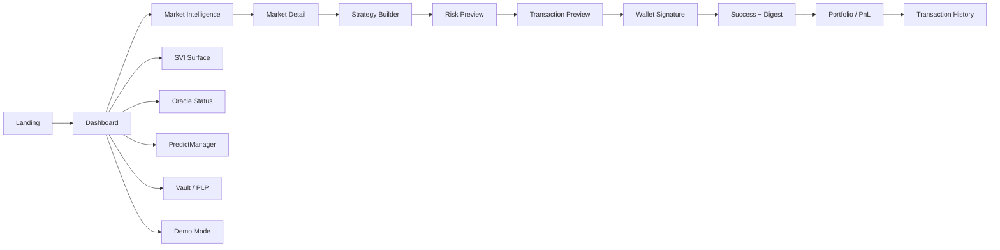
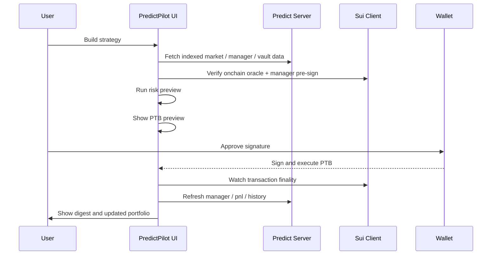
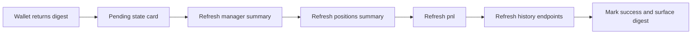

# WIREFRAMES.md

## Purpose and verified anchors

This document defines the local wireframe contract for **PredictPilot**, a DeepBook Predict intelligence and execution terminal built for the Sui Overflow 2026 hackathon. It is grounded in official Sui Overflow guidance, official DeepBook Predict documentation, official Sui transaction and wallet docs, and official Sui / DeepBook branding references. The app must present itself as an **intelligence and execution terminal**, not a generic sportsbook or casual betting page. Sui Overflow 2026 only allows one track per submission, and each track will have dedicated mentors and workshops, so the UI must communicate a singular, polished, track-specific story within a short judge session. citeturn19view0turn19view1turn4search0turn23search1

DeepBook Predict is officially documented as an **expiry-based prediction market protocol on Sui** that supports binary positions, vertical ranges, oracle-driven pricing, shared `PredictManager` accounts, and a vault that issues `PLP` LP shares. The current public integration target is **Sui Testnet**, the current quote asset is **dUSDC**, and applications are explicitly encouraged to combine three data sources: the public Predict server for render-ready pages, live Sui events for low-latency oracle freshness, and direct onchain reads around wallet flows that need authoritative state. citeturn23search0turn15view0turn10view2turn9view2

The wireframes below intentionally emphasize the protocol features that make Predict different from generic prediction products: re-usable `PredictManager` accounts, `OracleSVI` lifecycle and freshness, strike and range construction, ask bounds, vault and `PLP` risk, PTB previews, and visible testnet execution. This is consistent with DeepBook’s official messaging that Spot, Margin, and Predict are three composable primitives with shared liquidity, and with the official DeepBook Predict launch framing that a Predict position is composable infrastructure rather than a dead-end market token. citeturn20view0turn20view1turn24view1turn24view2

### Product experience goal

PredictPilot should feel like the **first tab a serious DeepBook Predict user opens**, with fast scanning, live risk context, and deterministic execution flows. The UI should answer three questions in under ten seconds:

- What is the latest oracle and volatility state?
- What position or LP action is attractive right now?
- What exact PTB am I about to sign on Sui Testnet?

### Judge experience goal

A judge should be able to land on the app, understand why DeepBook Predict matters, execute a real testnet trade, inspect the resulting portfolio state, and see why the product is more sophisticated than a YES / NO betting site in **3 to 5 minutes**. The interface should therefore front-load:

- real Sui Testnet status
- real `dUSDC`
- visible `PredictManager`
- `OracleSVI` and freshness indicators
- risk preview before signature
- transaction digest after execution
- portfolio and PnL refresh after confirmation

### Verified official constraints that shape the wireframes

- DeepBook Predict is currently a **testnet integration surface**, and package IDs / object layouts are provisional before mainnet. The UI must warn about this everywhere signatures happen. citeturn22search6turn15view0
- The current public server base URL is the official render-ready interface for market, vault, portfolio, and history data. The UI should not center itself around raw chain scanning. citeturn15view1turn9view2
- `OracleSVI` moves through four lifecycle states: inactive, active, pending settlement, and settled. Minting requires a live oracle. Redeems can quote against live or settled state. citeturn10view0turn25view1
- `PredictManager` is a **per-user shared account**, and positions / ranges are quantities stored inside it rather than standalone onchain objects. The UI must not pretend positions are separate object NFTs. citeturn16search5turn25view1
- `predict::mint`, `redeem`, `mint_range`, `redeem_range`, `supply`, and `withdraw` are all verified public flows. Preview functions exist for binary and range trade amounts. citeturn15view3turn15view4turn15view5turn15view6turn15view7turn15view8turn15view9
- Sui PTBs are the standard transaction unit, can compose multiple commands in one transaction, and are designed for automation and transaction builders. Wallet flows should accept serialized `Transaction` objects rather than app-built bytes. citeturn10view3turn10view4
- Sui dApp Kit is the official SDK for Sui apps, and wallets that implement Wallet Standard appear automatically in the connection UI. citeturn10view6turn11view0turn11view1turn11view2
- Sui Overflow past editions were competitive, with 352 submissions in 2024 and 599 submissions in 2025. Winning projects included DeFi credit, vault, and bot-style products, which reinforces the need for a polished, utility-first terminal rather than a novelty UI. citeturn18view4turn18view0turn18view2turn18view3

### Design assumptions

The following assumptions are **local PredictPilot implementation contracts**, not protocol facts:

- Frontend stack: React + TypeScript + Vite, with Tailwind CSS and the modern Sui dApp Kit packages. This matches official create-dapp guidance and reduces setup risk for Codex. citeturn11view3turn11view1
- Default theme: dark terminal theme with restrained accents, high-density tables, and crisp charts.
- App structure: left navigation, center intelligence canvas, right execution rail on desktop; bottom tabs on mobile.
- Data model: indexed server first, live oracle deltas second, onchain read verification third.
- No fake order book UI unless an official Predict orderbook surface is verified. PredictPilot should use **surface, strike, range, and vault** metaphors, not a fabricated market depth ladder.

### Information architecture



### Anti-fake API warning for Codex

Do **not** build this as:
- a generic sportsbook event feed
- a fake offchain odds board
- a UI that treats positions as standalone collectible objects
- a UI that assumes a Predict websocket exists
- a UI that hides oracle freshness, ask bounds, or vault exposure

PredictPilot must visibly reflect the documented DeepBook Predict primitives: `PredictManager`, `OracleSVI`, `MarketKey`, `RangeKey`, vault / `PLP`, PTB execution, and Testnet-specific `dUSDC`. citeturn16search5turn16search4turn25view1turn15view0

## Global shell and interaction grammar

The global shell is based on the official DeepBook Predict data flow guidance: render from the Predict server, stream oracle freshness from live Sui events, and perform authoritative onchain checks around execution time. The app therefore uses a **three-zone layout**: a left navigation rail, a center intelligence workspace, and a right execution rail that persists on all trading and LP screens. citeturn10view2turn9view3

### Global layout wireframe

```text
+------------------------------------------------------------------------------------------------------------------+
| PredictPilot | Sui Testnet | Oracle feed: LIVE | Predict server: OK | Wallet | dUSDC | Manager | Alerts | Help |
+----------------------+-------------------------------------------------------------------------------------------+
| NAV                  | CENTER INTELLIGENCE CANVAS                             | RIGHT EXECUTION RAIL            |
| - Dashboard          | - Screen title + breadcrumb                            | - Selected market / LP action   |
| - Markets            | - KPIs / chart / tables / intelligence                 | - Manager balance               |
| - SVI Surface        | - Contextual tabs                                      | - Quantity / strike / expiry    |
| - Oracle Status      | - Filter bar                                           | - Risk checks                   |
| - Strategy Builder   | - Main visualizations                                  | - Preview quote                 |
| - PredictManager     | - Drill-down panels                                    | - Execute / review PTB          |
| - Portfolio          |                                                        |                                  |
| - PnL                |                                                        |                                  |
| - Vault / PLP        |                                                        |                                  |
| - History            |                                                        |                                  |
| - Demo Mode          |                                                        |                                  |
+----------------------+-------------------------------------------------------------------------------------------+
| Footer: last sync | build commit | testnet warning | docs link cluster | feedback                              |
+------------------------------------------------------------------------------------------------------------------+
```

### Navigation wireframe

**Purpose:** permanent orientation and rapid screen switching.

**Primary user:** judge and trader.

**Key data shown:** active route, unsynced alerts count, wallet state, stale data badge.

**Primary action:** quick switch to markets, surface, portfolio, and demo.

**Secondary actions:** open docs drawer, keyboard shortcuts, collapse nav.

**Required components:** vertical nav, section icons, active item pill, unread badge.

**ASCII:**
```text
+----------------------+
| PredictPilot         |
|----------------------|
| Overview             |
| > Dashboard          |
|   Markets            |
|   SVI Surface        |
|   Oracle Status      |
| Execute              |
|   Strategy Builder   |
|   PredictManager     |
| Assets               |
|   Portfolio          |
|   PnL                |
|   Vault / PLP        |
|   History            |
| Demo                 |
|   Demo Mode          |
|----------------------|
| Testnet | LIVE 3     |
+----------------------+
```

**Loading:** render nav skeleton immediately.

**Empty:** not applicable.

**Error:** fallback to minimal links.

**Success:** active item animates subtly.

**Codex notes:** support collapsed rail and `[` `]` keyboard toggles.

### Top bar wireframe

The top bar should present protocol reality before page content: **Sui Testnet**, official Predict server health, oracle feed staleness, wallet, `dUSDC`, and `PredictManager`. This makes the app judge-friendly because the network and execution surface are visible at all times. DeepBook Predict’s documented deployment is currently Testnet with `dUSDC` as the current quote asset. citeturn15view0turn15view1

**Purpose:** expose network, health, wallet, and freshness globally.

**Primary user:** all users.

**Key data shown:** network badge, server health, oracle feed freshness, wallet address, `dUSDC`, manager status.

**Primary action:** connect wallet or open wallet menu.

**Secondary actions:** switch network if allowed, open health drawer, search market.

**Required components:** brand mark, environment chip, freshness indicator, wallet button, account menu.

**ASCII:**
```text
+--------------------------------------------------------------------------------------------------+
| PredictPilot  [Sui Testnet]  [Predict server OK]  [Oracle LIVE 1.2s]  Search BTC...             |
|                                      [dUSDC 124.52] [Manager Ready] [0x12ab...89ef] [Connect]    |
+--------------------------------------------------------------------------------------------------+
```

**Loading:** skeleton pills for badges and wallet.

**Empty:** wallet CTA reads `Connect wallet to start`.

**Error:** show `[Predict server degraded]` and `[Oracle fallback indexed]`.

**Success:** transaction success chip appears beside wallet for 10 seconds.

**Copy examples:**
- `Sui Testnet only. Predict contract IDs may change before mainnet.`
- `dUSDC is DeepBook Test USDC, not mainnet USDC.`

**Codex notes:** color-code only the status accents, not the entire header.

### Wallet connection wireframe

Wallet Standard is the canonical mechanism for wallet discovery, and Sui dApp Kit provides the official connection UI pattern. PredictPilot should use a branded wallet drawer instead of a browser-default pop-up list. citeturn10view5turn10view6turn11view2

**Purpose:** authorize user account and expose signer identity.

**Primary user:** first-time user.

**Key data shown:** supported wallets, current network, authorization summary.

**Primary action:** connect.

**Secondary actions:** learn about testnet, copy address after connect, disconnect.

**Required components:** modal / drawer, wallet list, account summary, privacy note.

**ASCII:**
```text
+---------------------------------------------+
| Connect your Sui wallet                     |
|---------------------------------------------|
| Network: Sui Testnet                        |
| Wallets detected                            |
| [ Slush ]                                   |
| [ Phantom ]                                 |
| [ Ledger ]                                  |
| [ Other Wallet Standard wallet ]            |
|---------------------------------------------|
| After connect you can:                      |
| - create a PredictManager                   |
| - deposit dUSDC                             |
| - sign PTBs                                 |
|---------------------------------------------|
| [Cancel]                         [Connect]  |
+---------------------------------------------+
```

**Loading:** spinner while detecting wallets.

**Empty:** `No Wallet Standard wallets detected.`

**Error:** `Wallet declined connection. Retry or choose another wallet.`

**Success:** show address, wallet name, and network.

**Copy examples:**
- `Wallet access lets PredictPilot prepare and sign Sui PTBs.`
- `We never custody your wallet. Prediction balances live in your PredictManager.`

**Codex notes:** prefer dApp Kit `ConnectButton` in desktop header and a full-screen drawer on mobile.

### Testnet warning wireframe

**Purpose:** explicit environment and risk disclosure.

**Primary user:** all users, especially judges.

**Key data shown:** environment, provisional deployment note, current quote asset.

**Primary action:** acknowledge warning.

**Secondary actions:** open contract info docs.

**Required components:** warning banner, dismiss action, learn-more link.

**ASCII:**
```text
+---------------------------------------------------------------------------------------------------+
| WARNING: PredictPilot currently targets DeepBook Predict on Sui Testnet. Package IDs and object   |
| layouts are provisional before mainnet. Current quote asset: dUSDC. [Learn more] [Dismiss]        |
+---------------------------------------------------------------------------------------------------+
```

**Loading:** none.

**Empty:** not applicable.

**Error:** not applicable.

**Success:** collapse into a small `Testnet` chip after dismiss.

**Codex notes:** persistent until dismissed once per browser.

### Data freshness indicator wireframe

Official docs recommend different read paths for different freshness needs. The UI therefore needs a shared freshness component on every market-facing screen. citeturn10view2turn9view3

**ASCII:**
```text
[Indexed 4s ago]  [Oracle live 1.1s ago]  [Onchain verified pre-sign]
```

**States:**
- green: under freshness SLA
- amber: stale but usable for browsing
- red: too stale for execution, block sign path

**Copy examples:**
- `Indexed data is good for browsing.`
- `Oracle freshness is required for safe execution.`
- `Onchain verification runs before signature.`

### Oracle freshness indicator wireframe

**ASCII:**
```text
+------------------------------+
| OracleSVI Freshness          |
| Live price:   0.8s ago       |
| SVI update:   1.4s ago       |
| Expiry in:    12m 31s        |
| State:        ACTIVE         |
+------------------------------+
```

**Copy examples:**
- `OracleSVI is the volatility state for one underlying and expiry.`
- `Mints require an active oracle. Pending settlement disables new minting.`

### Risk warning indicator wireframe

Ask bounds and exposure constraints are documented protocol-level controls, so the UI should surface them as first-class warnings rather than hidden details. citeturn25view0turn25view1

**ASCII:**
```text
+-----------------------------------------------+
| Risk checks                                   |
| ✔ Oracle active                               |
| ✔ Manager funded                              |
| ! Post-spread ask near upper bound            |
| ✔ Est. exposure within protocol limit         |
+-----------------------------------------------+
```

### Modal and drawer wireframes

The app should use:
- **modals** for wallet connect, transaction preview, success
- **right drawers** for risk preview, help, explainers
- **bottom sheets** on mobile for action flows

**ASCII modal:**
```text
+-----------------------------------------------------------+
| Transaction Preview                                       |
|-----------------------------------------------------------|
| Action: Mint binary UP                                    |
| Oracle: BTC 15m                                           |
| Strike: 70,000                                            |
| Qty: 100                                                  |
| PTB: 4 commands                                           |
| Gas: est. 0.00x SUI                                       |
|-----------------------------------------------------------|
| [Back]                                      [Sign in wallet]|
+-----------------------------------------------------------+
```

### Toast and notification wireframes

**ASCII:**
```text
[Success] Mint submitted. Awaiting finality...
[Success] Confirmed on Sui Testnet. Digest: 0xabc...123
[Warning] Oracle data is stale. Review before signing.
[Error] Manager has insufficient dUSDC.
```

### Tooltip and help text wireframes

**Examples:**
- `PredictManager`: `Your reusable DeepBook Predict account. It stores deposited quote balances plus position quantities.`
- `PLP`: `PLP represents your share of the shared Predict vault.`
- `Ask bounds`: `Protocol-configured mint price limits after spread and utilization adjustment.`
- `Settlement`: `The first post-expiry oracle update freezes settlement.`

### Component-level wireframes

#### Market card

```text
+----------------------------------------------------+
| BTC 15m Oracle                                     |
| ACTIVE | Price fresh 0.8s | SVI fresh 1.4s         |
| Spot 69,842 | Fwd 69,926 | Expiry 12m              |
| ATM UP 0.52 | ATM DOWN 0.48 | Best range 69-70k    |
| [Open market] [Build strategy]                     |
+----------------------------------------------------+
```

#### Execution rail

```text
+--------------------------------------+
| Selected action                      |
| Binary UP                            |
| Oracle: BTC 15m                      |
| Strike: 70,000                       |
| Qty: [ 100 ]                         |
| Manager dUSDC: 124.52                |
| Est. mint cost: 51.83                |
| [Risk preview] [PTB preview]         |
| [Execute]                            |
+--------------------------------------+
```

#### PLP stat card

```text
+--------------------------------------+
| Vault / PLP                          |
| Vault value: ...                     |
| Max payout: ...                      |
| Utilization: ...                     |
| Your PLP: ...                        |
| Available withdraw: ...              |
+--------------------------------------+
```

## Core intelligence screens

The core screens below are designed around the surfaces that the official Predict server already exposes: predict state, oracle list and state, vault summary and performance, manager summary and positions, PnL, and history endpoints. Live Sui events are used only to keep oracle and SVI freshness visible. citeturn9view2turn9view3

### Dashboard wireframe

**Purpose:** instant protocol overview and judge entry point.

**Primary user:** first-time judge, active trader.

**Key data shown:** active oracles, freshness, top market opportunities, vault utilization, your `dUSDC`, manager readiness, open positions, PLP exposure.

**Primary action:** open a market and trade.

**Secondary actions:** jump to SVI, portfolio, demo mode.

**Required components:** KPI row, opportunity table, freshness strip, watchlist, recent activity, quick action cards.

**ASCII:**
```text
+------------------------------------------------------------------------------------------------------------------+
| Dashboard                                                                                                        |
| [Live oracles 6] [Manager ready] [dUSDC 124.52] [Open positions 3] [PLP exposure 0] [Oracle stale alerts 0]   |
|------------------------------------------------------------------------------------------------------------------|
| Opportunity Watchlist                     | Vault / PLP Snapshot               | Quick Start                     |
| BTC 15m  ACTIVE  ATM gap +2.1%            | Vault value         ...            | [Trade binary]                 |
| BTC 30m  ACTIVE  Range edge +1.4%         | Utilization         ...            | [Trade range]                  |
| BTC 60m  PENDING SETTLEMENT               | Available withdraw  ...            | [Create manager]               |
|-------------------------------------------+------------------------------------+----------------------------------|
| Oracle freshness sparkline                | Mini SVI surface                    | Recent transactions             |
| Market movers table                       | PnL snapshot                        | Demo walkthrough card           |
+------------------------------------------------------------------------------------------------------------------+
```

**Loading:** skeleton KPI cards, table shimmer, mini-chart placeholders.

**Empty:** `No markets indexed yet. Switch to Demo Mode or retry.`

**Error:** banner with `Predict server unavailable. Showing cached summary only.`

**Success:** recent transaction card animates into list after confirmation.

**Copy examples:**
- `Open a live OracleSVI market, preview risk, then sign one PTB.`
- `PredictPilot is optimized for DeepBook Predict on Sui Testnet.`

**Codex notes:** make the first above-the-fold CTA the judge path: market -> preview -> sign.

### Market intelligence screen wireframe

**Purpose:** compare multiple active oracle / expiry surfaces and identify trade candidates.

**Primary user:** active trader.

**Key data shown:** oracle state, expiry, spot, forward, ATM probabilities, freshness, ask-bound proximity, recent trades.

**Primary action:** open market detail.

**Secondary actions:** add to watchlist, compare expiries, filter by freshness.

**Required components:** filters, sortable table, heatmap, sparkline strip, compare panel.

**ASCII:**
```text
+------------------------------------------------------------------------------------------------------------------+
| Market Intelligence                                                                                              |
| Filters: [Underlying BTC] [State ACTIVE] [Expiry 15m-60m] [Freshness < 5s] [Show stale off]                    |
|------------------------------------------------------------------------------------------------------------------|
| Oracle / Expiry | State | Spot | Forward | ATM up | ATM down | SVI age | Ask bound proximity | Action          |
| BTC 15m         | ACT   | ...  | ...     | 0.52   | 0.48     | 1.4s    | SAFE               | [Open]          |
| BTC 30m         | ACT   | ...  | ...     | 0.49   | 0.51     | 0.9s    | WATCH              | [Open]          |
| BTC 60m         | PEND  | ...  | ...     | -      | -        | 5.8s    | N/A                | [View]          |
|------------------------------------------------------------------------------------------------------------------|
| Heatmap: expiry x strike edge         | Recent trade tape           | Watchlist / notes panel                 |
+------------------------------------------------------------------------------------------------------------------+
```

**Loading:** table skeleton with sticky filters.

**Empty:** `No active markets match this filter.`

**Error:** `Oracle list failed to load. Retry.`

**Success:** watchlist star flashes and sidebar note saves.

**Copy examples:**
- `Use freshness and state first. A pretty edge with a stale oracle is not executable.`
- `Pending settlement is browse-only.`

**Codex notes:** support row-click drill-in and keyboard navigation.

### Market detail screen wireframe

**Purpose:** deep drill-down into one oracle and expiry.

**Primary user:** trader or judge during execution path.

**Key data shown:** spot, forward, lifecycle state, expiry countdown, strike ladder, recent price history, SVI slices, recent trades, current manager position.

**Primary action:** open Strategy Builder with prefilled market.

**Secondary actions:** toggle strike / range views, compare with another expiry, open oracle status.

**Required components:** chart tabs, strike ladder, market summary card, execution rail, manager mini-card.

**ASCII:**
```text
+------------------------------------------------------------------------------------------------------------------+
| BTC Oracle 15m                                                                                                   |
| ACTIVE | Price 69,842 | Fwd 69,926 | Expiry 12m 31s | Price 0.8s ago | SVI 1.4s ago                            |
|------------------------------------------------------------------------------------------------------------------|
| [Price] [SVI slice] [Strike ladder] [Recent trades]                                                             |
|                                                                                                                  |
| Main chart / ladder                                                           | Action rail                      |
| Strike 68k  UP 0.81  DOWN 0.19                                               | Direction [UP][DOWN]             |
| Strike 69k  UP 0.64  DOWN 0.36                                               | Strike [ 70000 ]                |
| Strike 70k  UP 0.52  DOWN 0.48                                               | Qty    [ 100 ]                  |
| Strike 71k  UP 0.39  DOWN 0.61                                               | Cost est. ...                   |
|                                                                                | [Build strategy]                |
| Your current manager qty: UP 70k = 200                                         | [Preview PTB]                   |
+------------------------------------------------------------------------------------------------------------------+
```

**Loading:** line chart skeleton, ladder placeholders, locked action rail.

**Empty:** `No indexed history yet for this oracle.`

**Error:** `Market state unavailable. Retry or return to Intelligence.`

**Success:** current manager qty panel refreshes after trade.

**Copy examples:**
- `Expiry marks when live pricing stops and settlement begins.`
- `Settlement is frozen on the first post-expiry oracle update.`

**Codex notes:** keep action rail sticky while chart scrolls.

### SVI surface explorer wireframe

This screen exists because official docs and hackathon materials emphasize `OracleSVI`, and because DeepBook Predict’s differentiator is surface-based pricing rather than hand-listed event odds. PredictPilot should make that visible. citeturn23search0turn9view3

**Purpose:** visualize volatility surface over strike and expiry.

**Primary user:** advanced trader, judge comparing product sophistication.

**Key data shown:** SVI history, current slices, time travel, butterfly / calendar flags.

**Primary action:** select a point on the surface and route to Strategy Builder.

**Secondary actions:** replay previous SVI updates, compare latest vs prior snapshot.

**Required components:** 3D or faux-3D surface, 2D slice toggle, freshness chip, anomaly alerts.

**ASCII:**
```text
+------------------------------------------------------------------------------------------------------------------+
| SVI Surface Explorer                                                                                             |
| BTC | Latest SVI 1.4s ago | State ACTIVE | [3D] [Slices] [Replay]                                               |
|------------------------------------------------------------------------------------------------------------------|
| Surface visualization                                                                                             |
|                                     /\                                                                           |
|                                /\  /  \                                                                          |
|                           /\  /  \/    \                                                                         |
|                      /\  /  \/            \                                                                      |
|                 /\  /  \/                    \                                                                   |
|------------------------------------------------------------------------------------------------------------------|
| Cursor: expiry 30m | strike 70k | implied surface point | [Open strategy here]                                 |
| Alerts: [No butterfly violation] [No calendar violation]                                                         |
+------------------------------------------------------------------------------------------------------------------+
```

**Loading:** shimmer surface grid and disabled cursor box.

**Empty:** `No SVI snapshots indexed for this oracle yet.`

**Error:** `SVI history could not be loaded.`

**Success:** replay scrubber updates and point selection persists into Strategy Builder.

**Copy examples:**
- `OracleSVI stores spot, forward, SVI parameters, lifecycle status, and settlement price.`
- `Replay helps judges see that Predict is a surface-priced protocol, not a static odds page.`

**Codex notes:** if 3D is too unstable, ship 2D slices first and label `3D TODO VERIFY`.

### Oracle status screen wireframe

**Purpose:** operations-grade health monitor.

**Primary user:** judge, trader, keeper-minded user.

**Key data shown:** lifecycle state, last price update, last SVI update, expiry, settlement readiness, recent state transitions.

**Primary action:** trade if active, review settle path if pending.

**Secondary actions:** open event timeline, compare oracle histories.

**Required components:** state card, event list, freshness chart, lifecycle explainer.

**ASCII:**
```text
+------------------------------------------------------------------------------------------------------------------+
| Oracle Status                                                                                                    |
|------------------------------------------------------------------------------------------------------------------|
| Oracle ID: 0x...                                                 State timeline                                  |
| Underlying: BTC                                                  [Inactive] -> [Active] -> [Pending] -> [Settled]|
| Expiry: 2026-..                                                  Current: ACTIVE                                 |
| Last price update: 0.8s ago                                      Recent events                                   |
| Last SVI update: 1.4s ago                                        - OraclePricesUpdated                           |
| Settlement price: not set                                        - OracleSVIUpdated                              |
| Ask bounds: current oracle bounds                                 - ...                                           |
|------------------------------------------------------------------------------------------------------------------|
| [Open market] [Inspect history] [View fresh/stale explanation]                                                  |
+------------------------------------------------------------------------------------------------------------------+
```

**Loading:** status cards skeleton,.

**Empty:** `No oracle selected.`

**Error:** `Oracle state unavailable.`

**Success:** event timeline updates in real time.

**Copy examples:**
- `Active accepts live spot, forward, and SVI updates.`
- `Pending settlement means expiry has passed but settlement is not frozen yet.`

**Codex notes:** this screen is ideal for demo narration.

### Strategy builder screen wireframe

The Strategy Builder is the heart of PredictPilot. It should feel closer to a quant terminal order ticket than to a betting slip. It must support both binary and range construction because the protocol explicitly supports both, with separate preview and execution functions. citeturn15view3turn15view6turn15view7

**Purpose:** assemble a validated binary or range trade.

**Primary user:** trader, judge during demo.

**Key data shown:** selected oracle, strike / range, direction, quantity, manager balance, estimated cost, freshness, ask-bound status.

**Primary action:** run risk preview.

**Secondary actions:** save scenario, duplicate with opposite direction, switch binary / range.

**Required components:** strategy type tabs, strike selectors, range band builder, quantity input, preview card, manager balance chip.

**ASCII:**
```text
+------------------------------------------------------------------------------------------------------------------+
| Strategy Builder                                                                                                 |
| [Binary] [Range]                                                                                                 |
|------------------------------------------------------------------------------------------------------------------|
| Market: BTC 15m ACTIVE                                                                                           |
| Binary mode                                                                                                      |
| Direction: [UP] [DOWN]                                                                                           |
| Strike:    [ 70000 ]  (slider + ladder click)                                                                    |
| Quantity:  [ 100 ]                                                                                               |
| Manager dUSDC: 124.52                                                                                            |
| Preview: mint cost ... | redeem payout ... | freshness OK | bounds SAFE                                         |
|------------------------------------------------------------------------------------------------------------------|
| [Run risk preview] [Review PTB] [Execute]                                                                        |
+------------------------------------------------------------------------------------------------------------------+
```

**Loading:** prefilled market shell with disabled inputs.

**Empty:** `Choose a market to start.`

**Error:** inline validation for quantity, stale oracle, insufficient balance.

**Success:** preserve last strategy in session.

**Copy examples:**
- `This screen builds a single DeepBook Predict PTB path.`
- `Review risk before signature. PredictPilot does not sign blind.`

**Codex notes:** tabs must preserve partially entered values.

### PredictManager screen wireframe

Official docs are explicit that each user should create one `PredictManager` and reuse it, and that positions are stored inside it rather than as separate objects. This screen must make that visible. citeturn16search5turn25view1

**Purpose:** create, inspect, fund, and reuse the manager account.

**Primary user:** first-time user, returning trader.

**Key data shown:** manager ID, owner, deposited balances, binary qtys, range qtys, deposit / withdraw controls.

**Primary action:** create manager if absent, otherwise deposit or withdraw.

**Secondary actions:** copy manager ID, open manager summary and positions summary.

**Required components:** manager card, balance table, position summary, actions panel.

**ASCII:**
```text
+------------------------------------------------------------------------------------------------------------------+
| PredictManager                                                                                                   |
|------------------------------------------------------------------------------------------------------------------|
| Status: [READY]                                                                                                  |
| Manager ID: 0x...                                                                                                |
| Owner: 0x12ab...89ef                                                                                             |
| Deposited balances                                                                                               |
| - dUSDC: 124.52                                                                                                  |
| Binary quantities                                                                                                 |
| - BTC 15m | 70k UP | 200                                                                                         |
| Range quantities                                                                                                  |
| - BTC 30m | 69k-70k | 40                                                                                         |
|------------------------------------------------------------------------------------------------------------------|
| [Deposit dUSDC] [Withdraw dUSDC] [Open positions summary] [Open PnL]                                             |
+------------------------------------------------------------------------------------------------------------------+
```

**Loading:** skeleton account card.

**Empty:** `No PredictManager found for this wallet. Create one to start trading.`

**Error:** `Manager summary failed to load.`

**Success:** on manager creation, show persistent success card with object ID.

**Copy examples:**
- `Your PredictManager is your reusable trading account on DeepBook Predict.`
- `Positions are stored as quantities inside the manager, not as separate collectibles.`

**Codex notes:** cache manager existence aggressively after first fetch.

## Execution and liquidity flows

Execution screens should reflect the official flow: a user selects current market data, creates or finds a `PredictManager`, deposits the enabled quote asset, previews trade amounts, signs a transaction, then refreshes both onchain and indexed surfaces after confirmation. LPs similarly use `supply` and `withdraw`, with `PLP` shares and max-payout-aware withdrawal constraints. citeturn16search1turn15view3turn15view9turn10view1

### Risk preview wireframe

**Purpose:** explain why the trade is safe, unsafe, or blocked before PTB review.

**Primary user:** trader and judge.

**Key data shown:** oracle state, freshness, ask bounds, manager funding, estimated protocol exposure safety, pending-settlement status.

**Primary action:** continue to PTB preview.

**Secondary actions:** edit strategy, open help text.

**Required components:** risk checklist, severity badges, explainers, CTA footer.

**ASCII:**
```text
+--------------------------------------------------------------+
| Risk Preview                                                 |
|--------------------------------------------------------------|
| Oracle state              ACTIVE            ✔                |
| Price freshness           0.8s ago          ✔                |
| SVI freshness             1.4s ago          ✔                |
| Post-spread ask           within bounds     ✔                |
| Manager funding           sufficient        ✔                |
| Settlement window         not pending       ✔                |
|--------------------------------------------------------------|
| Notes                                                        |
| Ask bounds prevent mint pricing outside configured limits.   |
|--------------------------------------------------------------|
| [Back to edit]                             [Review PTB]      |
+--------------------------------------------------------------+
```

**Loading:** checklist skeleton.

**Empty:** not applicable.

**Error:** red state if freshness or bounds cannot be determined.

**Success:** all checks green and CTA enabled.

**Copy examples:**
- `Ask bounds are protocol-configured price limits after spread.`
- `If the oracle is stale or pending settlement, PredictPilot blocks blind execution.`

**Codex notes:** this drawer must open by default before any wallet CTA.

### Transaction preview wireframe

Sui PTBs are the correct unit of execution, and wallet flows should sign serialized `Transaction` objects. PredictPilot should therefore expose a human-readable PTB summary before signature. citeturn10view3turn10view4

**Purpose:** reveal what will be signed.

**Primary user:** all executing users.

**Key data shown:** action summary, key inputs, manager ID, expected objects touched, gas estimate, network, wallet account.

**Primary action:** sign in wallet.

**Secondary actions:** inspect technical PTB steps, copy raw summary.

**Required components:** action summary, PTB step list, gas row, signer row, disclosure footer.

**ASCII:**
```text
+------------------------------------------------------------------------------------------------------------------+
| Transaction Preview                                                                                              |
|------------------------------------------------------------------------------------------------------------------|
| Network: Sui Testnet                                                                                             |
| Signer: 0x12ab...89ef                                                                                            |
| Action: Mint binary position                                                                                     |
| Oracle: BTC 15m                                                                                                  |
| Strike: 70,000 | Direction: UP | Quantity: 100                                                                   |
| Manager: 0x...                                                                                                   |
| Estimated cost: ... dUSDC                                                                                        |
| Estimated gas: ... SUI                                                                                           |
|------------------------------------------------------------------------------------------------------------------|
| PTB steps                                                                                                        |
| 1. Read manager + oracle state                                                                                   |
| 2. Call preview / local confirm data                                                                             |
| 3. Call mint path                                                                                                 |
| 4. Return updated balances to manager                                                                            |
|------------------------------------------------------------------------------------------------------------------|
| [Back]                                                                         [Sign in wallet]                  |
+------------------------------------------------------------------------------------------------------------------+
```

**Loading:** summary shell with pending gas estimate.

**Empty:** not applicable.

**Error:** `Preview failed. Re-run risk checks.`

**Success:** after sign, transition into pending digest state.

**Copy examples:**
- `This trade executes as one Sui programmable transaction block.`
- `Review the PTB before you sign.`

**Codex notes:** include a collapsible advanced section for technical users.

### Binary mint flow wireframe

**Purpose:** buy an UP or DOWN binary position.

**Primary user:** directional trader.

**Key data shown:** direction, strike, expiry, quantity, estimated mint cost, manager balance, risk state.

**Primary action:** mint.

**Secondary actions:** flip direction, duplicate to different strike.

**Required components:** direction toggle, strike ladder, qty input, preview, CTA.

**ASCII:**
```text
+------------------------------------------------------------------------------------------------------------------+
| Binary Mint                                                                                                      |
| BTC 15m ACTIVE                                                                                                   |
|------------------------------------------------------------------------------------------------------------------|
| Direction [UP] [DOWN]                                                                                            |
| Strike ladder -> 68k | 69k | [70k] | 71k | 72k                                                                  |
| Quantity   [ 100 ]                                                                                                |
| Your manager dUSDC: 124.52                                                                                        |
| Estimated mint cost: ...                                                                                          |
| Estimated payout profile: settles above strike                                                                    |
| Checkpoints: freshness OK | bounds OK                                                                             |
|------------------------------------------------------------------------------------------------------------------|
| [Risk preview] [PTB preview] [Mint binary]                                                                        |
+------------------------------------------------------------------------------------------------------------------+
```

**Loading:** lock mint button until preview resolves.

**Empty:** no active oracle selected.

**Error:** insufficient balance, stale oracle, ask-bound violation.

**Success:** success modal with new manager quantity and digest.

**Copy examples:**
- `UP pays if settlement is above the selected strike.`
- `Mint uses dUSDC already deposited in your PredictManager.`

**Codex notes:** preserve the user’s chosen quantity between nearby strike clicks.

### Binary redeem flow wireframe

**Purpose:** sell back a binary position into the manager.

**Primary user:** position owner.

**Key data shown:** owned quantity, average cost local metric if available, estimated redeem payout, settlement state.

**Primary action:** redeem.

**Secondary actions:** redeem partial, switch to permissionless-settled explanation.

**Required components:** quantity slider, payout preview, ownership summary, CTA.

**ASCII:**
```text
+------------------------------------------------------------------------------------------------------------------+
| Binary Redeem                                                                                                    |
|------------------------------------------------------------------------------------------------------------------|
| Position: BTC 15m | 70k UP                                                                                        |
| Owned quantity: 200                                                                                                |
| Redeem amount: [ 100 ]                                                                                             |
| Estimated payout to manager: ...                                                                                   |
| Oracle state: ACTIVE                                                                                               |
| If settled, permissionless redemption may also be possible.                                                        |
|------------------------------------------------------------------------------------------------------------------|
| [Risk preview] [PTB preview] [Redeem binary]                                                                       |
+------------------------------------------------------------------------------------------------------------------+
```

**Loading:** fetch owned quantity first.

**Empty:** `You do not own this binary position.`

**Error:** redeem quote unavailable.

**Success:** manager balance and remaining quantity update immediately.

**Copy examples:**
- `Redeem sells the position and returns payout to your PredictManager.`
- `After settlement, anyone can redeem settled positions into the owner’s manager.`

**Codex notes:** if position qty is zero, disable screen and route to Strategy Builder.

### Range mint flow wireframe

**Purpose:** buy a bounded vertical range.

**Primary user:** volatility / band trader.

**Key data shown:** lower strike, higher strike, expiry, quantity, estimated mint cost, payout band explanation.

**Primary action:** mint range.

**Secondary actions:** set width presets, flip to binary.

**Required components:** dual strike selectors, range visualization, preview box.

**ASCII:**
```text
+------------------------------------------------------------------------------------------------------------------+
| Range Mint                                                                                                       |
| BTC 30m ACTIVE                                                                                                   |
|------------------------------------------------------------------------------------------------------------------|
| Lower strike [ 69000 ]     Higher strike [ 70000 ]                                                               |
| Band preview: (69k, 70k]                                                                                        |
| Quantity     [ 40 ]                                                                                              |
| Estimated mint cost: ...                                                                                         |
| Settlement pays when final price lands in the selected band.                                                     |
| Manager dUSDC: ...                                                                                               |
|------------------------------------------------------------------------------------------------------------------|
| [Risk preview] [PTB preview] [Mint range]                                                                        |
+------------------------------------------------------------------------------------------------------------------+
```

**Loading:** render disabled dual inputs until market loads.

**Empty:** `Select an active market to build a range.`

**Error:** lower strike not less than higher strike, stale oracle, insufficient balance.

**Success:** range quantity appears in manager summary.

**Copy examples:**
- `A range is one bounded instrument, not two separate binaries.`
- `Band pays when settlement lands in (lower, higher].`

**Codex notes:** provide preset widths like ATM ±1 band only as local UI helpers.

### Range redeem flow wireframe

**Purpose:** sell back an owned range position.

**Primary user:** range holder.

**Key data shown:** owned qty, selected redeem qty, estimated payout, settlement state.

**Primary action:** redeem range.

**Secondary actions:** redeem partial, duplicate range setup again.

**Required components:** owned qty panel, redeem slider, payout quote, CTA.

**ASCII:**
```text
+------------------------------------------------------------------------------------------------------------------+
| Range Redeem                                                                                                     |
|------------------------------------------------------------------------------------------------------------------|
| Position: BTC 30m | 69k-70k                                                                                      |
| Owned quantity: 40                                                                                                |
| Redeem amount: [ 20 ]                                                                                             |
| Estimated payout to manager: ...                                                                                  |
| State: ACTIVE                                                                                                     |
|------------------------------------------------------------------------------------------------------------------|
| [Risk preview] [PTB preview] [Redeem range]                                                                       |
+------------------------------------------------------------------------------------------------------------------+
```

**Loading:** owned qty first.

**Empty:** `No range quantity found for this band.`

**Error:** redeem quote unavailable.

**Success:** updated manager range qty.

**Copy examples:**
- `Range redemption returns payout to your PredictManager balance.`
- `Use History to inspect prior range mints and redeems.`

**Codex notes:** keep range key visible in advanced panel for power users.

### dUSDC deposit flow wireframe

DeepBook Predict requires the enabled quote asset to be deposited in the caller’s `PredictManager` before minting positions or ranges. The current supported public quote asset is `dUSDC` on Testnet. citeturn16search5turn15view0

**Purpose:** move `dUSDC` from wallet inventory into manager balance.

**Primary user:** first-time or underfunded trader.

**Key data shown:** wallet `dUSDC`, manager `dUSDC`, transfer amount, note about testnet token.

**Primary action:** deposit.

**Secondary actions:** open official token-request guidance, max amount, refresh balances.

**Required components:** amount input, source / destination summary, submit button.

**ASCII:**
```text
+---------------------------------------------------------------+
| Deposit dUSDC to PredictManager                               |
|---------------------------------------------------------------|
| Wallet dUSDC: 250.00                                          |
| Manager dUSDC: 124.52                                         |
| Amount: [ 50.00 ]                                             |
| Destination: PredictManager 0x...                             |
| Note: dUSDC is DeepBook Test USDC on Sui Testnet.             |
|---------------------------------------------------------------|
| [Cancel]                                      [Deposit]        |
+---------------------------------------------------------------+
```

**Loading:** load wallet and manager balances.

**Empty:** `No dUSDC detected in wallet.`

**Error:** deposit transaction failed or amount invalid.

**Success:** manager balance increments and success toast appears.

**Copy examples:**
- `Deposit quote assets before minting positions or ranges.`
- `Need more dUSDC? Open the official DeepBook Predict test token request flow.`

**Codex notes:** automatic faucet integration is `TODO VERIFY`; safe default is an external help CTA only.

### dUSDC withdraw flow wireframe

**Purpose:** move manager `dUSDC` back to wallet inventory.

**Primary user:** trader exiting.

**Key data shown:** manager balance, wallet balance, requested amount.

**Primary action:** withdraw.

**Secondary actions:** max, refresh balances.

**Required components:** amount input, balance summary, CTA.

**ASCII:**
```text
+---------------------------------------------------------------+
| Withdraw dUSDC from PredictManager                            |
|---------------------------------------------------------------|
| Manager dUSDC: 124.52                                         |
| Wallet dUSDC: 250.00                                          |
| Amount: [ 25.00 ]                                             |
| Destination: connected wallet                                 |
|---------------------------------------------------------------|
| [Cancel]                                      [Withdraw]       |
+---------------------------------------------------------------+
```

**Loading:** balance fetch.

**Empty:** `Manager balance is zero.`

**Error:** withdraw amount exceeds available manager balance.

**Success:** wallet and manager balances both refresh.

**Copy examples:**
- `Withdraw returns quote assets from your manager back to your wallet.`
- `Make sure you are not withdrawing funds needed for your next PTB.`

**Codex notes:** always refresh wallet coin objects after success.

### Vault and PLP screen wireframe

**Purpose:** understand shared liquidity, utilization, available withdraw, and user PLP.

**Primary user:** LP, judge evaluating sophistication.

**Key data shown:** vault value, max payout, utilization, available withdraw, user `PLP`, performance range.

**Primary action:** open supply or withdraw flow.

**Secondary actions:** inspect LP history, simulate scenario.

**Required components:** vault cards, performance chart, LP action buttons, exposure panel.

**ASCII:**
```text
+------------------------------------------------------------------------------------------------------------------+
| Vault / PLP                                                                                                      |
|------------------------------------------------------------------------------------------------------------------|
| [Vault value ...] [Max payout ...] [Utilization ...] [Available withdraw ...] [Your PLP ...]                   |
|------------------------------------------------------------------------------------------------------------------|
| Vault performance chart                                          | Exposure by oracle                            |
| LP history                                                       | Withdrawal limiter status                     |
|------------------------------------------------------------------------------------------------------------------|
| [Supply liquidity] [Withdraw liquidity] [Open LP history]                                                     |
+------------------------------------------------------------------------------------------------------------------+
```

**Loading:** KPI skeleton row and chart placeholder.

**Empty:** `No LP position yet. Supply dUSDC to receive PLP.`

**Error:** `Vault summary unavailable.`

**Success:** PLP balance updates after LP action.

**Copy examples:**
- `PLP represents your proportional claim on vault value.`
- `Withdrawals burn PLP and are limited by max payout coverage.`

**Codex notes:** chart may use `vault/performance?range=ALL` plus client range selectors.

### Vault supply flow wireframe

**Purpose:** deposit accepted quote asset and receive PLP.

**Primary user:** LP.

**Key data shown:** amount, estimated PLP, vault utilization snapshot, available quote asset.

**Primary action:** supply.

**Secondary actions:** max, open risk notes.

**Required components:** amount input, estimate panel, CTA.

**ASCII:**
```text
+---------------------------------------------------------------+
| Supply vault liquidity                                        |
|---------------------------------------------------------------|
| Asset: dUSDC                                                  |
| Wallet dUSDC: 250.00                                          |
| Supply amount: [ 100.00 ]                                     |
| Estimated PLP received: ...                                   |
| Vault utilization now: ...                                    |
|---------------------------------------------------------------|
| [Risk notes]                                  [Supply]         |
+---------------------------------------------------------------+
```

**Loading:** estimation pending.

**Empty:** `No dUSDC available in wallet.`

**Error:** invalid amount or vault state unavailable.

**Success:** PLP token balance and LP history refresh.

**Copy examples:**
- `The first supplier receives PLP one-to-one. Later suppliers receive proportional shares.`
- `PLP is not a guaranteed-yield product. Review vault exposure first.`

**Codex notes:** show conservative estimate wording.

### Vault withdraw flow wireframe

**Purpose:** burn PLP and withdraw selected quote asset.

**Primary user:** LP.

**Key data shown:** owned PLP, requested burn, estimated `dUSDC`, currently available withdraw.

**Primary action:** withdraw.

**Secondary actions:** max available, open explanation of withdrawal limit.

**Required components:** PLP input, estimate panel, availability warning.

**ASCII:**
```text
+---------------------------------------------------------------+
| Withdraw vault liquidity                                      |
|---------------------------------------------------------------|
| Your PLP: 320.00                                              |
| Available withdraw now: 85.40 dUSDC                           |
| Burn PLP amount: [ 50.00 ]                                    |
| Estimated dUSDC returned: ...                                 |
|---------------------------------------------------------------|
| Note: available withdraw depends on max payout coverage.      |
|---------------------------------------------------------------|
| [Cancel]                                     [Withdraw]        |
+---------------------------------------------------------------+
```

**Loading:** availability fetch.

**Empty:** `No PLP balance found.`

**Error:** request exceeds available withdrawal amount.

**Success:** PLP decreases, `dUSDC` wallet balance increases.

**Copy examples:**
- `Withdrawals are gated by current vault obligations, not only by your PLP balance.`
- `If available withdraw is low, return later or reduce size.`

**Codex notes:** block impossible amounts client-side.

### Transaction confirmation flow



### Post-transaction refresh flow



## Portfolio, history, demo, and responsive states

After any transaction, users need immediate confirmation that the manager, portfolio, and history changed. Official endpoints already exist for manager summary, manager position summary, manager PnL, LP history, and transaction history, so these screens should feel highly credible during demo. citeturn9view2

### Portfolio screen wireframe

**Purpose:** consolidated view of current positions and balances.

**Primary user:** returning trader, judge after execution.

**Key data shown:** manager balance, open binaries, open ranges, state, size, latest estimated value.

**Primary action:** redeem or open detail.

**Secondary actions:** filter by expiry, state, or type.

**Required components:** summary cards, positions table, filters, action chips.

**ASCII:**
```text
+------------------------------------------------------------------------------------------------------------------+
| Portfolio                                                                                                        |
|------------------------------------------------------------------------------------------------------------------|
| [Manager dUSDC 72.69] [Binary positions 2] [Range positions 1] [Settling soon 1]                                |
|------------------------------------------------------------------------------------------------------------------|
| Type   | Oracle | Key / Band   | Qty | State   | Latest est. | Freshness | Action                               |
| Binary | BTC15m | 70k UP       | 100 | ACTIVE  | ...         | 0.8s      | [Redeem]                            |
| Binary | BTC30m | 69k DOWN     | 200 | ACTIVE  | ...         | 1.0s      | [Redeem]                            |
| Range  | BTC30m | 69k-70k      | 40  | ACTIVE  | ...         | 1.0s      | [Redeem]                            |
+------------------------------------------------------------------------------------------------------------------+
```

**Loading:** table skeleton with sticky summary cards.

**Empty:** `No positions yet. Open Market Intelligence to place your first trade.`

**Error:** `Portfolio summary failed to load.`

**Success:** updated row pulses after trade.

**Copy examples:**
- `Positions shown here are manager quantities, not separate objects.`
- `Use PnL for attribution and History for event-level audit.`

**Codex notes:** support row-level redeem quick actions.

### PnL screen wireframe

**Purpose:** performance attribution by manager and market.

**Primary user:** trader, judge.

**Key data shown:** total PnL, realized / unrealized local split if available, oracle-level breakdown, time range.

**Primary action:** change range.

**Secondary actions:** export screenshot, drill into market.

**Required components:** line chart, breakdown table, range selector.

**ASCII:**
```text
+------------------------------------------------------------------------------------------------------------------+
| PnL                                                                                                              |
| Range: [1D] [1W] [ALL]                                                                                           |
|------------------------------------------------------------------------------------------------------------------|
| Total PnL card      | Realized card      | Unrealized / est. card                                               |
|------------------------------------------------------------------------------------------------------------------|
| PnL chart                                                                                                        |
|                                                                                                                  |
| Breakdown table                                                                                                  |
| Oracle | Type   | Net PnL | Qty | Notes                                                                         |
+------------------------------------------------------------------------------------------------------------------+
```

**Loading:** chart placeholder and KPI skeletons.

**Empty:** `PnL appears after your first position or LP action.`

**Error:** `PnL endpoint unavailable.`

**Success:** chart updates after range switch without full page flash.

**Copy examples:**
- `PnL is manager-level attribution over the selected range.`
- `Use ALL for judge demo if you need one stable summary.`

**Codex notes:** align default range with endpoint support.

### Transaction history screen wireframe

**Purpose:** audit trail for trades and LP actions.

**Primary user:** judge, trader, keeper-minded user.

**Key data shown:** mints, redeems, range actions, LP supplies, LP withdrawals, tx digest, timestamp.

**Primary action:** open tx detail.

**Secondary actions:** filter by action type, export.

**Required components:** history filters, event list, digest link button, source badge.

**ASCII:**
```text
+------------------------------------------------------------------------------------------------------------------+
| Transaction History                                                                                              |
| Filters: [All] [Mints] [Redeems] [Ranges] [LP]                                                                   |
|------------------------------------------------------------------------------------------------------------------|
| Time       | Action        | Market / Vault | Qty | Amount | Digest        | Source                              |
| 12:30:10   | Mint binary   | BTC15m 70k UP  |100  | ...    | 0xabc...123   | indexed + verified                  |
| 12:41:03   | Redeem range  | BTC30m 69-70k  | 20  | ...    | 0xdef...456   | indexed + verified                  |
| 13:10:55   | LP supply     | Vault dUSDC    | ... | ...    | 0xghi...789   | indexed                              |
+------------------------------------------------------------------------------------------------------------------+
```

**Loading:** row skeletons.

**Empty:** `No history yet. Execute one testnet action to populate this feed.`

**Error:** `History endpoints unavailable.`

**Success:** newest row slides in at top.

**Copy examples:**
- `History combines indexed pagination with transaction-level confirmation.`
- `Digest lets judges confirm this was real testnet execution.`

**Codex notes:** keep digest column copyable with a one-click icon.

### Demo mode wireframe

**Purpose:** guided judge path with no confusion.

**Primary user:** judge.

**Key data shown:** step counter, recommended clicks, sample narrative, live state badges.

**Primary action:** start guided flow.

**Secondary actions:** jump to any step, exit demo.

**Required components:** overlay, spotlight, side timeline, reset.

**ASCII:**
```text
+------------------------------------------------------------------------------------------------------------------+
| Demo Mode                                                                                                        |
| Step 1 of 5: Review live oracle freshness                                                                        |
|--------------------------------------------------------------------------------------------------------------- --|
| Left overlay:                                                                                                    |
| - Why this matters                                                                                               |
| - What to click next                                                                                             |
| - What a judge should notice                                                                                     |
|                                                                                                                  |
| Spotlight target: Oracle freshness card                                                                          |
| [Next step] [Skip] [Exit demo]                                                                                   |
+------------------------------------------------------------------------------------------------------------------+
```

**Loading:** minimal.

**Empty:** not applicable.

**Error:** if spotlight target missing, fallback to sidebar step list.

**Success:** step completed checkmark and subtle celebration.

**Copy examples:**
- `This demo shows a real DeepBook Predict flow on Sui Testnet.`
- `Notice the PTB preview before the wallet signature.`

**Codex notes:** do not dark-pattern force Demo Mode; it should be optional but highly polished.

### Empty state wireframes

#### Positions empty

```text
+------------------------------------------------------+
| No positions yet                                     |
| Mint a binary or range position to populate this tab |
| [Open Market Intelligence]                           |
+------------------------------------------------------+
```

#### Manager empty

```text
+------------------------------------------------------+
| No PredictManager found                              |
| Create one shared manager to start trading           |
| [Create PredictManager]                              |
+------------------------------------------------------+
```

#### LP empty

```text
+------------------------------------------------------+
| No PLP position                                      |
| Supply dUSDC to the shared vault to receive PLP      |
| [Open Vault / PLP]                                   |
+------------------------------------------------------+
```

### Loading state wireframes

#### Screen loading

```text
+------------------------------------------------------+
| [███████] [███████] [███████]                        |
|------------------------------------------------------|
| [ chart skeleton................................. ]  |
| [ table row skeleton............................. ]  |
| [ table row skeleton............................. ]  |
+------------------------------------------------------+
```

#### Execution preview loading

```text
+---------------------------------------------+
| Previewing trade...                         |
| Checking oracle freshness                   |
| Calculating quote                           |
| Verifying manager balance                   |
+---------------------------------------------+
```

### Error state wireframes

#### Recoverable error

```text
+------------------------------------------------------+
| Could not refresh indexed data                       |
| Last successful sync: 17s ago                        |
| [Retry] [Use cached snapshot]                        |
+------------------------------------------------------+
```

#### Blocking execution error

```text
+------------------------------------------------------+
| Execution blocked                                    |
| Oracle is stale or pending settlement                |
| [Back to market] [Learn why]                         |
+------------------------------------------------------+
```

### Success state wireframes

#### Trade success modal

```text
+------------------------------------------------------+
| Success                                              |
| Binary mint confirmed on Sui Testnet                 |
| Digest: 0xabc...123                                  |
| Manager balance updated                              |
| [Open Portfolio] [View History]                      |
+------------------------------------------------------+
```

#### LP success modal

```text
+------------------------------------------------------+
| Success                                              |
| Vault supply confirmed                               |
| PLP balance refreshed                                |
| [Open Vault] [View History]                          |
+------------------------------------------------------+
```

### Mobile responsive wireframes

The mobile layout should preserve the same trust model, but compress navigation into bottom tabs and execution into bottom sheets. TradingView’s official feature set emphasizes synchronized layouts and watchlists across devices, while Hyperliquid emphasizes a real-time onchain dashboard, so PredictPilot mobile should still feel like a serious terminal, just condensed. citeturn6search3turn6search7turn6search0

**Requirements:**
- bottom nav with 5 tabs: Home, Markets, Build, Portfolio, Demo
- action sheets for trade and LP flows
- sticky freshness chip inside each market page
- no 3D surface default on small screens; use 2D slices
- transaction preview must become a full-screen sheet

**ASCII mobile market detail:**
```text
+-----------------------------+
| BTC 15m  ACTIVE             |
| Price fresh 0.8s            |
|-----------------------------|
| chart / ladder              |
|                             |
| Strike 70k                  |
| Qty 100                     |
| Cost ...                    |
| [Risk preview]              |
| [Mint binary]               |
|-----------------------------|
| Home Markets Build Port Demo|
+-----------------------------+
```

**Loading:** skeleton optimized for one-column layout.

**Empty:** same copy as desktop, shorter.

**Error:** sticky bottom retry bar.

**Success:** full-width toast with digest copy button.

**Codex notes:** prioritize tap targets and avoid nested side-by-side cards below 390px width.

## Judge walkthrough, routes, components, and implementation notes

The judge walkthrough must reveal the exact differentiators judges care about: this is on Sui, it uses DeepBook Predict’s actual primitives, it executes on testnet, and it shows risk and post-trade state. Given historical submission volume and competition, the UI must be legible, fast, and polished within minutes. citeturn18view0turn18view4

### Judge walkthrough wireframe path

```mermaid
flowchart LR
    A[Landing hero] --> B[Dashboard]
    B --> C[Oracle freshness card]
    C --> D[Market detail]
    D --> E[Strategy builder]
    E --> F[Risk preview]
    F --> G[Transaction preview]
    G --> H[Wallet sign]
    H --> I[Success modal with digest]
    I --> J[Portfolio refresh]
    J --> K[Vault / PLP or SVI surface]
```



### Landing page wireframe

**Purpose:** set the story in under ten seconds.

**Primary user:** first-time judge.

**Key data shown:** value proposition, protocol proof points, live testnet badge, launch demo CTA.

**Primary action:** launch demo or open dashboard.

**Secondary actions:** open docs, connect wallet.

**Required components:** hero, feature strip, live badges, screen preview, CTA row.

**ASCII:**
```text
+------------------------------------------------------------------------------------------------------------------+
| PredictPilot                                                                                                     |
| DeepBook Predict intelligence and execution terminal on Sui Testnet                                              |
| [Live on Sui Testnet] [dUSDC] [PTB preview] [OracleSVI]                                                          |
|                                                                                                                  |
| [Launch Demo] [Open Dashboard] [Connect Wallet]                                                                  |
|                                                                                                                  |
| Why this matters                                                                                                 |
| - Surface-priced prediction primitives                                                                           |
| - Risk preview before signature                                                                                  |
| - Real testnet execution and digest                                                                              |
| - Portfolio, PnL, Vault / PLP analytics                                                                          |
+------------------------------------------------------------------------------------------------------------------+
```

**Loading:** hero loads instantly with skeleton preview.

**Empty:** not applicable.

**Error:** not applicable.

**Success:** connect CTA changes to dashboard CTA after wallet connect.

**Copy examples:**
- `Predict is not a dead-end bet ticket. It is a composable DeFi primitive.`
- `From oracle freshness to PTB preview, then one real testnet execution.`

**Codex notes:** keep hero concise and let the dashboard do the heavy lifting.

### Frontend route mapping

The following are **local PredictPilot routes**, not official protocol endpoints.

- `/` -> landing page
- `/dashboard` -> dashboard
- `/markets` -> market intelligence
- `/markets/:oracleId` -> market detail
- `/svi` -> SVI surface explorer
- `/oracle-status` -> oracle status hub
- `/strategy` -> strategy builder
- `/manager` -> PredictManager
- `/portfolio` -> portfolio
- `/pnl` -> PnL
- `/vault` -> vault / PLP
- `/history` -> transaction history
- `/demo` -> demo mode

### Component mapping

- `Topbar` -> network badge, server health, oracle freshness, wallet connect, manager status
- `SidebarNav` -> route navigation and stale-alert badge
- `OpportunityTable` -> dashboard and market intelligence
- `OracleFreshnessCard` -> dashboard, market detail, oracle status
- `StrikeLadder` -> market detail, strategy builder, binary mint
- `RangeBandBuilder` -> strategy builder, range mint
- `RiskPreviewDrawer` -> all execution flows
- `TransactionPreviewModal` -> all execution flows
- `ManagerSummaryCard` -> topbar, manager, portfolio
- `VaultSummaryCard` -> dashboard and vault
- `HistoryTable` -> history and modal drill-down
- `DemoOverlay` -> demo mode only

### Visual design direction

PredictPilot should borrow the **density and scanning behavior** of professional terminals while still feeling unmistakably Sui-native. TradingView emphasizes synced layouts, watchlists, and device continuity; Hyperliquid emphasizes real-time fully onchain trading; Polymarket emphasizes broad market discovery. PredictPilot should combine those lessons into a cleaner, more risk-aware terminal tailored to DeepBook Predict. citeturn6search3turn6search7turn6search0turn6search1

Use a dark theme with:
- muted graphite backgrounds
- restrained cyan / Sui blue accents
- green / amber / red only for state, freshness, and risk
- large tabular numerals
- low-gloss cards, no neon casino gradients

Use current Sui branding assets only; do not stretch, recolor, or recreate the logo. citeturn5search0

### Copywriting guidelines

- Speak like a terminal, not a casino.
- Prefer `trade`, `mint`, `redeem`, `supply`, `withdraw`, `preview`, `verify`.
- Avoid `bet`, `wager`, `parlay`, `win big`.
- Explain protocol terms once, then stay concise.
- Always disclose `Testnet` near any signature CTA.

### Microcopy examples

- **OracleSVI:** `OracleSVI is the protocol's volatility state for one underlying and expiry.`
- **PredictManager:** `Your reusable DeepBook Predict account for balances and position quantities.`
- **dUSDC:** `DeepBook Test USDC on Sui Testnet. Not mainnet USDC.`
- **PLP:** `PLP tracks your share of shared vault value.`
- **Ask bounds:** `Mint blocked if the post-spread ask falls outside protocol bounds.`
- **Expiry:** `Expiry ends live pricing and starts settlement transition.`
- **Settlement:** `First post-expiry price push freezes settlement.`
- **PTB preview:** `You are about to sign one Sui programmable transaction block.`
- **Transaction digest:** `Confirmed on Sui Testnet. Digest copied.`

### Codex implementation instructions

- Build the desktop shell first: sidebar, topbar, dashboard, market detail, execution rail.
- Use the official Sui dApp Kit instance and provider pattern from the latest docs. citeturn11view0turn11view2
- Use `ConnectButton` or equivalent wallet component for initial integration, then customize around it. citeturn10view6turn11view2
- Treat PTB preview as a required step, not an optional hidden accordion.
- Use TanStack Query or equivalent for server surfaces with explicit freshness tags.
- Refresh the manager, positions, PnL, and history queries after every successful execution.
- Separate browsing state from execution state to avoid accidental stale execution.
- Prefer optimistic UI only after the wallet returns a digest, not before.

### Warnings for Codex

- Do not model binaries or ranges as separate collectible cards with fake object IDs.
- Do not ship a fake live orderbook.
- Do not hide `Testnet`.
- Do not hide `PredictManager`.
- Do not omit risk preview.
- Do not sign directly from Strategy Builder without PTB preview.
- Do not auto-faucet `dUSDC` unless the official flow is verified.
- Do not assume event-stream transport details beyond official guidance to use Sui checkpoints or events for freshness. citeturn9view3

### TODO VERIFY

- Exact participant handbook judging criteria and language, beyond what is publicly surfaced on the Sui Overflow website. TODO VERIFY.
- Exact content of the official DeepBook Predict workshop FAQ document. TODO VERIFY.
- Whether the public Predict server offers any streaming transport beyond documented HTTP endpoints. Current docs verify HTTP endpoints and recommend Sui checkpoint / event streaming for freshness. TODO VERIFY. citeturn9view2turn9view3
- Whether any wallet-friendly automatic `dUSDC` request or faucet API exists beyond the official token request flow. TODO VERIFY. citeturn23search0
- Whether the demo should surface exact package / object IDs in UI or only in an advanced info drawer. Current IDs are documented but provisional. TODO VERIFY. citeturn15view0
- Whether 3D SVI rendering is worth the risk for the hackathon build or should stay on a 2D slice fallback. TODO VERIFY.
- Exact explorer deep-link target for transaction digests in the final environment. TODO VERIFY.

### Final wireframe checklist

- [ ] Landing page explains PredictPilot in one sentence and shows live testnet status.
- [ ] Global top bar always shows Sui Testnet, server health, oracle freshness, wallet, `dUSDC`, and manager state.
- [ ] Dashboard above the fold includes live oracle freshness, manager readiness, open position count, and a clear trade CTA.
- [ ] Market Intelligence is sortable and freshness-first.
- [ ] Market Detail exposes strike ladder, state, expiry countdown, and action rail.
- [ ] SVI Surface screen exists and makes the product feel technically differentiated.
- [ ] Oracle Status screen explains lifecycle state and settlement readiness.
- [ ] Strategy Builder supports both binary and range flows.
- [ ] Risk Preview is mandatory before any signature action.
- [ ] Transaction Preview reveals a human-readable PTB summary.
- [ ] Binary mint and redeem flows are distinct and clear.
- [ ] Range mint and redeem flows are distinct and clear.
- [ ] PredictManager screen visibly anchors the account model.
- [ ] `dUSDC` deposit and withdraw flows are separate and obvious.
- [ ] Vault / PLP screen makes LP risk legible.
- [ ] Portfolio and PnL screens refresh after execution.
- [ ] History screen shows digests and action types.
- [ ] Demo Mode provides a judge-friendly five-step path.
- [ ] Empty, loading, error, and success states are all implemented.
- [ ] Mobile uses bottom tabs and full-screen preview sheets.
- [ ] No generic sportsbook wording or visuals survive into the final UI.
- [ ] No fake APIs, fake depths, or fake object models are introduced.
- [ ] Every execution flow visibly ends in a real Sui Testnet transaction digest.